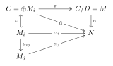
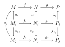
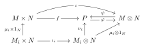

### 2.1
Show that $(\mathbb{Z}/m\mathbb{Z}) \otimes_{\mathbb{Z}} (\mathbb{Z}/n\mathbb{Z}) = 0$ if $m, n$ are coprime.
Proof: We show that $\mathbb{Z}_{m}\otimes_{\mathbb{Z}}\mathbb{Z}_{n}\cong \mathbb{Z}_{m} /n\mathbb{Z}_{m}\cong \mathbb{Z}_{(m,n)}$: 
Consider $f:\mathbb{Z}_{m}\times \mathbb{Z}_{n}\to \mathbb{Z}_{m} /n\mathbb{Z}_{m},(\bar{a},\bar{b})\mapsto ab+n\mathbb{Z}_{m}$, then $f$ is well-defined and bilinear. Hence $f$ induces a $\mathbb{Z}-$module homomorphism $\alpha:\mathbb{Z}_{m}\otimes_{\mathbb{Z}}\mathbb{Z}_{n}\to \mathbb{Z}_{m} /n\mathbb{Z}_{m}$ such that $\alpha(\bar{a}⊗ \bar{b})=ab+n\mathbb{Z}_{m}$. Consider $g:\mathbb{Z}_{m}\to \mathbb{Z}_{m}\otimes_{\mathbb{Z}}\mathbb{Z}_{n},\bar{a}\mapsto \bar{a}\otimes 1$, then $n\mathbb{Z}_{m}\subset \mathrm{Ker}g$ so $g$ induces a homomorphism $\beta:\mathbb{Z}_{m} /n\mathbb{Z}_{m}\to \mathbb{Z}_{m}\otimes_{\mathbb{Z}}\mathbb{Z}_{n}$ such that $\beta(\bar{a}+n\mathbb{Z}_{m})=\bar{a}\otimes 1$. We can verify that $\alpha\beta=1_{\mathbb{Z}_{m} /n\mathbb{Z}_{m}}$ and $\beta\alpha=1_{\mathbb{Z}_{m}\otimes_{\mathbb{Z}}\mathbb{Z}_{n}}$, hence $\alpha$ is an isomorphism and $\mathbb{Z}_{m}\otimes_{\mathbb{Z}}\mathbb{Z}_{n}\cong \mathbb{Z}_{m} /n\mathbb{Z}_{m}\cong \mathbb{Z}_{(m,n)}$.
### 2.2
Let $A$ be a ring, $\mathfrak{a}$ an ideal, $M$ an $A$-module. Show that $(A/\mathfrak{a}) \otimes_A M$ is isomorphic to $M/\mathfrak{a}M$.
Proof: The sequence $0\to \mathfrak{a}\to A\to A /\mathfrak{a}\to 0$ is exact. By right exactness of $-\otimes_{A}M$, $\mathfrak{a}\otimes_{A}M\stackrel{f}{\to} A\otimes_{A}M\to A /\mathfrak{a}\otimes_{A}M\to 0$ is exact. Hence $A /\mathfrak{a}\otimes_{A}M\cong(A\otimes_{A}M) /\mathrm{Im}f$. Since $\varphi:A\otimes_{A}M\cong M,a\otimes m\mapsto am$ is an isomorphism, and $\varphi f(\mathfrak{a}\otimes_{A}M)=\mathfrak{a}M$, we obtain
$$
(A /\mathfrak{a})\otimes_{A}M\cong (A \otimes_{A}M) /\mathrm{Im}f\cong M /\mathfrak{a}M.
$$
### 2.3
Let $A$ be a local ring, $M$ and $N$ finitely generated $A$-modules. Prove that if $M \otimes N = 0$, then $M = 0$ or $N = 0$.
Proof: Let $\mathfrak{m}$ be the unique maximal ideal, and $k=A /\mathfrak{m}$ be a field. Let $M_{k}=k\otimes_{A}M\cong M /\mathfrak{m}M$ by Exercise2.2, then
$0=(M\otimes_{A}N)_{k}\cong(k \otimes_{A} k)\otimes_{A}M\otimes_{A}N\cong M_{k}\otimes_{k}N_{k}.$
(Clearly $k\otimes_{A}k\cong k$ by $x\otimes y\mapsto xy$ and $x\mapsto x\otimes 1$).
Since $M_{k},N_{k}$ are both vector spaces over $k$, they are both free, and either $M_{k}=0$ or $N_{k}=0$.
Suppose $M_{k}=0$ then $M=\mathfrak{m}M$ where $\mathfrak{m}=\mathfrak{R}$ is the Jacobson radical (since $A$ is local). $M$ is finitely generated so by Nakayama's lemma $M=0$.
### 2.4
Let $M_i$ ($i \in I$) be any family of $A$-modules, and let $M$ be their direct sum. Prove that $M$ is flat $\Leftrightarrow$ each $M_i$ is flat.
Proof: Take any $f:N^{\prime}\to N$ injective. Since $N^{\prime}\otimes_{A}M\cong \bigoplus_{i\in I}(N^{\prime}\otimes_{A}M_{i})$, consider the embeddings $\iota_{i}:M_{i}\to M$ and $\iota^{\prime}_{i}:N^{\prime}\otimes_{A}M_{i}\to N^{\prime}\otimes_{A}M$, then $\mathrm{Ker} (f\otimes 1_{M})=\bigoplus_{i\in I}^{}{\iota_{i}^{\prime}(\mathrm{Ker} (f\otimes 1_{M_{i}}))}$, so $f\otimes 1_{M}$ is injective iff $f\otimes 1_{M_{i}}$ are injective. Hence $M$ is flat iff $M_{i}$ are flat.
### 2.5
Let $A[x]$ be the ring of polynomials in one indeterminate over a ring $A$. Prove that $A[x]$ is a flat $A$-algebra. 
Proof: $A[x]$ is a free $A-$module so it is flat.
### 2.6
For any $A$-module, let $M[x]$ denote the set of all polynomials in $x$ with coefficients in $M$, that is to say expressions of the form
$$
m_0 + m_1x + \cdots + m_rx^r \quad (m_i \in M).
$$
Defining the product of an element of $A[x]$ and an element of $M[x]$ in the obvious way, show that $M[x]$ is an $A[x]$-module.
Show that $M[x] \cong A[x] \otimes_A M$.
Proof: Define the $A[x]-$module structure as $\sum_{i=0}^{n}{a_{i}x^{i}}\cdot \sum_{j=0}^{p}{m_{j}x^{j}}=\sum_{i=0}^{n+p}{m^{\prime}_{i}x^{i}}$ where $m_{i}^{\prime}=\sum_{j+k=i}^{}{a_{j}\cdot m_{k}}$.
Consider $f:A[x]\times M\to M[x],\left( \sum_{i=0}^{n}{a_{i}x^{i}},m \right)\mapsto \sum_{i=0}^{n}{a_{i}mx^{i}}$ then $f$ is well-defined and bilinear, so it induces an $A-$module homomorphism $\alpha:A[x]\otimes_{A}M\to M[x]$ such that $\alpha(\phi \otimes m)=m\phi$. Let $\beta:M[x]\to A[x]\otimes_{A}M$, $\beta(\sum_{i=0}^{n}{m_{i}x^{i}})=\sum_{i=0}^{n}{x^{i}\otimes m_{i}}$ then $\beta$ is an $A-$module homomorphism. Verify that $\beta\alpha=1_{A[x]\otimes_{A}M}$ for the generators of $A[x]\otimes_{A}M$ and $\alpha\beta=1_{M[x]}$. Hence $\alpha,\beta$ are isomorphisms and $M[x]\cong A[x]\otimes_{A}M$.
### 2.7
Let $\mathfrak{p}$ be a prime ideal in $A$. Show that $\mathfrak{p}[x]$ is a prime ideal in $A[x]$. If $\mathfrak{m}$ is a maximal ideal in $A$, is $\mathfrak{m}[x]$ a maximal ideal in $A[x]$?
Proof: Note that $A[x] /\mathfrak{a}[x]\cong (A\otimes_{A}A[x]) /(\mathfrak{a}\otimes_{A}A[x])\cong A /\mathfrak{a}\otimes_{A}A[x]\cong (A /\mathfrak{a})[x]$ by exactness of $-⊗_{A} A[x]$ and Exercise2.6.
Hence $\mathfrak{a}[x]$ is prime iff $(A /\mathfrak{a})[x]$ is an integral domain, and $\mathfrak{a}[x]$ is maximal iff $(A /\mathfrak{a})[x]$ is a field. If $\mathfrak{p}\subset A$ is prime, clearly $A /\mathfrak{p}$ is an integral domain, so $(A /\mathfrak{p})[x]$ is also an integral domain. However, if $\mathfrak{m}\subset A$ is maximal, $k[x]=(A /\mathfrak{m})[x]$ is generally not a field, e.g. $\mathbb{R}[x]$ is not a field.
### 2.8
i) If $M$ and $N$ are flat $A$-modules, then so is $M \otimes_A N$.
ii) If $B$ is a flat $A$-algebra and $N$ is a flat $B$-module, then $N$ is flat as an $A$-module.
Proof: (i) Note that $-\otimes_{A}(M\otimes_{A}N)$ is naturally isomorphic to the composition of the two exact functors $-\otimes_{A}M$ and $-\otimes_{A}N$, hence it is exact and $M\otimes_{A}N$ is flat.
(ii) Likewise $-\otimes_{A}N$ is naturally isomorphic to the composition of the two exact functors $-\otimes_{A}B$ and $-\otimes_{B}N$, since $N\cong B\otimes_{B}N$ naturally as $B-$modules. Hence $N$ is a flat $A-$module.
### 2.9
Let $0 \to M' \to M \to M'' \to 0$ be an exact sequence of $A$-modules. If $M'$ and $M''$ are finitely generated, then so is $M$.
Proof: By exactness we can view $M^{\prime}\subset M$ and $M^{\prime\prime}=M /M^{\prime}$. Suppose $M^{\prime\prime}=(m_{1}^{\prime\prime},\cdots,m_{k}^{\prime\prime})$ and $M^{\prime}=(m_{1}^{\prime},\cdots,m_{t}^{\prime})$, and take $m_{i}\in M$ such that $\pi(m_{i})=m_{i}^{\prime\prime}$. Then for any $a\in M$, $\pi(a)=\sum_{}^{}{c_{i}m_{i}^{\prime\prime}}\in M^{\prime\prime}$ so $a-\sum_{}^{}{c_{i}m_{i}}\in M^{\prime}=(m_{1}^{\prime},\cdots,m_{t}^{\prime})$. Hence $M=(m_{1},\cdots,m_{k},m_{1}^{\prime},\cdots,m_{t}^{\prime})$ is finitely generated.
### 2.10
Let $A$ be a ring, $\mathfrak{a}$ an ideal contained in the Jacobson radical of $A$; let $M$ be an $A$-module and $N$ a finitely generated $A$-module, and let $u: M \to N$ be a homomorphism. If the induced homomorphism $M/\mathfrak{a}M \to N/\mathfrak{a}N$ is surjective, then $u$ is surjective.
Proof: Since $M /\mathfrak{a}M\to N/\mathfrak{a}N$ is surjective, $\mathrm{Im}u+\mathfrak{a}N=N$, so $(\mathfrak{a} N+\mathrm{Im}u) /\mathrm{Im}u=N /\mathrm{Im}u$. $N /\mathrm{Im}u$ is finitely generated and $\mathfrak{a}\subset \mathfrak{R}$ so by Nakayama's lemma $N /\mathrm{Im}u=0$ and $u$ is surjective.
### 2.11
Let $A$ be a ring $\neq 0$. Show that $A^m \cong A^n \Rightarrow m = n$.
If $\phi: A^m \to A^n$ is surjective, then $m \geqslant n$.
If $\phi: A^m \to A^n$ is injective, is it always the case that $m \leqslant n$?
Proof: (a)(b) If $\phi:A^{m}\to A^{n}$ is surjective, then $\mathrm{Ker}\phi\to A^{m}\to A^{n}\to 0$ is an exact sequence. Take a maximal ideal $\mathfrak{m}\subset A$, and consider the field $k=A/\mathfrak{m}$. By right-exactness of tensoring, $\phi \otimes 1_{k}:A^{m}\otimes_{A}k\to A^{n}\otimes_{A}k$ is surjective. Since $k^{m}\cong(A\otimes_{A}k)^{m}\cong A^{m}\otimes_{A}k$ as $A-$modules, we obtain a surjective homomorphism $k^{m}\to k^{n}$, so by knowledge of linear algebra $m\geqslant n$.
If $\phi$ is bijective, consider the surjective homomorphism $\phi ^{-1}:A^{n}\to A^{m}$, then $m\geqslant n$ and $m\leqslant n$ so $m=n$.
(c) (Proof from MSE)
Suppose $\phi:A^{m}\to A^{n}$ is injective and $m>n$, consider the embedding $\iota:A^{n}=A^{n}\times 0^{m-n}\to A^{m}$, and $\psi=\iota\phi$ which is also injective. Denote $\pi:A^{m}\to A,(a_{i})\mapsto a_{m}$ as the projection. By Hamilton-Cayley theorem, there exists $n\geqslant 1$ and $a_{1},\cdots,a_{n}\in A$ such that 
$$
\psi ^{n}+a_{1}\psi ^{n-1}+\cdots+a_{n-1}\psi+a_{n}id=0\in \mathrm{End}(A^{m}).
$$
Take the least such $n\geqslant 1$, then $\pi\psi=0$ implies $0=\pi(\psi ^{n}+a_{1}\psi ^{n-1}+\cdots+a_{n}id)$ so $a_{n}=0$. Since $\psi$ is injective, $\psi(\psi ^{n-1}+a_{1}\psi ^{n-2}+\cdots+a_{n-1})=0$ implies $\psi ^{n-1}+a_{1}\psi ^{n-2}+\cdots+a_{n-1}=0$, a contradiction to minimality of $n$.
Another proof: If $\phi:A^{m}\to A^{n}$ is injective and $m>n$, then the exterior algebra $\bigwedge_{i=1}^{m}A^{n}=0$ since by knowledge of linear algebra it has dimension $\binom{n}{m}$. Take a basis $\{ e_{1},\cdots,e_{m} \}$ of $A^{m}$, then $\phi(e_{1}),\cdots,\phi(e_{m})$ are linearly independent, so $\phi(e_{1})\wedge\cdots\wedge\phi(e_{m})\neq 0$, a contradiction.
### 2.12
Let $M$ be a finitely generated $A$-module and $\phi: M \to A^n$ a surjective homomorphism. Show that $\text{Ker}(\phi)$ is finitely generated.
Proof: Let $\{ e_{1},\cdots,e_{n} \}$ be a basis of $A^{n}$ and take $u_{i}\in M$ such that $\phi(u_{i})=e_{i}$. Then $\mathrm{Ker}\phi\cap (u_{1},\cdots,u_{n})=0$ since $\sum_{}^{}{c_{i}u_{i}}\in \mathrm{Ker}\phi\implies \sum_{}^{}{c_{i}e_{i}}=0\implies c_{i}=0$. For any $a\in M$, take $c_{i}$ such that $\phi(a)=\sum_{}^{}{c_{i}e_{i}}$, then $a-\sum_{}^{}{c_{i}u_{i}}\in \mathrm{Ker}\phi$, so $M=(u_{1},\cdots,u_{n})+\mathrm{Ker}\phi$. Hence $M=(u_{1},\cdots,u_{n})\oplus \mathrm{Ker}\phi$, and $\mathrm{Ker}\phi$ is finitely generated since it is the homomorphic image of $M$.
### 2.13
Let $f: A \to B$ be a ring homomorphism, and let $N$ be a $B$-module. Regarding $N$ as an $A$-module by restriction of scalars, form the $B$-module $N_B = B \otimes_A N$. Show that the homomorphism $g: N \to N_B$ which maps $y$ to $1 \otimes y$ is injective and that $g(N)$ is a direct summand of $N_B$.
Proof: Consider $h:N_{B}\to N$ be the $B-$module homomorphism induced by the bilinear map $B\times N\to N,(b,n)\mapsto bn$, then $h(b\otimes n)=bn$. Hence $hg=1_{N}$ so $g$ is injective. If $g(n)\in \mathrm{Im}g\cap \mathrm{Ker}h$, then $n=hg(n)=0$ so $g(n)=0$ and $\mathrm{Im}g\cap \mathrm{Ker}h=0$. Since $b\otimes n=1\otimes bn+(b\otimes n-1\otimes bn)$ where $1\otimes bn=gh(b\otimes n)\in \mathrm{Im}g$, $b\otimes n-1\otimes bn\in \mathrm{Ker}h$, and $N_{B}$ is generated by $b\otimes n$, we obtain $N_{B}=\mathrm{Im}g+\mathrm{Ker}h$. Therefore $N_{B}=\mathrm{Im}g\oplus \mathrm{Ker}h$ and $\mathrm{Im}g$ is a direct summand of $N_{B}$.

---
**Direct limits**
### 2.14
A partially ordered set $I$ is said to be a **directed set** if for each pair $i, j$ in $I$ there exists $k \in I$ such that $i \leqslant k$ and $j \leqslant k$.
Let $A$ be a ring, let $I$ be a directed set and let $(M_i)_{i \in I}$ be a family of $A$-modules indexed by $I$. For each pair $i, j$ in $I$ such that $i \leqslant j$, let $\mu_{ij}: M_i \to M_j$ be an $A$-homomorphism, and suppose that the following axioms are satisfied:
(1) $\mu_{ii}$ is the identity mapping of $M_i$, for all $i \in I$;
(2) $\mu_{ik} = \mu_{jk} \circ \mu_{ij}$ whenever $i \leqslant j \leqslant k$.
Then the modules $M_i$ and homomorphisms $\mu_{ij}$ are said to form a **direct system** $\mathbf{M} = (M_i, \mu_{ij})$ over the directed set $I$.
We shall construct an $A$-module $M$ called the **direct limit** of the direct system $\mathbf{M}$. Let $C$ be the direct sum of the $M_i$, and identify each module $M_i$ with its canonical image in $C$. Let $D$ be the submodule of $C$ generated by all elements of the form $x_i - \mu_{ij}(x_i)$ where $i \leqslant j$ and $x_i \in M_i$. Let $M = C/D$, let $\mu: C \to M$ be the projection and let $\mu_i$ be the restriction of $\mu$ to $M_i$.
The module $M$, or more correctly the pair consisting of $M$ and the family of homomorphisms $\mu_i: M_i \to M$, is called the **direct limit** of the direct system $\mathbf{M}$, and is written $\lim_{\longrightarrow} M_i$. From the construction it is clear that $\mu_i = \mu_j \circ \mu_{ij}$ whenever $i \leqslant j$.
### 2.15
In the situation of Exercise 14, show that every element of $M$ can be written in the form $\mu_i(x_i)$ for some $i \in I$ and some $x_i \in M_i$.
Show also that if $\mu_i(x_i) = 0$ then there exists $j \geqslant i$ such that $\mu_{ij}(x_i) = 0$ in $M_j$.
Proof: Every element $a\in C$ is the finite sum $a=\sum_{i\in J}^{}{m_{i}}$ where $J$ is finite. Take $k\in I$ such that $i\leqslant k\forall i\in J$, then $a\equiv \sum_{i\in J}^{}{\mu_{ik}(m_{i})}\pmod{D}$. Therefore every element $\mu(a)\in M$ is $\mu_{k}(x_{k})$ for $x_{k}=\sum_{i\in J}^{}{\mu_{ik}(m_{i})}\in M_{k}$.
If $\mu_{i}(x_{i})=0$ then $x_{i}\in D$ implies $x_{i}=\sum_{(u,v)\in J}^{}{x_{u}-\mu_{uv}(x_{u})}$ for some finite $J$, and we can write the sum as $x_{i}=\sum_{u\in T}^{}{z_{u}}$ where $z_{u}=0\forall u\neq i$. Take $j\in I$ larger than $i$ and $(u,v)\in J$, then 
$$
\mu_{ij}(x_{i})=\sum_{u\in T}^{}{\mu_{uj}(z_{u})}=\sum_{(u,v)\in J}^{}{\mu_{uj}(x_{u})-\mu_{vj}\mu_{uv}(x_{u})}=0.
$$
### 2.16
Show that the direct limit is characterized (up to isomorphism) by the following property. Let $N$ be an $A$-module and for each $i \in I$ let $\alpha_i: M_i \to N$ be an $A$-module homomorphism such that $\alpha_i = \alpha_j \circ \mu_{ij}$ whenever $i \leqslant j$. Then there exists a unique homomorphism $\alpha: M \to N$ such that $\alpha_i = \alpha \circ \mu_i$ for all $i \in I$.

Proof: Given $N$ and $\alpha_{i}$ such that $\alpha_{i}=\alpha_{j}\circ\mu_{ij}$, there is a unique $\tilde{\alpha}:\bigoplus_{i\in I}M_{i}\to N$ such that $\tilde{\alpha}\iota_{i}=\tilde{\alpha}|_{M_{i}}=\alpha_{i}$ where $\iota_{i}:M_{i}\to \oplus M_{j}$. Since $\alpha(x_{i})=\alpha_{j}\mu_{ij}(x)$, $x_{i}-\mu_{ij}(x_{i})\in \mathrm{Ker} \tilde{\alpha}$ for all $i\leqslant j$. Hence $D\subset \mathrm{Ker} \tilde{\alpha }$ and there is a unique $\alpha:M=C /D\to N$ such that $\tilde{\alpha}=\alpha\pi$, then $\alpha\circ\mu_{i}=\alpha\pi\iota_{i}=\tilde{\alpha}\iota_{i}=\alpha_{i}$.
If there exists another $\beta:M\to N$ then $(\beta\pi)\iota_{i}=\beta\mu_{i}=\alpha_{i}$ implies $\beta\pi=\tilde{\alpha }$, so $\beta=\alpha$.
Consider the category $\mathfrak{C}$, where objects are $(N,\{ \alpha_{i}:M_{i}\to N|i\in I \})$ such that $\alpha_{i}=\alpha_{j}\circ\mu_{ij}$, and morphisms are $\phi:(N,\{ \alpha_{i} \})\to(P,\{ \beta_{i} \})$ where $\phi:N\to P$ is a $A-$module homomorphism and $\beta_{i}=\phi\alpha_{i}$. Verify that $\phi$ is an equivalence in $\mathfrak{C}$ iff it is a $A-$module isomorphism. Since $(M,\mu_{i})$ is the universal object of $\mathfrak{C}$, it is unique up to isomorphism.
### 2.17
Let $(M_i)_{i \in I}$ be a family of submodules of an $A$-module, such that for each pair of indices $i, j$ in $I$ there exists $k \in I$ such that $M_i + M_j \subseteq M_k$. Define $i \leqslant j$ to mean $M_i \subseteq M_j$ and let $\mu_{ij}: M_i \to M_j$ be the embedding of $M_i$ in $M_j$. Show that
$$
\lim_{\longrightarrow} M_i = \sum M_i = \bigcup M_i. 
$$
In particular, any $A$-module is the direct limit of its finitely generated submodules.
Proof: For any $\alpha_{i}:M_{i}\to N$ such that $\alpha_{i}=\alpha_{j}\mu_{ij}$, define $\alpha:\bigcup M_{i}\to N$ as $\alpha(m_{i})=\alpha_{i}(m_{i})$ for $m_{i}\in M_{i}$ and $\mu_{i}$ the embedding. Verify that $\alpha$ is a well-defined $A-$module homomorphism, and $\alpha_{i}=\alpha\mu_{i}$. Clearly $\alpha$ is unique, so by the universal property $\displaystyle\lim_{  \longrightarrow }M_{i}=\bigcup M_{i}$.
### 2.18
Let $\mathbf{M} = (M_i, \mu_{ij}), \mathbf{N} = (N_i, \nu_{ij})$ be direct systems of $A$-modules over the same directed set. Let $M, N$ be the direct limits and $\mu_i: M_i \to M, \nu_i: N_i \to N$ the associated homomorphisms.
A **homomorphism** $\phi: \mathbf{M} \to \mathbf{N}$ is by definition a family of $A$-module homomorphisms $\phi_i: M_i \to N_i$ such that $\phi_j \circ \mu_{ij} = \nu_{ij} \circ \phi_i$ whenever $i \leqslant j$. Show that $\phi$ defines a unique homomorphism $\displaystyle\phi = \lim_{\longrightarrow} \phi_i: M \to N$ such that $\phi \circ \mu_i = \nu_i \circ \phi_i$ for all $i \in I$.
Proof: Let $\tilde{\phi}_{i}:M_{i}\to N,\tilde{\phi}_{i}=\nu_{i}\phi_{i}$, then $\tilde{\phi}_{j}\mu_{ij}=\nu_{j}\phi_{j}\mu_{ij}=\nu_{j}\nu_{ij}\phi_{i}=\nu_{i}\phi_{i}=\tilde{\phi}_{i}$ for all $i\leqslant j$. Hence there is a unique homomorphism $\phi:M\to N$ such that $\phi\mu_{i}=\tilde{\phi}_{i}=\nu_{i}\phi_{i}$ for all $i\in I$.
### 2.19
A sequence of direct systems and homomorphisms $\mathbf{M} \to \mathbf{N} \to \mathbf{P}$ is **exact** if the corresponding sequence of modules and module homomorphisms is exact for each $i \in I$. Show that the sequence $M \to N \to P$ of direct limits is then exact.

Proof: If $n\in \mathrm{Ker}g$ then take $i\in I$ such that $n=\nu_{i}(n_{i})$ for some $n_{i}\in N_{i}$ (by Exercise2.15). Then $0=g(n)=g\nu_{i}(n_{i})=\lambda_{i}g_{i}(n_{i})$. By Exercise2.15 there exists $j\geqslant i$ such that $\lambda_{ij}(g_{i}(n_{i}))=0$, so $0=\lambda_{ij}g_{i}(n_{i})=g_{j}\nu_{ij}(n_{i})$. Hence $\nu_{ij}(n_{i})\in \mathrm{Ker}g_{j}=\mathrm{Im}f_{j}$. Suppose $\nu_{ij}(n_{i})=f_{j}(m_{j})$, then
$$
f\mu_{j}(m_{j})=\nu_{j}f_{j}(m_{j})=\nu_{j}\nu_{ij}(n_{i})=\nu_{i}(n_{i})=n.
$$
Hence $n\in \mathrm{Im}f$ and $\mathrm{Ker}g\subset \mathrm{Im}f$.
If $n=f(m)\in \mathrm{Im}f$, take $i\in I$ such that $\mu_{i}(m_{i})=m$ for some $m_{i}\in M_{i}$, then $n=f\mu_{i}(m_{i})=\nu_{i}f_{i}(m_{i})$. Note that $g_{i}f_{i}(m_{i})=0$, so
$$
0=\lambda_{i}g_{i}f_{i}(m_{i})=g\nu_{i}f_{i}(m_{i})=g(n).
$$
Hence $n\in \mathrm{Ker}g$ and $\mathrm{Im}f\subset \mathrm{Ker}g$, so $\mathrm{Im}f=\mathrm{Ker}g$ and $M\stackrel{f}{\to}N\stackrel{g}{\to}P$ is exact.

---
**Tensor products commute with direct limits**
### 2.20
Keeping the same notation as in Exercise 14, let $N$ be any $A$-module. Then $(M_i \otimes N, \mu_{ij} \otimes 1)$ is a direct system; let $\displaystyle P = \lim_{\longrightarrow} (M_i \otimes N)$ be its direct limit.
For each $i \in I$ we have a homomorphism $\mu_i \otimes 1: M_i \otimes N \to M \otimes N$, hence by Exercise 16 a homomorphism $\psi: P \to M \otimes N$. Show that $\psi$ is an isomorphism, so that
$$
\lim_{\longrightarrow} (M_i \otimes N) \cong (\lim_{\longrightarrow} M_i) \otimes N.
$$

Proof: Consider the map $f:M\times N\to P$: for $(m,n)\in M\times N$, suppose $m=\mu_{i}(m_{i})$, then define $f(m,n)=\nu_{i}(m_{i}\otimes n)$. 
If $i\leqslant j$ and $m=\mu_{i}(m_{i})=\mu_{j}(m_{j})$, then $\mu_{j}(m_{j})=\mu_{j}(\mu_{ij}(m_{i}))$ so $\mu_{jk}(m_{j})=\mu_{jk}\mu_{ij}(m_{i})=\mu_{ik}(m_{i})$ for some $k\geqslant j$. Hence  $\nu_{i}(m_{i}\otimes n)=\nu_{k}\nu_{ik}(m_{i}\otimes n)=\nu_{k}(\mu_{ik}(m_{i})\otimes n)=\nu_{k}(\mu_{jk}(m_{j})\otimes n)=\nu_{j}(m_{j}\otimes n)$.
Therefore $f$ is well-defined, and clearly $f$ is $A-$module bilinear since $\nu_{i}$ is bilinear. $f$ induces a $A-$module homomorphism $\varphi:M\otimes N\to P$ such that $\varphi\iota=f$.
For any $m\otimes n\in M\otimes N$, suppose $(m,n)=(\mu_{i}\times 1)(m_{i},n)$, then 
$$
\begin{align}
\psi\varphi(m\otimes n) & =\psi f(m,n)=\psi f(\mu_{i}\times 1)(m_{i},n) \newline
 & =\psi\nu_{i}\iota_{i}(m,n)=(\mu_{i}\otimes  1_{N})\iota_{i}(m_{i},n)=m\otimes n,
\end{align}
$$
and for any $\nu_{i}(m_{i}\otimes n)\in P$, 
$$
\begin{align}
\varphi\psi(\nu_{i}(m_{i}\otimes n))=\varphi(\mu_{i}\otimes  1_{N})(m_{i}\otimes n)=\varphi\iota(\mu_{i}\times 1_{N})(m_{i},n)=\nu_{i}\iota_{i}(m_i,n)=\nu_{i}(m\otimes n).
\end{align}
$$
Hence we verified the identity on all generators of $M\otimes N$ and $P$, so $\varphi\psi= 1_{P}$ and $\psi\varphi= 1_{M\otimes N}$, therefore $\displaystyle P=\lim_{ \longrightarrow }(M_{i}\otimes N)\cong M\otimes N$.
### 2.21
Let $(A_i)_{i \in I}$ be a family of rings indexed by a directed set $I$, and for each pair $i \leqslant j$ in $I$ let $\alpha_{ij}: A_i \to A_j$ be a ring homomorphism, satisfying conditions (1) and (2) of Exercise 14. Regarding each $A_i$ as a $\mathbb{Z}$-module we can then form the direct limit $A = \displaystyle\lim_{\longrightarrow} A_i$. Show that $A$ inherits a ring structure from the $A_i$ so that the mappings $A_i \to A$ are ring homomorphisms. The ring $A$ is the **direct limit** of the system $(A_i, \alpha_{ij})$.
If $A = 0$ prove that $A_i = 0$ for some $i \in I$.
Proof: (a) For $r,s\in A$, let $r=\alpha_{i}(a_{i}),s=\alpha_{j}(a_{j})$. Take $k\in I$ such that $i,j\leqslant k$, we define
$$
r\cdot s=\alpha_{k}(\alpha_{ik}(a_{i})\cdot \alpha_{jk}(a_{j})).
$$
If $k\leqslant l$, then
$$
\alpha_{k}(\alpha_{ik}(a_{i})\cdot \alpha_{jk}(a_{j}))=\alpha_{l}\alpha_{kl}(\alpha_{ik}(a_{i})\cdot\alpha_{jk}(a_{j}))=\alpha_{l}(\alpha_{il}(a_{i})\cdot\alpha_{jl}(a_{j})).
$$
so $r\cdot s$ is independent of the choice of $k$ (if $i,j\leqslant k,l$, take $k,l\leqslant m$).
If $r=\alpha_{i}(a_{i})=\alpha_{l}(a_{l})$, take $i,j,l\leqslant k$, then
$$
\alpha_{k}\alpha_{lk}(a_{l})=\alpha_{l}(a_{l})=\alpha_{i}(a_{i})=\alpha_{k}\alpha_{ik}(a_{i})
$$
so there exists $m\geqslant k$ such that $\alpha_{km}(\alpha_{ik}(a_{i})-\alpha_{lk}(a_{l}))=0$. Hence
$$
\alpha_{m}(\alpha_{im}(a_{i})\cdot\alpha_{jm}(a_{j}))=\alpha_{m}(\alpha_{lm}(a_{l})\cdot\alpha_{jm}(a_{j})).
$$
Therefore the product is well-defined.
For $r=\alpha_{i}(a),s=\alpha_{i}(b)$ and $t=\alpha_{i}(c)$, $(r+s)t=\alpha_{i}((a+b)c)=\alpha_{i}(ac+bc)=rt+st$, and $1_{A}=\alpha_{i}(1_{A_{i}})$ is the identity. Hence $A$ is a ring and by definition $\alpha_{i}$ is a ring homomorphism.
(b) If $A=0$ then $1_{A}=0$ so $\alpha_{i}(1_{A_{i}})=0$, and $1_{A_{j}}=\alpha_{ij}(1_{A_{j}})=0$ for some $j\geqslant i$. Hence $A_{j}=0$.
### 2.22
Let $(A_i, \alpha_{ij})$ be a direct system of rings and let $\mathfrak{N}_i$ be the nilradical of $A_i$. Show that $\displaystyle\lim_{\longrightarrow} \mathfrak{N}_i$ is the nilradical of $\displaystyle\lim_{\longrightarrow} A_i$.
If each $A_i$ is an integral domain, then $\displaystyle\lim_{\longrightarrow} A_i$ is an integral domain.
Proof: (a) If $a_{i}\in \mathfrak{N}_{i}$, suppose $a_{i}^{n}=0$ then $\alpha_{i}(a_{i})^{n}=\alpha_{i}(a_{i}^{n})=0$, so $\alpha_{i}(a_{i})\in \mathfrak{N}$ and $\displaystyle\lim_{ \longrightarrow}\mathfrak{N}_{i}\subset \mathfrak{N}$.
If $a\in \mathfrak{N}$, suppose $a^{n}=0$ and $a=\alpha_{i}(a_{i})$, then $\alpha_{i}(a_{i}^{n})=0$ implies $\alpha_{ij}(a_{i}^{n})=0$ for some $j\geqslant i$. Hence $\alpha_{ij}(a_{i})\in \mathfrak{N}_{j}$ so $\displaystyle a=\alpha_{j}(\alpha_{ij}(a_{i}))\in \lim_{\longrightarrow}\mathfrak{N}_{i}$.
Therefore $\displaystyle\mathfrak{N}=\lim_{  \longrightarrow }\mathfrak{N}_{i}$.
(b) If each $A_{i}$ is an integral domain, and $ab=0$ for $a,b\in A$, suppose $a=\mu_{i}(u),b=\mu_{i}(v)$, then $\mu_{i}(uv)=0$ implies $\mu_{ij}(uv)=0$ for some $j\geqslant i$. Hence $\mu_{ij}(u)\cdot\mu_{ij}(v)=0$ so either $\mu_{ij}(u)=0$ or $\mu_{ij}(v)=0$. Since $a=\mu_{j}(\mu_{ij}(u))$ and $b=\mu_{j}(\mu_{ij}(v))$, $a=0$ or $b=0$.
### 2.23
Let $(B_\lambda)_{\lambda \in \Lambda}$ be a family of $A$-algebras. For each finite subset $J$ of $\Lambda$ let $B_J$ denote the tensor product (over $A$) of the $B_\lambda$ for $\lambda \in J$. If $J'$ is another finite subset of $\Lambda$ and $J \subseteq J'$, there is a canonical $A$-algebra homomorphism $B_J \to B_{J'}$. Let $B$ denote the direct limit of the rings $B_J$ as $J$ runs through all finite subsets of $\Lambda$. The ring $B$ has a natural $A$-algebra structure for which the homomorphisms $B_J \to B$ are $A$-algebra homomorphisms. The $A$-algebra $B$ is the **tensor product** of the family $(B_\lambda)_{\lambda \in \Lambda}$.
Proof: Define the algebra structure on $B$ as follows: if $a,b\in B$, suppose $a=\mu_{i}(u),b=\mu_{i}(v)$, then $a\cdot b$ is defined as $a\cdot b=\mu_{i}(uv)$; if $a\in A,b\in B$ suppose $b=\mu_{i}(v)$ then define $a\cdot b=\mu_{i}(av)$. Analogous to Exercise2.21, verify that it is well-defined. 
## TODO

---
**Flatness and Tor**
In these Exercises it will be assumed that the reader is familiar with the definition and basic properties of the Tor functor.

### 2.24
If $M$ is an $A$-module, the following are equivalent:
i) $M$ is flat;
ii) $\text{Tor}_n^A(M, N) = 0$ for all $n > 0$ and all $A$-modules $N$;
iii) $\text{Tor}_1^A(M, N) = 0$ for all $A$-modules $N$.[To show that (i) $\Rightarrow$ (ii), take a free resolution of $N$ and tensor it with $M$. Since $M$ is flat, the resulting sequence is exact and therefore its homology groups, which are the $\text{Tor}_n^A(M, N)$, are zero for $n > 0$. To show that (iii) $\Rightarrow$ (i), let $0 \to N' \to N \to N'' \to 0$ be an exact sequence. Then, from the Tor exact sequence,
$$ \text{Tor}_1(M, N'') \to M \otimes N' \to M \otimes N \to M \otimes N'' \to 0 $$
is exact. Since $\text{Tor}_1(M, N'') = 0$ it follows that $M$ is flat.]

### 2.25
Let $0 \to N' \to N \to N'' \to 0$ be an exact sequence, with $N''$ flat. Then $N'$ is flat $\Leftrightarrow N$ is flat. [Use Exercise 24 and the Tor exact sequence.]

### 2.26
Let $N$ be an $A$-module. Then $N$ is flat $\Leftrightarrow \text{Tor}_1(A/\mathfrak{a}, N) = 0$ for all finitely generated ideals $\mathfrak{a}$ in $A$.[Show first that $N$ is flat if $\text{Tor}_1(M, N) = 0$ for all finitely generated $A$-modules $M$, by using (2.19). If $M$ is finitely generated, let $x_1, \dots, x_n$ be a set of generators of $M$, and let $M_i$ be the submodule generated by $x_1, \dots, x_i$. By considering the successive quotients $M_i/M_{i-1}$ and using Exercise 25, deduce that $N$ is flat if $\text{Tor}_1(M, N) = 0$ for all cyclic $A$-modules $M$, i.e., all $M$ generated by a single element, and therefore of the form $A/\mathfrak{a}$ for some ideal $\mathfrak{a}$. Finally use (2.19) again to reduce to the case where $\mathfrak{a}$ is a finitely generated ideal.]

### 2.27
A ring $A$ is **absolutely flat** if every $A$-module is flat. Prove that the following are equivalent:
i) $A$ is absolutely flat.
ii) Every principal ideal is idempotent.
iii) Every finitely generated ideal is a direct summand of $A$.[i) $\Rightarrow$ ii). Let $x \in A$. Then $A/(x)$ is a flat $A$-module, hence in the diagram
$$
\begin{CD}
(x) \otimes A @>\beta>> (x) \otimes A/(x) \newline
@VVV @VV{\alpha}V \newline
A @>>> A/(x)
\end{CD}
$$
the mapping $\alpha$ is injective. Hence $\text{Im}(\beta) = 0$, hence $(x) = (x^2)$. ii) $\Rightarrow$ iii). Let $x \in A$. Then $x = ax^2$ for some $a \in A$, hence $e = ax$ is idempotent and we have $(e) = (x)$. Now if $e, f$ are idempotents, then $(e, f) = (e + f - ef)$. Hence every finitely generated ideal is principal, and generated by an idempotent $e$, hence is a direct summand because $A = (e) \oplus (1 - e)$. iii) $\Rightarrow$ i). Use the criterion of Exercise 26.]

### 2.28
A Boolean ring is absolutely flat. The ring of Chapter 1, Exercise 7 is absolutely flat. Every homomorphic image of an absolutely flat ring is absolutely flat. If a local ring is absolutely flat, then it is a field.
If $A$ is absolutely flat, every non-unit in $A$ is a zero-divisor.
