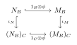

### 3.1
Let $S$ be a multiplicatively closed subset of a ring $A$, and let $M$ be a finitely generated $A$-module. Prove that $S^{-1}M = 0$ if and only if there exists $s \in S$ such that $sM = 0$.
Proof: Suppose $M=(m_{1},\cdots,m_{n})$ is finitely generated, then $S^{-1}M=0$ implies $\forall1\leqslant i\leqslant n, \frac{m_{i}}{1}=0\in S^{-1}M$ so there exists $s_{i}\in S$ such that $s_{i}m_{i}=0$. Let $s=s_{1}\cdots s_{n}$, then $s\in S$ and $sm_{i}=0\forall 1\leqslant i\leqslant  n$, hence $sM=0$.
The converse is trivial.
### 3.2
Let $\mathfrak{a}$ be an ideal of a ring $A$, and let $S = 1 + \mathfrak{a}$. Show that $S^{-1}\mathfrak{a}$ is contained in the Jacobson radical of $S^{-1}A$.
Use this result and Nakayama's lemma to give a proof of (2.5) which does not depend on determinants.
Proof: Clearly $S$ is multiplicative. For any $\frac{a}{s }\in S^{-1}\mathfrak{a}$ and $\frac{t}{s^{\prime}}\in S^{-1}A$, $ss^{\prime}+ta\in S+\mathfrak{a}\subset S$ so $1+\frac{t}{s^{\prime}} \frac{a}{s}$ has an inverse $\frac{ss^{\prime}}{ss^{\prime}+ta}\in S^{-1}A$. Hence $S^{-1}\mathfrak{a}\subset \mathfrak{R}(S^{-1}A)$.
If $M$ is a finitely generated $A-$module and $\mathfrak{a}\subset A$ satisfy $\mathfrak{a}M=M$, then $S^{-1}M=(S^{-1}\mathfrak{a})(S^{-1}M)$ where $S^{-1}\mathfrak{a}\subset \mathfrak{R}(S^{-1}A)$. By Nakayama's lemma $S^{-1}M=0$, so by Exercise3.1 $sM=0$ for some $s \in S$. By definition $s\equiv 1\pmod {\mathfrak{a}}$.
### 3.3
Let $A$ be a ring, let $S$ and $T$ be two multiplicatively closed subsets of $A$, and let $U$ be the image of $T$ in $S^{-1}A$. Show that the rings $(ST)^{-1}A$ and $U^{-1}(S^{-1}A)$ are isomorphic.
Proof: For any ring homomorphism $\varphi:A\to B$ that maps elements of $ST$ to units, by the universal property there is a unique $\tilde{\varphi}:S^{-1}A\to B$ such that $\tilde{\varphi}\iota_{1}=\varphi$. Then $\tilde{\varphi}$ maps elements of $U=\iota_{1}(T)$ to units in $B$, so there is a unique $\overline{\varphi}:U^{-1}(S^{-1}A)\to B$ such that $\bar{\varphi}\iota_{2}=\tilde{\varphi}$, which implies $\bar{\varphi}(\iota_{2}\iota_{1})=\varphi$. If $\phi:U^{-1}(S^{-1}A)\to B$ also satisfy $\phi(\iota_{2}\iota_{1})=\varphi$, then by uniqueness $\phi\iota_{2}=\tilde{\varphi i}$ and $\phi=\bar{\varphi}$. Therefore $(ST)^{-1}A\cong U^{-1}(S^{-1}A)$.
### 3.4
Let $f : A \to B$ be a homomorphism of rings and let $S$ be a multiplicatively closed subset of $A$. Let $T = f(S)$. Show that $S^{-1}B$ and $T^{-1}B$ are isomorphic as $S^{-1}A$-modules.
Proof: Consider $\tilde{f}:S^{-1}B\to T^{-1}B$ be the homomorphism induced by $f\times 1_{B}:S\times B\to T\times B,(s,b)\mapsto(f(s),b)$. We can verify that $f\times 1_{B}$ keeps the equivalence relation, so $\tilde{f}(b /s)=b /f(s)$ is a well-defined homomorphism of rings. For $a /s^{\prime}\in S^{-1}A$, $\tilde{f}\left( \frac{a}{s^{\prime}} \frac{b}{s} \right)=\tilde{f}\left( \frac{f(a)b}{s^{\prime}s} \right)=\frac{f(a)}{f(s^{\prime})} \frac{b}{f(s)}=\frac{a}{s^{\prime}}\cdot \frac{b}{f(s)}$, so $\tilde{f}$ is a $S^{-1}A-$module homomorphism.
If $b /s\in n\mathrm{Ker}\tilde{f}$ then $tb=0$ for some $t\in T$. Take $s^{\prime}\in f^{-1}(t)$ then $s^{\prime}b=tb=0$ so $\frac{b}{s}=0$. Clearly $\tilde{f}$ is surjective, so $\tilde{f}$ Is an isomorphism $S^{-1}B\cong T^{-1}B$.
### 3.5
Let $A$ be a ring. Suppose that, for each prime ideal $\mathfrak{p}$, the local ring $A_{\mathfrak{p}}$ has no nilpotent element $\ne 0$. Show that $A$ has no nilpotent element $\ne 0$. If each $A_{\mathfrak{p}}$ is an integral domain, is $A$ necessarily an integral domain?
Proof: If $a^{n}=0$ for $a\in A$ then $\left( \frac{a}{1} \right)^{n}=0$ in $A_{\mathfrak{p}}$ so $\frac{a}{1}=0\in A_{\mathfrak{p}}$ and $ab=0$ for some $b\not\in \mathfrak{p}$. If $a\neq 0$, take a maximal ideal $\mathfrak{m}\supset Ann(a)$ then $\mathfrak{m}$ is prime, and there are no $b\not\in \mathfrak{m}$ such that $ab=0$, a contradiction. (Or note that $\mathfrak{N}(A_{\mathfrak{p}})=\mathfrak{N}(A)_{\mathfrak{p}}$ and recall that the property $A=0$ is local.)
However, even if each $A_{\mathfrak{p}}$ is an integral domain, consider $A=\mathbb{Z}_{6}$ then $A$ is not an integral domain but $A_{(2)},A_{(3)}$ are both integral domains. Or consider $A=\mathbb{R}^{2}$, then $\mathfrak{p}=\mathbb{R}\times 0,0\times \mathbb{R}$, so $A_{\mathfrak{p}}\cong \mathbb{R}$ is an integral domain, but $A$ is not an integral domain.
### 3.6
Let $A$ be a ring $\ne 0$ and let $\Sigma$ be the set of all multiplicatively closed subsets $S$ of $A$ such that $0 \notin S$. Show that $\Sigma$ has maximal elements, and that $S \in \Sigma$ is maximal if and only if $A - S$ is a minimal prime ideal of $A$.
See Exercise1.8.
### 3.7
A multiplicatively closed subset $S$ of a ring $A$ is said to be **saturated** if
$$
xy \in S \Leftrightarrow x \in S \text{ and } y \in S.
$$
Prove that
i) $S$ is saturated $\Leftrightarrow A - S$ is a union of prime ideals.
ii) If $S$ is any multiplicatively closed subset of $A$, there is a unique smallest saturated multiplicatively closed subset $\bar{S}$ containing $S$, and that $\bar{S}$ is the complement in $A$ of the union of the prime ideals which do not meet $S$. ($\bar{S}$ is called the **saturation** of $S$.)
If $S = 1 + \mathfrak{a}$, where $\mathfrak{a}$ is an ideal of $A$, find $\bar{S}$.
Proof: (i) Assume $A-S=\bigcup_{i\in I}\mathfrak{p}_{i}$, if $xy\in S$ and $x,y\not\in S$, suppose $x\in \mathfrak{p}_{i}$, then $xy\in \mathfrak{p}_{i}\subset A- S$, a contradiction.
If $S$ is saturated, we show that $A-S=\bigcup_{\mathfrak{p}\cap S=\emptyset}\mathfrak{p}$, or equivalently $S^{-1}(A-S)=\bigcup_{\mathfrak{q}}\mathfrak{q}=\{ a\in S^{-1}A:a\text{ nonunit} \}$: Clearly $S^{-1}S$ consists of units. If $\frac{a}{s}\in S^{-1}(A-S)$ has an inverse $\frac{b}{t}$, then $s^{\prime}(ab-st)=0$ for some $s^{\prime}\in S$, so $s^{\prime}ab=s^{\prime}st\in S$ which implies $a\in S$, a contradiction. Hence $S^{-1}(A-S)=\{ a\in S^{-1}A:a\text{ nonunit} \}=\bigcup_{\mathfrak{q}}\mathfrak{q}$ and $S^{-1}S=\{ a\in S^{-1}A:a\text{ unit} \}$. Therefore $A-S=\left( \bigcup_{\mathfrak{q}}\mathfrak{q} \right)^{c}=\bigcup_{\mathfrak{p}\cap S=\emptyset}\mathfrak{p}$.
(ii) By (i) $\overline{S}=A-\left( \bigcup_{\mathfrak{p}\cap S=\emptyset}\mathfrak{p} \right)$ is saturated. If $T\supset S$ is saturated, $T=A-\left( \bigcup_{\mathfrak{p}\cap T=\emptyset}\mathfrak{p} \right)\supset \overline{S}$. Hence $\overline{S}$ is minimal.
If $S=1+\mathfrak{a}$, then $\overline{S}=A-\bigcup_{\mathfrak{m}\supset \mathfrak{a}}\mathfrak{m}$.
### 3.8
Let $S, T$ be multiplicatively closed subsets of $A$, such that $S \subseteq T$. Let $\phi : S^{-1}A \to T^{-1}A$ be the homomorphism which maps each $a/s \in S^{-1}A$ to $a/s$ considered as an element of $T^{-1}A$. Show that the following statements are equivalent:
i) $\phi$ is bijective.
ii) For each $t \in T$, $t/1$ is a unit in $S^{-1}A$.
iii) For each $t \in T$ there exists $x \in A$ such that $xt \in S$.
iv) $T$ is contained in the saturation of $S$ (Exercise 7).
v) Every prime ideal which meets $T$ also meets $S$.
Proof: (ii)=>(i) if for each $t\in T$, $t /1$ is a unit in $S^{-1}A$, then $\iota_{1} 1_{A}$ maps $t$ to units of $S^{-1}A$, so it induces a unique homomorphism $\psi:T^{-1}A\to S^{-1}A$ such that $\psi\iota_{2}=\iota_{1}1_{A}$. By uniqueness $\psi\phi=1_{S^{-1}A}$ and $\phi\psi= 1_{T^{-1}A}$, so $\phi$ is bijective.
(iii)=>(ii) For each $t\in T$, take $x\in A$ such that $xt\in S$, then $t /1$ has an inverse $x /xt\in S^{-1}A$, so it is a unit.
(iv)=>(iii) Let $S^{\prime}=\{ a\in A: \exists x\in A,ax\in S \}$, we show that $\overline{S}\subset S^{\prime}$, which implies (iii). If $a\in S$, then $a^{2}\in S$ so $a\in S^{\prime}$. If $a,b\in S^{\prime}$, suppose $ax,by\in S$, then $(ab)(xy)=(ax)(by)\in S$ so $ab\in S^{\prime}$ and $S^{\prime}$ is multiplicative. If $ab\in S^{\prime}$, suppose $abx\in S$, then $a(bx)=b(ax)\in S$ implies $a,b\in S^{\prime}$, so $S^{\prime}$ is saturated. Hence $\overline{S}\subset S^{\prime}$ so $T\subset S^{\prime}$. (Obviously $\overline{S}=S^{\prime}$).
(v)=>(iv) by definition, $T\subset \overline{T}=A-\bigcup_{\mathfrak{p}\cap T=\emptyset}\mathfrak{p}\subset \overline{S}=A-\bigcup_{\mathfrak{p}\cap S=\emptyset}\mathfrak{p}$.
(i)=>(v) If $\mathfrak{p}\cap T\neq \emptyset$ but $\mathfrak{p}\cap S=\emptyset$, then $S^{-1}\mathfrak{p}\subset S^{-1}A$ is prime, so $\phi(S^{-1}\mathfrak{p})$ is prime. However, take $t\in \mathfrak{p}\cap T$, then $\frac{t}{1}\in \phi(S^{-1}\mathfrak{p})$ but $\frac{t}{1}$ is a unit in $T^{-1}A$, a contradiction. 
### 3.9
The set $S_0$ of all non-zero-divisors in $A$ is a saturated multiplicatively closed subset of $A$. Hence the set $D$ of zero-divisors in $A$ is a union of prime ideals (see Chapter 1, Exercise 14). Show that every minimal prime ideal of $A$ is contained in $D$. 
The ring $S_0^{-1}A$ is called the **total ring of fractions** of $A$. Prove that
i) $S_0$ is the largest multiplicatively closed subset of $A$ for which the homomorphism $A \to S_0^{-1}A$ is injective.
ii) Every element in $S_0^{-1}A$ is either a zero-divisor or a unit.
iii) Every ring in which every non-unit is a zero-divisor is equal to its total ring of fractions (i.e., $A \to S_0^{-1}A$ is bijective).
Proof: Note that $S_{0}$ is contained in every maximal multiplicative set $S$, otherwise $S_{0}S$ is strictly larger, so $D$ contains every minimal prime ideal.
(i) For any $a\in \mathrm{Ker}\iota$ where $\iota:A\to S^{-1}A$, $sa=0$ for some $s \in S$, so $\mathrm{Ker}\iota=0\iff S\subset S_{0}$.
(ii) For any $a /s \in S_{0}^{-1}A$, if $a\in S_{0}$ then $a /s$ has inverse $s /a$ so it is a unit. Otherwise $a\in A-S_{0}=D$ is a zero divisor, take $ab=0\in A$, then $a /s\cdot b /1=0\in S_{0}^{-1}A$ so $a /s$ is a zero divisor.
(iii) Consider $\iota:A\to S_{0}^{-1}A,a\mapsto a /1$, then by (i) $\iota$ is injective, and if $a /s \in S_{0}^{-1}A$, then $s \in S_{0}$ is a non zero-divisor, so $s$ is a unit, and $a /s=\iota(as^{-1})$. Therefore $\iota$ is bijective and $A\cong S_{0}^{-1}A$.
### 3.10
Let $A$ be a ring.
i) If $A$ is absolutely flat (Chapter 2, Exercise 27) and $S$ is any multiplicatively closed subset of $A$, then $S^{-1}A$ is absolutely flat.
ii) $A$ is absolutely flat iff $A_{\mathfrak{m}}$ is a field for each maximal ideal $\mathfrak{m}$.
Proof: (i) If $M$ is a $S^{-1}A-$module, then $M$ is flat as a $A-$module, denoted as $M|_{A}$. Consider $S^{-1}M|_{A}$, then $\psi:M\to S^{-1}M|_{A},m\mapsto m /1$ is a well-defined $S^{-1}A-$isomorphism: for $m /s \in  S^{-1}M$, $\frac{1}{s}m$ is well-defined, so $\psi\left( \frac{1}{s}m \right)=m /s$ and $\psi$ is surjective; if $\psi(m)=0$ then $sm=0$ for some $s \in S$, so $m=\frac{1}{s}sm=0$ and $\psi$ is injective; clearly $\psi$ is a homomorphism of groups, and $\psi\left( \frac{a}{s}m \right)=\frac{a}{s} \frac{m}{1}=\frac{a}{s}\psi(m)$ so $\psi$ is an $S^{-1}A-$module homomorphism.
If $\phi:N^{\prime}\to N$ is injective, we show that $\phi \otimes 1_{M}:N^{\prime}\otimes_{S^{-1}A}M\to N\otimes_{S^{-1}A}M$ is injective: note that $N^{\prime}\otimes_{S^{-1}A}M=S^{-1}N^{\prime}|_{A}\otimes_{S^{-1}A}S^{-1}M|_{A}=S^{-1}(N^{\prime}|_{A}\otimes_{A}M|_{A})$ by the previous part, and $N^{\prime}|_{A}\otimes_{A}M|_{A}\to N|_{A}\otimes_{A}M|_{A}$ is injective since $A$ is absolutely flat. Since localization keeps exactness, $S^{-1}(N^{\prime}|_{A}\otimes_{A}M|_{A})\to S^{-1}(N|_{A}\otimes_{A}M|_{A})$ is also injective.
(ii) The only if part is shown in (i). For (ii), use Theorem3.10 and the fact that all module of a field are free, hence flat.
### 3.11
Let $A$ be a ring. Prove that the following are equivalent:
i) $A/\mathfrak{N}$ is absolutely flat ($\mathfrak{N}$ being the nilradical of $A$).
ii) Every prime ideal of $A$ is maximal.
iii) $\operatorname{Spec}(A)$ is a $T_1$-space (i.e., every subset consisting of a single point is closed).
iv) $\operatorname{Spec}(A)$ is Hausdorff.
If these conditions are satisfied, show that $\operatorname{Spec}(A)$ is compact and totally disconnected (i.e. the only connected subsets of $\operatorname{Spec}(A)$ are those consisting of a single point).
Proof: (iv)=>(iii) is trivial. (iii)=>(ii): If $\mathfrak{p}$ is a non-maximal prime ideal, take a maximal ideal $\mathfrak{m}$ containing $\mathfrak{p}$, then for any $\mathfrak{p}\in V(I)$ where $I\subset A$, $I\subset \mathfrak{p}\subset \mathfrak{m}$ so $\mathfrak{m}\in V(I)$. Hence $\mathrm{Spec}(A)$ is not T1, a contradiction.
(ii)<=>(i) We show that $(A /\mathfrak{N})_{\mathfrak{m}}$ is a field for every maximal ideal $\mathfrak{m}\subset A /\mathfrak{N}$, then by Exercise3.10 $A /\mathfrak{N}$ is absolutely flat. If $(A /\mathfrak{N})_{\mathfrak{m}}$ has a non-zero prime ideal $\mathfrak{p}\subset(A /\mathfrak{N})_{\mathfrak{m}}$, then $\mathfrak{p}$ corresponds to a prime ideal $\mathfrak{q}\subsetneq \mathfrak{m}$ such that $\mathfrak{N}\subsetneq \mathfrak{q}$. Hence $\mathfrak{q}$ is a non-maximal prime ideal, a contradiction. The converse is analogous.
(i)=>(iv) By Exercise2.27, $A /\mathfrak{N}$ is absolutely flat implies every principle ideal is idempotent. For any $x\neq y\in \mathrm{Spec}(A)$, by (i)=>(ii) they are both maximal ideals, so $\mathfrak{p}_{x}+\mathfrak{p}_{y}=(1)$. Take $a\in \mathfrak{p}_{x}$ and $b\in \mathfrak{p}_{y}$ such that $(a)+(b)=1$, and idempotent elements $e\in(a),g\in(b)$ that generate $(a),(b)$. Let $f=(1-e)g$, then $x\in X_{f}$ and $y\in X_{e}$, while $(f)+(e)=1$ since $g=f+eg\in(f,e)$. Hence we obtain disjoint open neighborhoods $X_{f},X_{e}$, and $\mathrm{Spec}(A)$ is indeed Hausdorff.
### 3.12
Let $A$ be an integral domain and $M$ an $A$-module. An element $x \in M$ is a **torsion element** of $M$ if $\operatorname{Ann}(x) \ne 0$, that is if $x$ is killed by some non-zero element of $A$. Show that the torsion elements of $M$ form a submodule of $M$. This submodule is called the **torsion submodule** of $M$ and is denoted by $T(M)$. If $T(M) = 0$, the module $M$ is said to be **torsion-free**. Show that
i) If $M$ is any $A$-module, then $M/T(M)$ is torsion-free.
ii) If $f : M \to N$ is a module homomorphism, then $f(T(M)) \subseteq T(N)$.
iii) If $0 \to M' \to M \to M''$ is an exact sequence, then the sequence $0 \to T(M') \to T(M) \to T(M'')$ is exact.
iv) If $M$ is any $A$-module, then $T(M)$ is the kernel of the mapping $\iota:x \mapsto 1 \otimes x$ of $M$ into $K \otimes_A M$, where $K$ is the field of fractions of $A$.
Proof: If $x,y\in T(M)$, suppose $ax=by=0$ where $a,b\neq 0$, then $ab\neq 0$ and $ab(x-y)=0$ so $x-y\in T(M)$ and it is a subgroup. If $x\in T(M)$ and $a\in A$, suppose $bx=0$ for $b\neq 0$, then $b(ax)=a(bx)=0$ so $ax\in T(M)$. Hence $T(M)$ is a sub-module.
(i) If $m+T(M)\in M /T(M)$ is a torsion element, take $a\in A$ such that $a\neq 0$ and $a(m+T(M))=0$, then $am\in T(M)$ implies $b(am)=0$ for some $b\neq 0$. Hence $abm=0$ so $m\in T(M)$, and therefore $M /T(M)$ is torsion free.
(ii) If $m\in M$ is a torsion element, suppose $am=0$ for $a\neq 0$, then $a(f(m))=f(am)=0$ so $f(m)\in T(N)$. Hence $f(T(M))\subset T(N)$.
(iii) Suppose $f:M^{\prime}\to M$ is injective and $g:M\to M^{\prime\prime}$ satisfy $\mathrm{Ker}g=\mathrm{Im}f$. Then $f|_{T(M^{\prime})}$ is clearly injective, and $\mathrm{Im}f|_{T(M)}\subset \mathrm{Ker} g|_{T(M)}$. If $g(m)=0$ for some $m\in T(M)$, then $m\in \mathrm{Ker}g=\mathrm{Im}f$ so take $f(m^{\prime})=m$ where $m^{\prime}\in M^{\prime}$. Suppose $am=0$ for some $a\neq 0$, then $f(am^{\prime})=am=0$ implies $am^{\prime}=0$, so $m^{\prime}\in T(M^{\prime})$ and $m\in \mathrm{Im}f|_{M^{\prime}}$. Therefore $\mathrm{Im}f|_{T(M)}=\mathrm{Ker}g|_{T(M)}$ and $T$ is left exact.
(iv) If $m\in T(M)$ take $am=0$ for $a\neq 0$, then $1\otimes m=\frac{1}{a}\otimes am=0$ so $m\in \mathrm{Ker}\iota$.
Recall Theorem3.5 gives an isomorphism $K\otimes_{A}M\cong S^{-1}M$ where $S=A\backslash\{ 0 \}$, by $a /s\otimes m\mapsto am /s$, then it induces $\tilde{\iota}:x\mapsto x /1$. Hence it is clear that $m\in \mathrm{Ker}\iota\implies m\in T(M)$.
### 3.13
Let $S$ be a multiplicatively closed subset of an integral domain $A$. In the notation of Exercise 12, show that $T(S^{-1}M) = S^{-1}(TM)$. Deduce that the following are equivalent:
i) $M$ is torsion-free.
ii) $M_{\mathfrak{p}}$ is torsion-free for all prime ideals $\mathfrak{p}$.
iii) $M_{\mathfrak{m}}$ is torsion-free for all maximal ideals $\mathfrak{m}$.
Proof: If $m /s \in T(S^{-1}M)$, then $am /s=0$ for some $a\neq 0$, which implies $s^{\prime}am=0$ for some $s^{\prime}\in S$. Since $s^{\prime}\in S$ which doesn't contain $0$, $(s^{\prime}a)m=0$ implies $m\in T(M)$. Consider $\varphi:T(S^{-1}M)\to S^{-1}(TM),m /s\mapsto m /s$ then $\varphi$ is well-defined, and clearly surjective. Verify that $\varphi$ is a $S^{-1}A-$module homomorphism. If $m /s \in \mathrm{Ker}\varphi$ then $s^{\prime}m=0$ for some $s^{\prime}\in S$, so $m /s=s^{\prime}m /s^{\prime}s=0$, hence $\varphi$ is an isomorphism $T(S^{-1}M)\cong S^{-1}(TM)$.
(i)(ii)(iii) are equivalent using $T(M_{\mathfrak{p}})=(T(M))_{\mathfrak{p}}$ and the fact that $M=0$ is local.
### 3.14
Let $M$ be an $A$-module and $\mathfrak{a}$ an ideal of $A$. Suppose that $M_{\mathfrak{m}} = 0$ for all maximal ideals $\mathfrak{m} \supseteq \mathfrak{a}$. Prove that $M = \mathfrak{a}M$.
Pass to the $A/\mathfrak{a}$-module $M/\mathfrak{a}M$ and use (3.8).
Proof: For any maximal ideal $\mathfrak{m}\supset \mathfrak{a}$, $M_{\mathfrak{m}}=0$ implies $A_{\mathfrak{m}}\otimes_{A}M /\mathfrak{a}M\cong(M /\mathfrak{a}M)_{\mathfrak{m}}=M_{\mathfrak{m}} /\mathfrak{a}M_{\mathfrak{m}}=0$ as $A_{\mathfrak{m}}-$modules (hence also as $A /\mathfrak{a}-$modules). Note that $(M /\mathfrak{a}M)_{\mathfrak{m} /\mathfrak{a}}\cong(A /\mathfrak{a})_{\mathfrak{m} /a}\otimes_{A /\mathfrak{a}} (M /\mathfrak{a}M)$ as $A /\mathfrak{a}-$modules, and $(A /\mathfrak{a})_{\mathfrak{m} /\mathfrak{a}}\cong (A /\mathfrak{a})_{\mathfrak{m}}$ as $A_{\mathfrak{m}}-$modules by Exercise3.4. So we only need to show that $(A /\mathfrak{a})_{\mathfrak{m}}\otimes_{A /\mathfrak{a}}(M /\mathfrak{a}M)\cong A_{\mathfrak{m}}\otimes_{A}(M /\mathfrak{a}M)$ as $A /\mathfrak{a}-$modules, then $(M /\mathfrak{a}M)_{\mathfrak{m} /\mathfrak{a}}=0$ for every localization of the $A /\mathfrak{a}-$module $M /\mathfrak{a}M$, so $M /\mathfrak{a}M=0$ and $M=\mathfrak{a}M$.
Consider $f:(A /\mathfrak{a})_{\mathfrak{m}}\times(M /\mathfrak{a}M)\to A_{\mathfrak{m}}\otimes_{A}(M /\mathfrak{a}M),(\bar{a} /s,m+\mathfrak{a}M)\mapsto 1 /s\otimes(am+\mathfrak{a}M)$, then if $a+\mathfrak{a}=b+\mathfrak{a}$, we have $am+\mathfrak{a}M=bm+\mathfrak{a}M$ so $f$ is well-defined. Clearly $f$ is $A /\mathfrak{a}-$bilinear, so it induces a $A /\mathfrak{a}-$module homomorphism $\alpha:(A /\mathfrak{a})_{\mathfrak{m}}\otimes_{A /\mathfrak{a}}(M /\mathfrak{a}M)\to A_{\mathfrak{m}}\otimes_{A}(M /\mathfrak{a}M)$ such that $\alpha(\bar{a} /s⊗ \bar{m})= 1 /s\otimes(am+\mathfrak{a}M)$. Likewise we take a $A-$module homomorphism $\beta:A_{\mathfrak{m}}\otimes_{A}(M /\mathfrak{a}M)\to(A /\mathfrak{a})_{\mathfrak{m}}\otimes_{A /\mathfrak{a}}(M /\mathfrak{a}M)$ such that $\beta\left( \frac{a}{s}⊗ \bar{m} \right)=1 /s \otimes (am+\mathfrak{a}M)$, and verify that $\alpha\beta=1,\beta\alpha=1$. Hence $(A /\mathfrak{a})_{\mathfrak{m}}\otimes_{A /\mathfrak{a}}(M /\mathfrak{a}M)\cong A_{\mathfrak{m}}\otimes_{A}(M /\mathfrak{a}M)$ as $A /\mathfrak{a}-$modules.
### 3.15
Let $A$ be a ring, and let $F$ be the $A$-module $A^n$. Show that every set of $n$ generators of $F$ is a basis of $F$.
Deduce that every set of generators of $F$ has at least $n$ elements.
Proof: Suppose $x_{1},\cdots,x_{n}$ generates $F=A^{n}$, and consider $\phi:F\to F,\phi(e_{i})=x_{i}$, then $\phi$ is surjective. $F$ is free so it is a projective module, hence the exact sequence $0\to \mathrm{Ker}\phi\to F\to F\to 0$ splits, and there exists $h:F\to F$ such that $1_{F}=\phi h$. Hence the matrices $M,N$ of $\phi ,h$ under the standard basis satisfy $MN=I$, so $\det M\cdot \det N=1$ and $\det M$ is a unit. Thus $M$ is invertible in $A^{n\times n}$, $\phi$ is an isomorphism and $x_{1},\cdots,x_{n}$ for a basis of $F$.
If a set of generators of $F$ has less then $n$ elements, add some zeros, then they form a basis of $F$, a contradiction.

Another proof: Likewise take $\phi:F\to F$. View $F$ as an $A[x]-$module by defining $f\cdot v=f(\phi)v$, then $F=A^{n}$ is a finitely generated $A[x]-$module, and $\phi$ is surjective implies $\mathfrak{a}=(x)$ satisfy $\mathfrak{a}F=F$. By Hamilton-Cayley applied to $1_{F}$, there exists $r\in A[x]$ such that $rF=0$ and $r\equiv 1\pmod{\mathfrak{a}}$. Let $r=1-xf$, then $\phi$ has an inverse $f(\phi)$, so $\phi$ is an isomorphism.
The proof from hint: Take $\phi:F\to F$. By (3.9) we may assume that $A$ is a local ring. Let $N$ be the kernel of $\phi$ and let $k = A/\mathfrak{m}$ be the residue field of $A$. Since $F$ is a flat $A$-module, the exact sequence $0 \to N \to F \to F \to 0$ gives an exact sequence $0 \longrightarrow k \otimes N \longrightarrow k \otimes F \xrightarrow{1 \otimes \phi} k \otimes F \longrightarrow 0$. Now $k \otimes F = k^n$ is an $n$-dimensional vector space over $k$; $1 \otimes \phi$ is surjective, hence bijective, hence $k \otimes N = 0$. Also $N$ is finitely generated, by Chapter 2, Exercise 12, hence $N = 0$ by Nakayama's lemma. Hence $\phi$ is an isomorphism.

### 3.16
Let $B$ be a flat $A$-algebra. Then the following conditions are equivalent:
i) $\mathfrak{a}^{ec} = \mathfrak{a}$ for all ideals $\mathfrak{a}$ of $A$.
ii) $\operatorname{Spec}(B) \to \operatorname{Spec}(A)$ is surjective.
iii) For every maximal ideal $\mathfrak{m}$ of $A$ we have $\mathfrak{m}^e \ne (1)$.
iv) If $M$ is any non-zero $A$-module, then $M_B \ne 0$.
v) For every $A$-module $M$, the mapping $x \mapsto 1 \otimes x$ of $M$ into $M_B$ is injective.
$B$ is said to be **faithfully flat** over $A$.
Proof: (i)=>(ii) For any $\mathfrak{p}\in \mathrm{Spec}(A)$, $\mathfrak{p}^{ec}=\mathfrak{p}$ so by Theorem3.16 it is the contraction of a prime ideal in $\mathrm{Spec}(B)$.
(ii)=>(iii) is trivial, since $\mathfrak{m}=\mathfrak{q}^{c}$ implies $\mathfrak{m}^{e}=\mathfrak{q}^{ce}\subset \mathfrak{q}\subsetneq(1)$.
(iii)=>(iv) Take any nonzero $x\in M$, and consider $\mathfrak{a}=\{ a\in A:ax=0 \}$, then $\mathfrak{a}\to A\to M$ is exact where $f:A\to M,a\mapsto ax$ and $\iota :\mathfrak{a}\to A,a\mapsto a$. Since $B$ is flat, $B\otimes_{A}\mathfrak{a}\to B\otimes_{A}A\to M_B$ is exact, so we only need to show $1_{B} \otimes\iota$ is not surjective. Note that $b\otimes a=ab\otimes 1$, so the image is contained in $\{ b\otimes 1:b\in \mathfrak{a}^{e} \}$ which does not contain $1\otimes 1$ since $1\not\in \mathfrak{a}^{e}$. Hence $\mathrm{Ker}(1\otimes f)\neq B\otimes_{A}A$ so $M_{B}\neq 0$.
(iv)=>(v) If $\iota:M\to M_{B},x\mapsto 1\otimes x$ has kernel $M^{\prime}$, then $0\to M^{\prime}\to M\to M_{B}$ is exact, so $0\to M^{\prime}_{B}\to M_{B}\to B\otimes_{A}M_{B}$ is exact. Note that $1_{B}\otimes\iota:M_{B}\to B\otimes_{A}M_{B}$ is injective since $1_{B}\otimes\iota(b\otimes x)= b\otimes 1\otimes x$ has a left inverse $g:B\otimes_{A}M_{B}\to M_{B}$ induced by $g(b\otimes b^{\prime}\otimes x)=bb^{\prime}\otimes x$. Hence $M^{\prime}_{B}=0$ so $M^{\prime}=0$ and $\iota$ is injective.
(v)=>(i) For any ideal $\mathfrak{a}\subset A$, let $M=A /\mathfrak{a}$, then $\phi:M\to M_{B}$ is injective, while $\mathfrak{a}^{ec} /\mathfrak{a}\subset \mathrm{Ker}\phi$, hence $\mathfrak{a}^{ec}=\mathfrak{a}$. 
### 3.17
Let $A \xrightarrow{f} B \xrightarrow{g} C$ be ring homomorphisms. If $g \circ f$ is flat and $g$ is faithfully flat, then $f$ is flat.

Proof: For any $\phi:N\to M$ be an monomorphism of $A-$modules, then $\iota_{N}:N_{B}\to(N_{B})_{C}$ and $\iota_{m}:M_{B}\to(M_{B})_{C}$ are injective since $g$ is faithfully flat. Note that $M_{C}=C\otimes_{A}M\cong C\otimes_{B}B\otimes_{A}M=(M_{B})_{C}$, so from $g∘ f$ is flat we obtain $1_{C}\otimes\phi:(N_{B})_{C}\to(M_{B})_{C}$ is injective. Note that the diagram is commutative, i.e., $\iota_{M}\circ(1_{B}\otimes\phi)=(1_{C}\otimes\phi)\circ\iota_{N}$, so $1_{B}\otimes\phi$ is also injective. Therefore $f$ is flat.
### 3.18
Let $f : A \to B$ be a flat homomorphism of rings, let $\mathfrak{q}$ be a prime ideal of $B$ and let $\mathfrak{p} = \mathfrak{q}^c$. Then $f^* : \operatorname{Spec}(B_{\mathfrak{q}}) \to \operatorname{Spec}(A_{\mathfrak{p}})$ is surjective.
Proof: By Exercise3.16 this is equivalent to $\tilde{f}:A_{\mathfrak{p}}\to B_{\mathfrak{q}}$ gives a faithfully flat $A_{\mathfrak{p}}-$algebra $B_{\mathfrak{q}}$. Let $S=A-\mathfrak{p}$, and $\tilde{f}:A_{\mathfrak{p}}\to B_{\mathfrak{q}},a /s\mapsto f(a) /f(s)$. Consider the $A-$algebra $B_{\mathfrak{p}}=S^{-1}B$, and by Exercise3.3, $B_{\mathfrak{q}}=U^{-1}(S^{-1}B)=U^{-1}B_{\mathfrak{p}}$ where $U=\{ t /1: t\in B-\mathfrak{q} \}$. Hence $\tilde{f}$ factors through the homomorphism $A_{\mathfrak{p}}\to B_{\mathfrak{p}}\to B_{\mathfrak{q}}$. We know that $B_{\mathfrak{q}}$ is a flat $B_{\mathfrak{p}}-$module, and $B_{\mathfrak{p}}$ is a flat $A_{\mathfrak{p}}-$module, so by Exercise2.8 $B_{\mathfrak{q}}$ is a flat $A_{\mathfrak{p}}-$module. 
Now we verify condition (iii) of Exercise3.16: If $\mathfrak{m}=\mathfrak{p}A_{\mathfrak{p}}$ is the unique maximal ideal of $A_{\mathfrak{p}}$, then $f(a /s)=f(a) /f(s)\in \mathfrak{q}B_{\mathfrak{q}}$ for any $a /s \in \mathfrak{p}A_{\mathfrak{p}}$, so $1\not\in \mathfrak{m}^{e}$. $B_{\mathfrak{q}}$ is faithfully flat, so $f^{*}$ is surjective.
### 3.19
Let $A$ be a ring, $M$ an $A$-module. The **support** of $M$ is defined to be the set $\operatorname{Supp}(M)$ of prime ideals $\mathfrak{p}$ of $A$ such that $M_{\mathfrak{p}} \ne 0$. Prove the following results:
i) $M \ne 0 \Leftrightarrow \operatorname{Supp}(M) \ne \varnothing$.
ii) $V(\mathfrak{a}) = \operatorname{Supp}(A/\mathfrak{a})$.
iii) If $0 \to M' \to M \to M'' \to 0$ is an exact sequence, then $\operatorname{Supp}(M) = \operatorname{Supp}(M') \cup \operatorname{Supp}(M'')$.
iv) If $M = \sum M_i$, then $\operatorname{Supp}(M) = \bigcup \operatorname{Supp}(M_i)$.
v) If $M$ is finitely generated, then $\operatorname{Supp}(M) = V(\operatorname{Ann}(M))$ (and is therefore a closed subset of $\operatorname{Spec}(A)$).
vi) If $M, N$ are finitely generated, then $\operatorname{Supp}(M \otimes_A N) = \operatorname{Supp}(M) \cap \operatorname{Supp}(N)$.
vii) If $M$ is finitely generated and $\mathfrak{a}$ is an ideal of $A$, then $\operatorname{Supp}(M/\mathfrak{a}M) = V(\mathfrak{a} + \operatorname{Ann}(M))$.
viii) If $f : A \to B$ is a ring homomorphism and $M$ is a finitely generated $A$-module, then $\operatorname{Supp}(B \otimes_A M) = f^{*-1}(\operatorname{Supp}(M))$.
Proof: (i) Since $M=0$ is a local property.
(ii) $\mathfrak{p}\in V(\mathfrak{a})\iff \mathfrak{a}\subset\mathfrak{p}$, while $\mathfrak{p}\in \mathrm{Supp}(A /\mathfrak{a})\iff(A /\mathfrak{a})_{\mathfrak{p}}\neq 0\iff S⊂ A-\mathfrak{a}$. Hence they are equivalent.
(iii) Since localization keeps exactness, $M^{\prime}_{\mathfrak{p}}\neq 0$ or $M^{\prime\prime}_{\mathfrak{p}}\neq0$ implies $M_{\mathfrak{p}}\neq 0$ and vice versa, so $\mathrm{Supp}(M)=\mathrm{Supp}(M^{\prime})\cup \mathrm{Supp}(M^{\prime\prime})$.
(iv) Trivial since localization factors through direct sums. 
($S^{-1}(\oplus A_{i})=S^{-1}A\otimes_{A}\oplus A_{i}=\oplus(S^{-1}A\otimes_{A}A_{i})=\oplus S^{-1}A_{i}$)
(v) Suppose $M=\langle x_{1},\cdots,x_{n} \rangle$ is finitely generated. If $M_{\mathfrak{p}}=0$ for some $\mathfrak{p}\subset A$, then $x_{i} /1=0$ implies there exists $s_{i}\in S=A-\mathfrak{p}$ such that $s_{i}x_{i}=0$. Let $s=s_{1}\cdots s_{n}$, then $sx_{i}=0$ so $s\in \mathrm{Ann}(M)\backslash \mathfrak{p}$, so $\mathfrak{p}\not\in V(\mathrm{Ann}(M))$.
If $\mathfrak{p}\not\in V(\mathrm{Ann}(M))$, then there exists $s \in \mathrm{Ann}(M)\cap S$ where $S=A-\mathfrak{p}$. Hence $M_{\mathfrak{p}}=0$ so $\mathfrak{p}\not\in \mathrm{Supp}(M)$.
(vi) By Exercise2.3, $M_{\mathfrak{p}}\otimes_{A_{\mathfrak{p}}}N_{\mathfrak{p}}=0$ iff $M_{\mathfrak{p}}=0$ or $N_{\mathfrak{p}}=0$. Recall that $(M\otimes_{A}N)_{\mathfrak{p}}\cong M_{\mathfrak{p}}\otimes_{A_{\mathfrak{p}}}N_{\mathfrak{p}}$, so $\mathrm{Supp}(M\otimes_{A}N)=\mathrm{Supp}(M)\cap \mathrm{Supp}(N)$.
(vii) Note that $M /\mathfrak{a}M\cong (A /\mathfrak{a})\otimes_{A}M$, so 
$$
\mathrm{Supp}(M /\mathfrak{a}M)\cong\mathrm{Supp}(A /\mathfrak{a})\cap \mathrm{Supp}(M)=V(\mathfrak{a})\cap V(\mathrm{Ann}(M))=V(\mathfrak{a}+\mathrm{Ann}(M)).
$$
(viii) Observe that if $\mathfrak{q}$ is prime in $B$ and $\mathfrak{p}=\mathfrak{q}^{c}$, then
$$
(B\otimes _{A}M)_{\mathfrak{q}}\cong B_{\mathfrak{q}}\otimes _{B}(B\otimes _{A}M)\cong B_{\mathfrak{q}}\otimes _{A}M\cong B_{\mathfrak{q}}\otimes _{A_{\mathfrak{p}}}A_{\mathfrak{p}}\otimes _{A}M\cong B_{\mathfrak{q}}\otimes _{A_{p}} M_{\mathfrak{p}}.
$$
where $A_{\mathfrak{p}}$ is a local ring. Hence $M_{\mathfrak{p}}=0$ implies $(B\otimes_{A}M)_{\mathfrak{q}}=0$ so $\mathrm{Supp}(B\otimes_{A}M)\subset f^{*-1}(\mathrm{Supp}(M))$.
If $(B\otimes_{A}M)_{\mathfrak{q}}=0$, then $B_{\mathfrak{q}}\otimes_{A_{\mathfrak{p}}}M_{\mathfrak{p}}=0$. Suppose $M=\langle x_{1},\cdots,x_{n} \rangle$ is finitely generated, then $1 /1\otimes x_{i} /1=0$ in $B_{\mathfrak{q}}\otimes_{A_{\mathfrak{p}}}M_{\mathfrak{p}}$ so there exists $N_{i}\subset B_{\mathfrak{q}}$ finitely generated, such that $1 /1\otimes x_{i} /1=0$ in $N_{i}\otimes_{A_{\mathfrak{p}}}M_{\mathfrak{p}}$. Let $N=\sum_{i=1}^{n}{N_{i}}$ then $N$ is also finitely generated, and $1 /1\otimes m /1=0\forall m\in M$ in $N\otimes_{A_{\mathfrak{p}}}M_{\mathfrak{p}}$. Therefore $N\otimes_{A_{\mathfrak{p}}}M_{\mathfrak{p}}=0$ where $A_{\mathfrak{p}}$ is local and $N,M_{\mathfrak{p}}$ are finitely generated. By Exercise2.3 $N=0$ or $M_{\mathfrak{p}}=0$. Since $1 /1\in N$ is non-zero, $M_{\mathfrak{p}}=0$. Therefore $\mathrm{Supp}(B\otimes_{A}M)=f^{*-1}(\mathrm{Supp}(M))$.
### 3.20
Let $f : A \to B$ be a ring homomorphism, $f^* : \operatorname{Spec}(B) \to \operatorname{Spec}(A)$ the associated mapping. Show that
i) Every prime ideal of $A$ is a contracted ideal $\iff f^*$ is surjective.
ii) Every prime ideal of $B$ is an extended ideal $\implies f^*$ is injective.
Is the converse of ii) true?
Proof: (i) Since $\mathrm{Im}f^{*}$ consists of all contracted prime ideals.
(ii) If every prime of $B$ is extended, suppose $\mathfrak{q},\mathfrak{q}^{\prime}\in \mathrm{Spec}(B)$ satisfy $\mathfrak{q}^{c}=\mathfrak{q}^{\prime c}$, Take $\mathfrak{p}^{e}=\mathfrak{q}$ and $\mathfrak{p}^{\prime e}=\mathfrak{q}^{\prime}$, then $\mathfrak{q}=\mathfrak{p}^{e}=\mathfrak{p}^{ece}=(\mathfrak{q}^{c})^{e}=(\mathfrak{q}^{\prime c})^{e}=\mathfrak{q}^{\prime}$. Hence $f^{*}$ is injective.
The converse is not true: (from MSE) Consider $A[y]=A[x] /(x^{2})$, and $\pi:A[y]\to A$ with kernel $(y)$. Then $y^{2}=0$ implies every prime ideal of $A[y]$ contains $y$, so if we consider the embedding $\iota:A\to A[y]$, $\iota ^{*}$ is bijective. However, for any prime $\mathfrak{p}\subset A$, $\mathfrak{p}^{e}=\mathfrak{p}A+\mathfrak{p}y$ is not prime, so no prime of $B$ is extended.
### 3.21
i) Let $A$ be a ring, $S$ a multiplicatively closed subset of $A$, and $\phi : A \to S^{-1}A$ the canonical homomorphism. Show that $\phi^* : \operatorname{Spec}(S^{-1}A) \to \operatorname{Spec}(A)$ is a homeomorphism of $\operatorname{Spec}(S^{-1}A)$ onto its image in $X = \operatorname{Spec}(A)$. Let this image be denoted by $S^{-1}X$.
In particular, if $f \in A$, the image of $\operatorname{Spec}(A_f)$ in $X$ is the basic open set $X_f$ (Chapter 1, Exercise 17).
ii) Let $f : A \to B$ be a ring homomorphism. Let $X = \operatorname{Spec}(A)$ and $Y = \operatorname{Spec}(B)$, and let $f^* : Y \to X$ be the mapping associated with $f$. Identifying $\operatorname{Spec}(S^{-1}A)$ with its canonical image $S^{-1}X$ in $X$, and $\operatorname{Spec}(S^{-1}B)$ ($= \operatorname{Spec}(f(S)^{-1}B)$) with its canonical image $S^{-1}Y$ in $Y$, show that $S^{-1}f^* : \operatorname{Spec}(S^{-1}B) \to \operatorname{Spec}(S^{-1}A)$ is the restriction of $f^*$ to $S^{-1}Y$, and that $S^{-1}Y = {f^*}^{-1}(S^{-1}X)$.
iii) Let $\mathfrak{a}$ be an ideal of $A$ and let $\mathfrak{b} = \mathfrak{a}^e$ be its extension in $B$. Let $\bar{f} : A/\mathfrak{a} \to B/\mathfrak{b}$ be the homomorphism induced by $f$. If $\operatorname{Spec}(A/\mathfrak{a})$ is identified with its canonical image $V(\mathfrak{a})$ in $X$, and $\operatorname{Spec}(B/\mathfrak{b})$ with its image $V(\mathfrak{b})$ in $Y$, show that $\bar{f}^*$ is the restriction of $f^*$ to $V(\mathfrak{b})$.
iv) Let $\mathfrak{p}$ be a prime ideal of $A$. Take $S = A - \mathfrak{p}$ in ii) and then reduce mod $S^{-1}\mathfrak{p}$ as in iii). Deduce that the subspace ${f^*}^{-1}(\mathfrak{p})$ of $Y$ is naturally homeomorphic to $\operatorname{Spec}(B_{\mathfrak{p}}/\mathfrak{p} B_{\mathfrak{p}}) = \operatorname{Spec}(k(\mathfrak{p}) \otimes_A B)$, where $k(\mathfrak{p})$ is the residue field of the local ring $A_{\mathfrak{p}}$.
$\operatorname{Spec}(k(\mathfrak{p}) \otimes_A B)$ is called the **fiber** of $f^*$ over $\mathfrak{p}$.
Proof: (i) Clearly $\phi ^{*}$ is bijective from $\mathrm{Spec}(S^{-1}A)$ to $S^{-1}X=\{ \mathfrak{p}\in X:\mathfrak{p}\cap S=\emptyset \}$. If $\mathfrak{p}\cap S=\emptyset$, then by Theorem3.11 $\mathfrak{p}^{ec}=\bigcup_{s \in S}(\mathfrak{p}:s)=\mathfrak{p}$, so $\phi ^{*}(V(\mathfrak{a}))=V(\mathfrak{a}^{c})$, and $\phi ^{*-1}(V(\mathfrak{b}))=V(\mathfrak{b}^{e})$.
### 3.22
Let $A$ be a ring and $\mathfrak{p}$ a prime ideal of $A$. Then the canonical image of $\operatorname{Spec}(A_{\mathfrak{p}})$ in $\operatorname{Spec}(A)$ is equal to the intersection of all the open neighborhoods of $\mathfrak{p}$ in $\operatorname{Spec}(A)$.

### 3.23
Let $A$ be a ring, let $X = \operatorname{Spec}(A)$ and let $U$ be a basic open set in $X$ (i.e., $U = X_f$ for some $f \in A$: Chapter 1, Exercise 17).
i) If $U = X_f$, show that the ring $A(U) = A_f$ depends only on $U$ and not on $f$.
ii) Let $U' = X_g$ be another basic open set such that $U' \subseteq U$. Show that there is an equation of the form $g^n = uf$ for some integer $n > 0$ and some $u \in A$, and use this to define a homomorphism $\rho : A(U) \to A(U')$ (i.e., $A_f \to A_g$) by mapping $a/f^m$ to $au^m/g^{mn}$. Show that $\rho$ depends only on $U$ and $U'$. This homomorphism is called the **restriction homomorphism**.
iii) If $U = U'$, then $\rho$ is the identity map.
iv) If $U \supseteq U' \supseteq U''$ are basic open sets in $X$, show that the diagram
$$
\begin{array}{ccc}
A(U) & \longrightarrow & A(U'') \\
& \searrow \quad \nearrow & \\
& A(U') &
\end{array}
$$
(in which the arrows are restriction homomorphisms) is commutative.
v) Let $x \ (= \mathfrak{p})$ be a point of $X$. Show that
$$
\varinjlim_{U \ni x} A(U) \cong A_{\mathfrak{p}}.
$$
The assignment of the ring $A(U)$ to each basic open set $U$ of $X$, and the restriction homomorphisms $\rho$, satisfying the conditions iii) and iv) above, constitutes a **presheaf of rings** on the basis of open sets $(X_f)_{f \in A}$. v) says that the **stalk** of this presheaf at $x \in X$ is the corresponding local ring $A_{\mathfrak{p}}$.

### 3.24
Show that the presheaf of Exercise 23 has the following property. Let $(U_i)_{i \in I}$ be a covering of $X$ by basic open sets. For each $i \in I$ let $s_i \in A(U_i)$ be such that, for each pair of indices $i, j$, the images of $s_i$ and $s_j$ in $A(U_i \cap U_j)$ are equal. Then there exists a unique $s \in A$ $(= A(X))$ whose image in $A(U_i)$ is $s_i$, for all $i \in I$. (This essentially implies that the presheaf is a sheaf.)

### 3.25
Let $f : A \to B$, $g : A \to C$ be ring homomorphisms and let $h : A \to B \otimes_A C$ be defined by $h(x) = f(x) \otimes g(x)$. Let $X, Y, Z, T$ be the prime spectra of $A, B, C, B \otimes_A C$ respectively. Then $h^*(T) = f^* Y \cap g^*(Z)$.[Let $\mathfrak{p} \in X$, and let $k = k(\mathfrak{p})$ be the residue field at $\mathfrak{p}$. By Exercise 21, the fiber $h^{*-1}(\mathfrak{p})$ is the spectrum of $(B \otimes_A C) \otimes_A k \cong (B \otimes_A k) \otimes_k (C \otimes_A k)$. Hence $\mathfrak{p} \in h^*(T) \Leftrightarrow (B \otimes_A k) \otimes_k (C \otimes_A k) \ne 0 \Leftrightarrow B \otimes_A k \ne 0$ and $C \otimes_A k \ne 0 \Leftrightarrow \mathfrak{p} \in f^*(Y) \cap g^*(Z)$.]

### 3.26
Let $(B_{\alpha}, g_{\alpha\beta})$ be a direct system of rings and $B$ the direct limit. For each $\alpha$, let $f_{\alpha} : A \to B_{\alpha}$ be a ring homomorphism such that $g_{\alpha\beta} \circ f_{\alpha} = f_{\beta}$ whenever $\alpha \le \beta$ (i.e. the $B_{\alpha}$ form a direct system of $A$-algebras). The $f_{\alpha}$ induce $f : A \to B$. Show that
$$
f^*(\operatorname{Spec}(B)) = \bigcap_{\alpha} f_{\alpha}^*(\operatorname{Spec}(B_{\alpha})).
$$[Let $\mathfrak{p} \in \operatorname{Spec}(A)$. Then $f^{*-1}(\mathfrak{p})$ is the spectrum of
$$
B \otimes_A k(\mathfrak{p}) \cong \varinjlim (B_{\alpha} \otimes_A k(\mathfrak{p}))
$$
(since tensor products commute with direct limits: Chapter 2, Exercise 20). By Exercise 21 of Chapter 2 it follows that $f^{*-1}(\mathfrak{p}) = \varnothing$ if and only if $B_{\alpha} \otimes_A k(\mathfrak{p}) = 0$ for some $\alpha$, i.e., if and only if $f_{\alpha}^{*-1}(\mathfrak{p}) = \varnothing$.]

### 3.27
i) Let $f_{\alpha} : A \to B_{\alpha}$ be any family of $A$-algebras and let $f : A \to B$ be their tensor product over $A$ (Chapter 2, Exercise 23). Then
$$
f^*(\operatorname{Spec}(B)) = \bigcap_{\alpha} f_{\alpha}^*(\operatorname{Spec}(B_{\alpha})).
$$
[Use Exercises 25 and 26.]
ii) Let $f_{\alpha} : A \to B_{\alpha}$ be any finite family of $A$-algebras and let $B = \prod_{\alpha} B_{\alpha}$. Define $f : A \to B$ by $f(x) = (f_{\alpha}(x))$. Then $f^*(\operatorname{Spec}(B)) = \bigcup_{\alpha} f_{\alpha}^*(\operatorname{Spec}(B_{\alpha}))$.
iii) Hence the subsets of $X = \operatorname{Spec}(A)$ of the form $f^*(\operatorname{Spec}(B))$, where $f : A \to B$ is a ring homomorphism, satisfy the axioms for closed sets in a topological space. The associated topology is the *constructible topology* on $X$. It is finer than the Zariski topology (i.e., there are more open sets, or equivalently more closed sets).
iv) Let $X_C$ denote the set $X$ endowed with the constructible topology. Show that $X_C$ is quasi-compact.

### 3.28
(Continuation of Exercise 27.)
i) For each $g \in A$, the set $X_g$ (Chapter 1, Exercise 17) is both open and closed in the constructible topology.
ii) Let $C'$ denote the smallest topology on $X$ for which the sets $X_g$ are both open and closed, and let $X_{C'}$ denote the set $X$ endowed with this topology. Show that $X_{C'}$ is Hausdorff.
iii) Deduce that the identity mapping $X_C \to X_{C'}$ is a homeomorphism. Hence a subset $E$ of $X$ is of the form $f^*(\operatorname{Spec}(B))$ for some $f : A \to B$ if and only if it is closed in the topology $C'$.
iv) The topological space $X_C$ is compact, Hausdorff and totally disconnected.

### 3.29
Let $f : A \to B$ be a ring homomorphism. Show that $f^* : \operatorname{Spec}(B) \to \operatorname{Spec}(A)$ is a continuous *closed* mapping (i.e., maps closed sets to closed sets) for the constructible topology.

### 3.30
Show that the Zariski topology and the constructible topology on $\operatorname{Spec}(A)$ are the same if and only if $A/\mathfrak{N}$ is absolutely flat (where $\mathfrak{N}$ is the nilradical of $A$). [Use Exercise 11.]