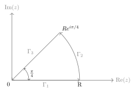
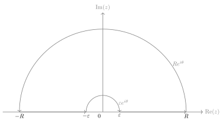
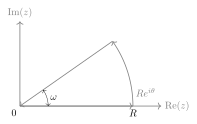

## Exercise
### Exercise 2.1
Prove that 
$$
\int_{0}^{\infty} \sin(x^{2}) \, \mathrm{d}x =\int_{0}^{\infty} \cos(x^{2}) \, \mathrm{d}x =\frac{\sqrt{ 2\pi }}{4}.
$$
Proof: 

 
 
Consider $f(z)=e^{-z^{2}}$ and the contour in the picture above, then
$$
0=\int_{0}^{R} e^{-x^{2}} \, \mathrm{d}x +\int_{0}^{\pi/4} e^{-R^{2}e^{2i\theta}}iRe^{i\theta} \, \mathrm{d}\theta+\int_{R}^{0} e^{-x^{2}e^{i\pi/2}}e^{i\pi/4} \, \mathrm{d}x .
$$
Note that
$$
\begin{align}
\lim_{ R \to \infty } \int_{0}^{R} e^{-x^{2}} \, \mathrm{d}x  & =\int_{0}^{\infty} e^{-x^{2}} \, \mathrm{d}x =\frac{\sqrt{ \pi }}{2},  \\
\lim_{ R \to \infty } \int_{0}^{R} e^{-x^{2}i} \, \mathrm{d}x  & =\int_{0}^{\infty} \cos(x^{2})-i\sin(x^{2}) \, \mathrm{d}x .
\end{align}
$$
Also
$$
\begin{align}
\left\lvert  \int_{0}^{\pi/4} e^{-R^{2}e^{2i\theta}}iR e^{i\theta} \, \mathrm{d}\theta   \right\rvert  & \leqslant \int_{0}^{\pi/4} e^{-R^{2}\cos 2\theta} \, \mathrm{d}\theta=\frac{1}{2}\int_{0}^{\pi/2} e^{-R^{2}\sin\theta} \, \mathrm{d}\theta\\
 & \leqslant \frac{1}{2}\int_{0}^{\pi/2}e^{-R^{2}2\theta/\pi}  \, \mathrm{d}\theta\leqslant \frac{\pi}{2R^{2}}\to 0.
\end{align}
$$
Hence
$$
\int_{0}^{\infty} \cos(x^{2})-i\sin (x^{2}) \, \mathrm{d}x =e^{-i\pi/4} \frac{\sqrt{ \pi }}{2}.
$$
### Exercise 2.2
Show that
$$
\int_{0}^{\infty} \frac{\sin x}{x} \, \mathrm{d}x =\frac{\pi}{2}.
$$
Proof: Consider $f(z)=\frac{e^{iz}-1}{z}$ and the contour

Then
$$
0=\int_{\lvert x \rvert \in[\varepsilon,R]}^{} \frac{e^{ix}-1}{x} \, \mathrm{d}x + i\int_{0}^{\pi} (e^{iRe^{i\theta}} -1)\, \mathrm{d}\theta-i\int_{0}^{\pi} (e^{i \varepsilon e^{i\theta}}-1) \, \mathrm{d}\theta.
$$
Note that
$$
\int_{\lvert x \rvert \in[\varepsilon,R]}^{} \frac{e^{ix}-1}{x} \, \mathrm{d}x =\int_{\varepsilon}^{R} \frac{\sin x}{x} \, \mathrm{d}x \to \int_{0}^{\infty} \frac{\sin x}{x} \, \mathrm{d}x .
$$
Similar to Exercise 2.1,
$$
\left\lvert  \int_{0}^{\pi} e^{i R e^{i\theta}} \, \mathrm{d}\theta   \right\rvert \leqslant O\left( \frac{1}{R} \right)\to 0.
$$
Also, by Lebesgue controlled convergence,
$$
\lim_{ \varepsilon \to 0 } \int_{0}^{\pi} (e^{i\varepsilon e^{i\theta}}-1) \, \mathrm{d}\theta=0. 
$$
Hence
$$
\int_{0}^{\infty} \frac{\sin x}{x} \, \mathrm{d}x =\frac{\pi}{2}.
$$
### Exercise 2.3
For $a,b>0$, calculate
$$
\int_{0}^{\infty} e^{-ax}\cos bx \, \mathrm{d}x ,\int_{0}^{\infty} e^{-ax}\sin bx \, \mathrm{d}x .
$$
Solution: Let $a+ib=Ae^{i\omega}$, where $A>0$, and consider $f(z)=e^{-Az}$ and the contour

 
Then
$$
0=\int_{0}^{R} e^{-Ax} \, \mathrm{d}x +\int_{0}^{\omega} e^{-AR e^{i\theta}} \, iRe^{i\theta}\mathrm{d}\theta +\int_{0}^{R} e^{-Axe^{i\theta}}e^{i\theta} \, \mathrm{d}x 
$$
Note that
$$
\begin{align}
\lim_{ R \to \infty } \int_{0}^{R} e^{-Ax} \, \mathrm{d}x  & = -\frac{1}{A}e^{-Ax}\Big\vert_{0}^{\infty}=\frac{1}{A}. \\
\lim_{ R \to \infty } \int_{0}^{R} e^{-Axe^{i\theta}}e^{i\theta} \, \mathrm{d}x  & =e^{i\theta}\int_{0}^{\infty} e^{-(a+ib)x} \, \mathrm{d}x .
\end{align}
$$
Also
$$
\left\lvert  \int_{0}^{\omega} e^{-AR e^{i\theta}}iR e^{i\theta} \, \mathrm{d}\theta  \right\rvert \leqslant R \int_{0}^{\omega} e^{-AR\cos\theta} \, \mathrm{d}\theta\leqslant R\omega e^{-AR\cos\omega} \to 0.
$$
Hence
$$
\int_{0}^{\infty} e^{-(a+ib)x} \, \mathrm{d}x =\frac{1}{a+ib},
$$
so
$$
\int_{0}^{\infty} e^{-ax}\cos bx \, \mathrm{d}x =\frac{a}{a^{2}+b^{2}},\int_{0}^{\infty} e^{-ax}\sin bx \, \mathrm{d}x =\frac{b}{a^{2}+b^{2}}.
$$
### Exercise 2.4
Prove that for any $\xi \in \mathbb{C}$,
$$
e^{-\pi\xi^{2}}=\int_{-\infty}^{\infty} e^{-\pi x^{2}}e^{2\pi i x \xi} \, \mathrm{d}x.
$$
Proof: Let $\xi=u+iv$, then
$$
\int_{\mathbb{R}}^{} e^{-\pi(x+i\xi)^{2}} \, \mathrm{d}x =0\iff \int_{\mathbb{R}}^{} e^{-\pi(x+iu)^{2}} \, \mathrm{d}x =0,
$$
which is already proved in Example 2.3.1.
### Exercise 2.5
If $f$ is continuously complex differentiable in an open set $U$ containing the triangle $T$, prove
$$
\int_{\partial T}^{} f(z) \, \mathrm{d}z=0 
$$
using Green theorem
$$
\int_{\partial T} Fdx+Gdy =\int_{T}^{} \left( \frac{\partial G}{\partial x}-\frac{\partial F}{\partial y} \right) \, \mathrm{d}x\mathrm{d}y .
$$
Proof: Let $f=u+iv$, then
$$
\begin{align}
\int_{\partial F}^{} f(z) \, \mathrm{d}z & =\int_{\partial T}^{} (u+iv) \, (\mathrm{d}x+i\mathrm{d}y)  \\
 & =\int_{\partial T}^{} u \, \mathrm{d}x -v\,\mathrm{d}y+i\int_{\partial T}^{} u \, \mathrm{d}y+v\,\mathrm{d}x  \\
 & =\int_{T}^{} \left( \frac{\partial u}{\partial y}+\frac{\partial v}{\partial x} \right) \, \mathrm{d}x \mathrm{d}y+i\int_{T}^{} \left( \frac{\partial v}{\partial y}-\frac{\partial u}{\partial x} \right) \, \mathrm{d}x \mathrm{d}y=0.
\end{align}
$$
### Exercise 2.6
Let $\Omega$ be an open subset of $\mathbb{C}$ and $T\subset\Omega$ be a triangle whose interior is also contained in $\Omega$. Suppose that $f$ is a function holomorphic in $\Omega$ except possibly at a point $\omega$ inside $T$. Prove that if $f$ is bounded near $\omega$, then
$$
\int_{T}f(z)\,\mathrm{d}z=0.
$$
Proof: Let $T_{0}=T$, and define $T_{n}$ as follows: divide $T_{n-1}$ into four triangles, and denote the one containing $w$ as $T_{n}$. Then $\mathrm{diam}T_{n}\to 0$ so for $n$ large enough, $T_{n}\subset O_{w}$ where $O_{w}$ is the neighborhood of $w$ where $f$ is bounded by $M$. By Goursat’s theorem,
$$
\left\lvert  \int_{T}f(z)\,\mathrm{d}z  \right\rvert = \left\lvert  \int_{T_{n}}^{} f(z) \, \mathrm{d}z  \right\rvert \leqslant M\mathrm{length}(T_{n})\to 0.
$$
Hence
$$
\int_{T}^{} f(z) \, \mathrm{d}z=0. 
$$
### Exercise 2.7
Suppose $f:\mathbb{D}\to \mathbb{C}$ is holomorphic. Show that the diameter $d=\sup_{z,w\in \mathbb{D}}{\lvert f(z)-f(w) \rvert}$ of $f(\mathbb{D})$ satisfies
$$
2\lvert f^{\prime}(0) \rvert \leqslant d.
$$
Moreover, it can be shown that equality holds precisely when $f(z)=a_{0}+a_{1}z$.
Proof: By the Cauchy integral formula, for any $r\in(0,1)$,
$$
2f^{\prime}(0)=\frac{1}{\pi i}\int_{\lvert \zeta \rvert =r}^{} \frac{f(\zeta)}{\zeta^{2}} \, \mathrm{d}\zeta =\frac{1}{2\pi i}\int_{\lvert \zeta \rvert =r}^{} \frac{f(\zeta)-f(-\zeta)}{\zeta^{2}} \, \mathrm{d}\zeta. 
$$
Hence
$$
2\lvert f^{\prime}(0) \rvert \leqslant \frac{1}{2\pi} \int_{0}^{2\pi} \frac{d}{r} \, \mathrm{d}x =\frac{d}{r}.
$$
Let $r\to 1$ then $2\lvert f^{\prime}(0) \rvert\leqslant d$.
The equality condition can be proved by the Schwarz lemma.
### Exercise 2.8
If $f$ is a holomorphic function on the strip $-1<y<1,x\in \mathbb{R}$ with
$$
\lvert f(z) \rvert \leqslant A(1+\lvert z \rvert )^{\eta},\,\eta\text{ a fixed real number}
$$
for all $z$. Show that for each integer $n\geqslant 0$, there exists $A_{n}\geqslant 0$ so that
$$
\lvert f^{(n)}(x) \rvert \leqslant A_{n}(1+\lvert x \rvert )^{\eta},\,\forall x\in \mathbb{R}.
$$
Proof: By Cauchy’s inequality:
$$
\lvert f^{(n)}(x) \rvert \leqslant 2^{n}n!\sup_{\lvert \zeta-x \rvert =1 /2}{\lvert f(\zeta) \rvert }\leqslant 2^{n}n!A\sup_{\lvert \zeta-x \rvert =1 /2}{(1+\lvert \zeta \rvert )^{\eta}}\leqslant 2^{n}n! \left( \frac{3}{2} \right)^{\eta}A(1+\lvert x \rvert )^{\eta}.
$$
(Since $1+\lvert \zeta \rvert\leqslant \lvert x \rvert+3 /2\leqslant \frac{3}{2}(1+\lvert x \rvert)$.)
### Exercise 2.9
Let $\Omega$ be a bounded open subset of $\mathbb{C}$, and $\varphi:\Omega\to \Omega$ a holomorphic function. Prove that if there exists a point $z_{0}\in\Omega$ such that
$$
\varphi(z_{0})=z_{0},\,\text{and } \varphi^{\prime}(z_{0})=1
$$
then $\varphi$ is linear.
Proof: We can assume $z_{0}=0$, otherwise consider $\psi(z)=\varphi(z+z_{0})-z_{0}$ and $\Omega^{\prime}=\Omega-z_{0}$. Let $\varphi(z)=z+a_{n}z^{n}+O(z^{n+1})$, and $\varphi_{k}=\varphi \circ\cdots\circ\varphi$, then by Cauchy’s inequality,
$$
k\lvert a_{n} \rvert =\lvert \varphi_{k}^{(n)}(0) \rvert \leqslant \frac{n!M}{r^{n}}.
$$
where $M=\sup_{z\in\Omega}{\lvert z \rvert}$. Hence $\lvert a_{n} \rvert \leqslant n!M /r^{n}k$, and let $k\to \infty$ we obtain $a_{n}=0$. Hence $\varphi$ is linear.
### Exercise 2.10
Weierstrass’s theorem states that a continuous function on $[0,1]$ can be uniformly approximated by polynomials. Can every continuous function on the closed unit disc be approximated uniformly by polynomials in the variable $z$?
Solution: No. The uniform limit of polynomials is holomorphic, but some continuous functions are not holomorphic (like $\mathrm{Re}(z)$).
### Exercise 2.11
Let $f$ be a holomorphic function on the disc $D_{R_{0}}$ centered at the origin and of radius $R_{0}$.
(a) Prove that whenever $0<R<R_{0}$ and $\lvert z \rvert<R$, then
$$
f(z)=\frac{1}{2\pi}\int_{0}^{2\pi} f(Re^{i\varphi})\mathrm{Re}\left( \frac{R e^{i\varphi}+z}{R e^{i\varphi}-z} \right) \, \mathrm{d}\varphi.
$$
Proof: Let $\zeta=R e^{i\varphi}$, then
$$
\mathrm{Re}\left( \frac{\zeta-z}{\zeta-z} \right)=\frac{\lvert \zeta \rvert ^{2}-\lvert z \rvert^{2} }{\lvert \zeta-z \rvert ^{2}}= \frac{\zeta}{\zeta-z}+\frac{\bar{z}}{\bar{\zeta}-\bar{z}}.
$$
Note that 
$$
f(z)=\frac{1}{2\pi} \int_{0}^{2\pi} f(\zeta) \frac{\zeta}{\zeta-z} \, \mathrm{d}\varphi 
$$
and since $R^{2} /\bar{z}$ is outside $D_{R_{0}}$, 
$$
0=\frac{1}{2\pi}\int_{0}^{2\pi} f(\zeta) \frac{\zeta}{\zeta-R^{2} /\bar{z}} \, \mathrm{d}\varphi=\frac{1}{2\pi} \int_{0}^{2\pi} f(\zeta) \frac{\bar{z}}{\bar{\zeta}-\bar{z}} \, \mathrm{d}\varphi 
$$
Hence
$$
f(z)=\frac{1}{2\pi}\int_{0}^{2\pi} f(\zeta) \mathrm{Re}\left( \frac{\zeta+z}{\zeta-z} \right) \, \mathrm{d}\varphi .
$$
(b) Show that
$$
\mathrm{Re}\left( \frac{R e^{i\gamma}+r}{R e^{i \gamma}-r} \right)=\frac{R^{2}-r^{2}}{R^{2}-2Rr\cos\gamma+r^{2}}.
$$
Proof: 
$$
\mathrm{Re}\left( \frac{Re^{i\gamma}+r}{R e^{i\gamma}-r} \right)=\frac{R^{2}-r^{2}}{\lvert Re^{i\gamma}-r \rvert ^{2}}= \frac{R^{2}-r^{2}}{R^{2}-2Rr\cos\gamma+r^{2}}.
$$
### Exercise 2.12
Let $u$ be a real-valued function defined on the unit disc $\mathbb{D}$. Suppose that $u$ is twice continuously differentiable and harmonic, i.e. $\triangle u(x,y)=0$ for all $(x,y)\in \mathbb{D}$.
(a) Prove that there exists a holomorphic function $f$ on the unit disc such that $\mathrm{Re}(f)=u$. Also show that the imaginary part of $f$ is uniquely defined up to an additive (real) constant.
Proof: Let $g=2\frac{\partial u}{\partial z}$, then $\frac{\partial g}{\partial \bar{z}}=2 \frac{\partial}{\partial \bar{z}}\frac{\partial}{\partial z}u=0$ so $g$ is holomorphic. By Theorem2.1 $g$ has a primitive $F$ on $\mathbb{D}$. Note that
$$
F(z)=\int_{0}^{z} \frac{\partial u}{\partial x}-i \frac{\partial u}{\partial y} \, \mathrm{d}z =u(z)+iv(z)+C,
$$
so $\mathrm{Re}(F)-u$ is a (real) constant, and $\mathrm{Im}(F)-v$ is also a real constant.
(b) Deduce from this result, and from Exercise 2.11, the Poisson integral representation formula from the Cauchy integral formula: If $u$ is harmonic in $\mathbb{D}$ and continuous on its closure, then if $z=r e^{i\theta}$ one has
$$
u(z)=\frac{1}{2\pi}\int_{0}^{2\pi} P_{r}(\theta-\varphi)u(e^{i\varphi}) \, \mathrm{d}\varphi
$$
where $P_{r}(\gamma)$ is the Poisson kernel for the unit disc given by
$$
P_{r}(\gamma)=\frac{1-r^{2}}{1-2r\cos\gamma+r^{2}}.
$$
Proof: Let $f$ be the holomorphic function such that $\mathrm{Re}(f)=u$, then by Exercise2.11, for $z=r e^{i\theta}$,
$$
f(z)=\frac{1}{2\pi}\int_{0}^{2\pi} f(Re^{i\varphi}) \mathrm{Re}\left( \frac{Re^{i\varphi}+z}{Re^{i\varphi}-z} \right) \, \mathrm{d}\varphi=\frac{1}{2\pi} \int_{0}^{2\pi} f(Re^{i\varphi})P_{r /R}(\theta-\varphi) \, \mathrm{d}\varphi.  
$$
Take the real part of both sides and let $R\to 1$ (since $P_{r}$ and $u$ are both uniformly continuous on $\overline{\mathbb{D}}$), we obtain
$$
u(z)=\frac{1}{2\pi}\int_{0}^{2\pi} P_{r}(\theta-\varphi)u(e ^{i\varphi}) \, \mathrm{d}\varphi. 
$$
### Exercise 2.13
Suppose $f$ is an analytic function defined everywhere in $\mathbb{C}$ and such that for each $z_{0}\in \mathbb{C}$ at least one coefficient in the expansion
$$
f(z)=\sum_{n=0}^{\infty}{c_{n}(z-z_{0})^{n}}
$$
is equal to $0$. Prove that $f$ is a polynomial.
Proof: Let $A_{n}=\{ z\in \mathbb{C}: f^{(n)}(z)=0 \}$, then $\mathbb{C}=\bigcup_{n\geqslant 0}A_{n}$ so there exists $n$ such that $A_{n}$ is uncountable. Hence $A_{n}$ has a limit point so $f^{(n)}\equiv 0$ i.e. $f$ is a polynomial.
### Exercise 2.14
Suppose $f$ is holomorphic in an open set containing the closed unit disc, except for a pole at $z_{0}$ on the unit circle. Show that if $\sum_{n=0}^{\infty}{a_{n}z^{n}}$ denotes the power series expansion of $f$ in the open unit disc, then
$$
\lim_{ n \to \infty } \frac{a_{n}}{a_{n+1}}=z_{0}.
$$
Proof: Consider the Laurent series of $f$ at $z_{0}$:
$$
f(z)=\sum_{k=1}^{N}{\frac{d_{-k}}{(z-z_{0})^{k}}}+\sum_{k=0}^{\infty}{d_{k}(z-z_{0})^{k}}.
$$
Let $g(z)=\sum_{k=1}^{N}{\frac{d_{-k}}{(z-z_{0})^{k}}}$ and $h(z)=f(z)-g(z)$, then $h$ is holomorphic in a disc $B(0,R)$ where $R>1$. Write $g(z)=\sum_{k=0}^{\infty}{b_{k}z^{k}}$ and $h(z)=\sum_{k=0}^{\infty}{c_{k}z^{k}}$, then by Cauchy’s inequality, $\lvert c_{k} \rvert\leqslant M /r^{k}$ where $r\in(1,R)$ and $M=\sup_{\lvert z \rvert\leqslant r}{\lvert h(z) \rvert}$. Note that $a_{n}=b_{n}+c_{n}$, and
$$
\begin{align}
g(z) & =\sum_{k=1}^{N}{\frac{d_{-k}(-1)^{k}}{z_{0}^{k} (1-z /z_{0})^{k}}}=\sum_{k=1}^{N}{\frac{d_{-k}(-1)^{k}}{z_{0}^{k}}\sum_{j=0}^{\infty}{\binom{k+j-1}{j}\left( \frac{z}{z_{0}} \right)^{j}}}\\
  & =\sum_{j=0}^{\infty}{z^{j} \sum_{k=1}^{N}{\frac{d_{-k}(-1)^{k}}{z_{0}^{k+j}}\cdot \binom{k+j-1}{k-1}}}.
\end{align}
$$
Hence $b_{n}=P(n) z_{0}^{-n}$ where $P$ is a polynomial.
$$
\lim_{ n \to \infty } \frac{a_{n}}{a_{n+1}}=\lim_{ n \to \infty } \frac{b_{n}+c_{n}}{b_{n+1}+c_{n+1}}=\lim_{ n \to \infty } \frac{1+c_{n} /b_{n}}{b_{n+1} /b_{n}+c_{n+1} /b_{n}}.
$$
Clearly $\lim_{ n \to \infty }c_{n} /b_{n}=\lim_{ n \to \infty }c_{n+1} /b_{n}=0$ (since $\lvert b_{n} \rvert=\lvert P(n) \rvert\to \infty$) and $\lim_{ n \to \infty }b_{n} /b_{n+1}=z_{0}$, therefore $\lim_{ n \to \infty }a_{n} /a_{n+1}=z_{0}$.
### Exercise 2.15
Suppose $f$ is a non-vanishing continuous function on $\overline{\mathbb{D}}$ that is holomorphic in $\mathbb{D}$. Prove that if 
$$
\lvert f(z) \rvert =1\text{ whenever } \lvert z \rvert =1,
$$
then $f$ is constant.
Proof: Extend $f$ to $\mathbb{C}$ by defining $f(z)=\overline{f(1 /\bar{z})}$ as in Schwarz reflection principle, then $f$ is holomorphic and entire, hence constant. 
## Problems
### Problem 2.1
Here are some examples of analytic functions on the unit disc that cannot be extended analytically past the unit circle. The following definition is needed. Let $f$ be a function defined in the unit disc $\mathbb{D}$, with boundary circle $C$. A point $w$ on $C$ is said to be regular for $f$ if there is an open neighborhood $U$ of $w$ and an analytic function $g$ on $U$, so that $f=g$ on $\mathbb{D}\cap U$. A function $f$ defined on $\mathbb{D}$ cannot be continued analytically past the unit circle if no point of $C$ is regular for $f$.
(a) Let 
$$
f(z)=\sum_{n=0}^{\infty}{z^{2^{n}}}\,\text{ for } \lvert z \rvert <1.
$$
Notice that the radius of convergence of the above series is $1$. Show that $f$ cannot be continued analytically past the unit disc.
Proof: For $\theta=2\pi p 2^{-k}$ where $p,k\in \mathbb{N}$, 
$$
\lim_{ r \to 1 } f(r e^{i\theta})=\sum_{n=0}^{k}{(re^{i\theta})^{2^{n}}}+\sum_{n=k+1}^{\infty}{r^{2^{n}}}\to \infty.
$$
Since $2\pi p 2^{-k}$ is dense on $\mathbb{S}^{1}$, $f$ can’t be continuously continued past the unit circle.
(b)$^{*}$ Fix $0<\alpha<\infty$. Show that the analytic function $f$ defined by
$$
f(z)=\sum_{n=0}^{\infty}{2^{-n\alpha}z^{2^{n}}}\,\text{ for }\lvert z \rvert <1
$$
extends continuously to the unit circle, but cannot be analytically continued past the unit circle.
Proof: Likewise, if $f$ can be analytically continued past the unit circle, let $m=\lfloor \alpha \rfloor+1$ and $g_{0}=f,g_{n}=(zg_{n-1})^{\prime}$, then $g_{m}$ is continuous on $\overline{\mathbb{D}}$. However, any $\theta=2\pi p 2^{-k}$, 
$$
\lim_{ r \to 1 } g_{m}(r e^{i\theta})=\lim_{ r \to 1 } 2^{-m\alpha}\sum_{n=0}^{\infty}{2^{n(m-\alpha)}z^{2^{n}}}\to \infty,
$$
Therefore $f$ can’t be analytically continued past the unit circle.
### Problem 2.2
Let
$$
F(z)=\sum_{n=1}^{\infty}{d(n)z^{n}}\,\text{ for }\lvert z \rvert <1
$$
where $d(n)$ denotes the number of divisors of $n$. Observe that the radius of convergence of this series is $1$. Verify the identity
$$
\sum_{n=1}^{\infty}{d(n)z^{n}}=\sum_{n=1}^{\infty}{\frac{z^{n}}{1-z^{n}}}.
$$
Using this identity, show that if $z=r$ with $0<r<1$, then
$$
\lvert F(r) \rvert \geqslant c \frac{1}{1-r} \log(1 /(1-r))
$$
as $r\to 1$. Similarly, if $\theta=2\pi p /q$ where $p,q\in \mathbb{Z}_{+}$ and $z=re^{i\theta}$ then
$$
\lvert F(r e^{i\theta}) \rvert \geqslant c_{p /q} \frac{1}{1-r} \log(1 /(1-r))
$$
as $r\to 1$. Conclude that $F$ cannot be continued analytically past the unit disc.
Proof: Note that $d(n)\in[0,n]$, so $\limsup_{ n \to \infty }(d(n))^{1/n}=1$ and the radius of convergence is $1$. 
$$
\sum_{n=1}^{\infty}{d(n)z^{n}}=\sum_{n=1}^{\infty}{\sum_{m\mid n}^{}{z^{n}}}=\sum_{m=1}^{\infty}{\sum_{k=1}^{\infty}{z^{km}}}=\sum_{m=1}^{\infty}{\frac{z^{m}}{1-z^{m}}}.
$$
For $z=r\in(0,1)$, 
$$
\lvert F(r) \rvert =\left\lvert  \sum_{m=1}^{\infty}{\frac{r^{m}}{1-r^{m}}}  \right\rvert \geqslant \frac{1}{1-r}\sum_{m=1}^{\infty}{\frac{r^{m}}{m}}=\frac{1}{1-r}\log\left( \frac{1}{1-r} \right).
$$
For $z=re^{i\theta}$ where $\theta=2\pi p /q$ and $p,q\in \mathbb{Z}_{+}$,
$$
\lvert F(re^{i\theta}) \rvert = \left\lvert  \sum_{t=1}^{q}{\sum_{m=0}^{\infty}{r^{mq+t} \frac{e^{it\theta}}{1-r^{mq+t}e^{it\theta}}}}  \right\rvert .
$$
Note that when $t=q$,
$$
\sum_{m=0}^{\infty}{\frac{r^{mq+t}e^{it\theta}}{1-r^{mq+t}e^{it\theta}}}=\sum_{m=1}^{\infty}{\frac{r^{mq}}{1-r^{mq}}}\geqslant\frac{1}{1-r^{q}} \log\left( \frac{1}{1-r^{q}} \right)\geqslant \frac{1 /q}{1-r}\log\left( \frac{1 /q}{1-r} \right),
$$
and when $t\in \{ 1,\cdots,q-1 \}$,
$$
\left\lvert \sum_{m=0}^{\infty}{\frac{r^{mq+t}e^{it\theta}}{1-r^{mq+t}e^{it\theta}}} \right\rvert\leqslant r^{t}\left\lvert  \sum_{m=0}^{\infty}{\frac{r^{mq}}{1-\cos t\theta}}  \right\rvert =Cr^{t} \frac{1}{1-r^{q}}\leqslant \frac{Cr^{t}}{1-r}.
$$
Hence
$$
\lvert F(re^{i\theta}) \rvert \geqslant c_{q} \frac{1}{1-r}\log\left( \frac{1}{1-r} \right).
$$
Since $e^{i 2\pi p /q}$ is dense on $\mathbb{S}^{1}$, $F$ cannot be analytically continued past the unit disc.
### Problem 2.3
Morera’s theorem states that if $f$ is continuous in $\mathbb{C}$ and $\int_{T}f(z)\,\mathrm{d}z=0$ for all triangles $T$, then $f$ is holomorphic in $\mathbb{C}$. Naturally, we may ask if the conclusion still holds if we replace triangles by other sets.
(a) Suppose that $f$ is continuous on $\mathbb{C}$, and
$$
\int_{C}^{} f(z) \, \mathrm{d}z=0
$$
fir every circle $C$. Prove that $f$ is holomorphic.
(b) More generally, let $\Gamma$ be any toy contour, and $\mathcal{F}$ the collection of all translates and dilates of $\Gamma$. Show that if $f$ is continuous on $\mathbb{C}$, and
$$
\int_{\gamma}^{} f(z) \, \mathrm{d}z=0\,\text{ for all }\gamma \in \mathcal{F} .
$$
then $f$ is holomorphic. In particular, Morris’s theorem holds under the weaker assumption that $\int_{T}^{} f(z) \, \mathrm{d}z=0$ for all equilateral triangles.
Proof: If $f$ is continuously differentiable, then by Green’s theorem, for any $\Omega \subset \mathbb{C}$ and $\gamma=\partial\Omega \in \mathcal{F}$,
$$
0=\int_{\gamma}^{} f(z) \, \mathrm{d}z =\int_{\Omega}^{} \left( \frac{\partial u}{\partial y}+\frac{\partial v}{\partial x} \right) \, \mathrm{d}x\mathrm{d}y +i \int_{\Omega}^{} \left( \frac{\partial u}{\partial x}-\frac{\partial v}{\partial y} \right) \, \mathrm{d}x\mathrm{d}y. 
$$
Note that $\frac{\partial u}{\partial y}+\frac{\partial v}{\partial x}$ is continuous and real-valued, hence $f$ satisfy the Cauchy-Riemann equations.
Any continuous function $f$, can be uniformly approximated by smooth functions $f_{\varepsilon}$ such that $f_{\varepsilon}=f*\varphi_{\varepsilon}$ where $\varphi_{\varepsilon}(\mathbf{x})=\varepsilon ^{-2}\varphi(\varepsilon ^{-1}\mathbf{x})$ are the mollifiers, $\varphi(\mathbf{x})=c\phi(1-\lvert \mathbf{x} \rvert^{2})$ and $\phi(x)=\begin{cases}e^{-1/x^{2}}, & x>0\\0, & x\leqslant 0\end{cases}$.
### Problem 2.4
Prove the converse to Runge’s theorem: if $K$ is a compact set whose complement is not connected, then there exists a function $f$ holomorphic in a neighborhood of $K$ which cannot be approximated uniformly by polynomials on $K$.
Proof: If $K^{C}$ is not connected, take one bounded component $G$, and any element $z_{0}\in G$. If $f(z)=1 /(z-z_{0})$ can be uniformly approximated by polynomials $\{ P_{n} \}$ on $K$, then there exists a polynomial $p$ such that 
$$
\left\lvert  p(z)-\frac{1}{z-z_{0}}  \right\rvert < d(K,z_{0})\leqslant \left\lvert  \frac{1}{z-z_{0}}  \right\rvert .
$$
Hence $\lvert (z-z_{0})p(z)-1 \rvert<1$. By the maximum modulus principle in Chapter3, this inequality also hold for all $z\in G$, leading to contradiction.
### Problem 2.5$^{*}$
There exists an entire function $F$ with the following “universal” property: given any entire function $h$, there is an increasing sequence $\{ N_{k} \}_{k=1}^{\infty}$ of positive integers, so that
$$
\lim_{ n \to \infty } F(z+N_{n})=h(z)
$$
uniformly on every compact subset of $\mathbb{C}$.
(a) Let $p_{1},p_{2},\cdots$ denote an enumeration of the collection of polynomials whose coefficients have rational real and imaginary parts. Show that it suffices to find an entire function $F$ and an increasing sequence $\{ M_{n} \}$ of positive integers, such that
$$
\lvert F(z)-p_{n}(z-M_{n}) \rvert <\frac{1}{n} \text{  whenever } z\in D_{n}, \tag{$\star$}
$$
where $D_{n}$ denotes the disc centered at $M_{n}$ and or radius $n$.
Proof: For any such $F$, and any entire function $h$, take a sequence of polynomials $\{ p_{n_{k}} \}_{k\geqslant 1}$ such that $\lim_{ k \to \infty }p_{n_{k}}(z)=h(z)$ on any compact subset of $\mathbb{C}$ (let $p_{n_{k}}(z)=\sum_{j=0}^{k}{\frac{h^{(j)}(0)}{j!}z^{j}}$). Then for any $N>0$, $z\in B(0,N)$, and $k$ sufficiently large,
$$
\lvert F(z+M_{n_{k}}) -h(z)\rvert \leqslant \lvert F(z+M_{n_{k}})-p_{n_{k}}(z) \rvert +\lvert p_{n_{k}}(z)-h(z) \rvert < \frac{1}{n_{k}}+\varepsilon(n_{k}).
$$
Hence $\lim_{ k \to \infty }F(z+M_{n_{K}})=h(z)$ converges uniformly on $B(0,N)$.
(b) Construct $F$ satisfying $(\star)$ as an infinite series
$$
F(z)=\sum_{n=1}^{\infty}{u_{n}(z)}
$$
where $u_{n}(z)=p_{n}(z-M_{n})e^{-c_{n}(z-M_{n})^{2}}$, and the quantities $c_{n}>0$ and $M_{n}>0$ are chosen appropriately with $c_{n}\to 0$ and $M_{n}\to \infty$.
Proof: Note that
$$
\lvert F(z)-p_{n}(z-M_{n}) \rvert \leqslant \sum_{k=1}^{n-1}+\sum_{k=n+1}^{\infty}{}{\lvert p_{k}(z-M_{k})e^{-c_{k}(z-M_{K})^{2}} \rvert }+\lvert p_{n}(z-M_{n}) \rvert \cdot \lvert 1-e^{-c_{n}(z-M_{n})^{2}} \rvert .
$$
Take $c_{n}\leqslant c_{n-1}$ and $c_{n}\leqslant(2^{n+1}n^{2}\max\{ 1,M \})^{-1}$ where $M=\sup_{\lvert z \rvert\leqslant n}{\lvert p_{n}(z) \rvert}$, then for any $\lvert z-M_{n} \rvert<n$,
$$
\lvert 1-e^{-c_{k}(z-M_{n})^{2}} \rvert \leqslant 2\lvert c_{k}(z-M_{n})^{2} \rvert \leqslant \frac{1}{2^{n}M}\implies \lvert p_{n}(z-M_{n}) \rvert \cdot \lvert 1-e^{-c_{n}(z-M_{n})^{2}} \rvert <2^{-n}.
$$
For $n\geqslant 1$, let $d=\max\{ \deg p_{k}:1\leqslant k\leqslant n \}$, and $A$ be the largest coefficient of $z^{d}$, then there exists $N>0$ such that $\lvert z \rvert>N$ implies $\lvert p_{k}(z) \rvert\leqslant 2A \lvert z \rvert^{d}$. For $M_{n}$ sufficiently large, and $\lvert z \rvert\leqslant n$, $\lvert e^{(z+M_{n}-M_{k})^{2}} \rvert\geqslant e^{(M_{n}-M_{k}-n)^{2}}\geqslant e^{M_{n}^{2} /2}$. Let $c=\min\{ c_{1},\cdots,c_{n} \}$, then for any $1\leqslant k\leqslant n$, and $\lvert z \rvert\leqslant n$,
$$
\lvert p_{k}(z+M_{n}-M_{k})e^{-c_{k}(z+M_{n}-M_{k})^{2}} \rvert,\lvert p_{n}(z+M_{k}-M_{n})e^{-c_{n}(z+M_{k}-M_{n})^{2}} \rvert  \leqslant 2A(2M_{n})^{d}e^{-cM_{n}^{2} /2}
$$
which tends to $0$. Hence we can take $M_{n}$ sufficiently large such that $2A(2M_{n})^{d}e^{-cM_{n}^{2}/2}<2^{-n}$. Then for any $z\in B(M_{n},n)$,
$$
\lvert F(z)-p_{n}(z-M_{n}) \rvert \leqslant \sum_{k=1}^{n-1}{2^{-n}}+2^{-n}+\sum_{k=n+1}^{\infty}{2^{-k}}=(n+1)2^{-n}.
$$
Hence we obtain the desired universal function $F$.

---
In the same spirit, there exists an alternate “universal” entire function $G$ with the following property: given any entire function $h$, there is an increasing sequence $\{ N_{k} \}_{k=1}^{\infty}$ of positive integers, so that
$$
\lim_{ k \to \infty } D^{N_{k}}G(z)=h(z)
$$
uniformly on every compact subset of $\mathbb{C}$. Here $D^{j}G$ denotes the $j^{th}$ complex derivative of $G$.
