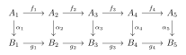
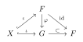
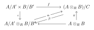
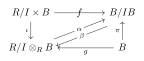

## Section 4.1 Modules, Homomorphisms and Exact Sequences
**Note:** $R$ is a ring.
### 4.1.1
If $A$ is an abelian group and $n > 0$ an integer such that $na = 0$ for all $a \in A$, then $A$ is a unitary $\mathbb{Z}_n$-module, with the action of $\mathbb{Z}_n$ on $A$ given by $\bar{k}a = ka$, where $k \in \mathbb{Z}$ and $k \mapsto \bar{k} \in \mathbb{Z}_n$ under the canonical projection $\mathbb{Z} \to \mathbb{Z}_n$.
Trivial.

### 4.1.2
Let $f: A \to B$ be an $R$-module homomorphism.
(a) $f$ is a monomorphism if and only if for every pair of $R$-module homomorphisms $g,h: D \to A$ such that $fg = fh$, we have $g = h$.
(b) $f$ is an epimorphism if and only if for every pair of $R$-module homomorphisms $k,t: B \to C$ such that $kf = tf$, we have $k = t$.
Proof: (a) If $f$ is a monomorphism, then for any $g,h:D\to A$ such that $fg=fh$, $\forall d\in D,f(g(d))=f(h(d))$ implies $g(d)=h(d)$, so $g=h$.
Conversely, let $D=\mathrm{Ker}f$ $g$ be the inclusion map and $h$ the zero map, then $fg=0=fh$ implies $g=h$ and $\mathrm{Ker}f=0$, so $f$ is a monomorphism.
(b) If $f$ is an epimorphism, for any $k,t:B\to C$ such that $kf=tf$, $\forall b\in B,\exists a\in A,f(a)=b$, then $k(b)=k(f(a))=t(f(a))=t(b)$ so $k=t$.
Conversely, let $C=B /\mathrm{Im}f$, $k$ be the projection and $t$ be the zero map, then $kf=0=tf$ implies $k=t$ and $\mathrm{Im}f=B$, so $f$ is an epimorphism.
### 4.1.3
Let $I$ be a left ideal of a ring $R$ and $A$ an $R$-module.
(a) If $S$ is a nonempty subset of $A$, then $IS = \left\{ \sum_{i=1}^n r_i a_i \mid n \in \mathbb{N}^*; r_i \in I; a_i \in S \right\}$ is a submodule of $A$. Note that if $S = \{a\}$, then $IS = Ia = \{ra \mid r \in I\}$.
(b) If $I$ is a two-sided ideal, then $A/IA$ is an $R/I$-module with the action of $R/I$ given by $(r + I)(a + IA) = ra + IA$.
Proof: (a) Clearly $IS$ is an additive subgroup. For any $x\in R$ and $\sum_{i=1}^{n}{r_{i}a_{i}}\in IS$, $xr_{i}\in I\forall 1\leqslant i\leqslant n$, so $x\sum_{i=1}^{n}{r_{i}a_{i}}=\sum_{i=1}^{n}{(xr_{i})a_{i}}\in IS$. Hence $IS$ is a submodule.
(b) If $r+I=s+I$ and $a+IA=b+IA$, then $r-s\in I$ and $a-b\in IA$ implies $ra-sb=r(a-b)+(r-s)b\in IA$. So the action is well-defined. It is easy to verify the action induces a module.
### 4.1.4
If $R$ has an identity, then every unitary cyclic $R$-module is isomorphic to an $R$-module of the form $R/J$, where $J$ is a left ideal of $R$.
Proof: For every cyclic unitary $R-$module $A=(a)$, let $J=\{ r\in R:ra=0 \}$, then it is easy to verify that $J$ is a left ideal of $R$. Consider $\varphi:A\to R /J,ra\mapsto r+J$. Note that $ra=sa\iff r-s\in J\iff r+J=s+J$, hence $\varphi$ is well-defined and injective. Clearly $\varphi$ is surjective.
Note that $\varphi(ra+sa)=\varphi((r+s)a)=(r+s)+J=\varphi(ra)+\varphi(sa)$, and $\varphi(rsa)=rs+J=r\varphi(sa)$, so $\varphi$ is a $R-$module isomorphism.
(Or consider $\Phi:R\to A,r\mapsto ra$ then $A\cong R /\mathrm{Ker}\Phi$ where $\mathrm{Ker}\Phi$ is a left ideal.)
### 4.1.5
If $R$ has an identity, then a nonzero unitary $R$-module $A$ is **simple** if its only submodules are $0$ and $A$.
(a) Every simple $R$-module is cyclic.
(b) If $A$ is simple every $R$-module endomorphism is either the zero map or an isomorphism.
Proof: (a) For any nonzero element $a\in A$, $A$ is simple implies the submodule $(a)=A$, so $A$ is cyclic.
(b) Suppose $A=(a)$, then for any endomorphism $f:A\to A$, if $f(a)=0$ then $f$ is the zero map. Otherwise $f(a)\neq 0$ so $A=(f(a))\subset\mathrm{Im}f$, hence $f$ is surjective. Note that $\mathrm{Ker}f$ is a submodule, and $\mathrm{Ker}f\neq A$ since $f\neq 0$, so $\mathrm{Ker}f=0$ and $f$ is an isomorphism.
### 4.1.6
A finitely generated $R$-module need not be finitely generated as an abelian group.
Proof: By Exercise2.1.10, $\mathbb{Q}$ is not a finitely generated abelian group, but $\mathbb{Q}=(1)$ as a $\mathbb{Q}-$module.
### 4.1.7
(a) If $A$ and $B$ are $R$-modules, then the set $\operatorname{Hom}_R(A,B)$ of all $R$-module homomorphisms $A \to B$ is an abelian group with $f + g$ given on $a \in A$ by $(f + g)(a) = f(a) + g(a) \in B$. The identity element is the zero map.
(b) $\operatorname{Hom}_R(A,A)$ is a ring with identity, where multiplication is composition of functions. $\operatorname{Hom}_R(A,A)$ is called the **endomorphism ring** of $A$.
(c) $A$ is a left $\operatorname{Hom}_R(A,A)$-module with $fa$ defined to be
$$
f(a)\, \forall a \in A, f \in \operatorname{Hom}_R(A,A)
$$
Proof: (a) Note that $(f+g)(a+b)=f(a+b)+g(a+b)=(f+g)(a)+(f+g)(b)$, and $(f+g)(ra)=f(ra)+g(ra)=rf(a)+rg(a)=r(f+g)(a)$, so $f+g\in \mathrm{Hom}_{R}(A,B)$. Clearly addition is associative and commutative, and the identity is the zero map, the inverse of $f$ is $(-f):a\mapsto-f(a)$.
(b) By (a) $\mathrm{Hom}_{R}(A,A)$ is an abelian group. Clearly $\mathrm{Hom}_{R}(A,A)$ is closed under composition and composition is associative. If $f,g,h\in \mathrm{Hom}_{R}(A,A)$, then $(f(g+h))(a)=f(g(a)+h(a))=fg(a)+fh(a)$ so $f(g+h)=fg+fh$. Likewise $((f+g)h)(a)=f(h(a))+g(h(a))=(fh+gh)(a)$ so $(f+g)h=fh+gh$. Hence $\mathrm{Hom}_{R}(A,A)$ is a ring with identity $1_{A}$.
(c) Note that $(f+g)a=(f+g)(a)=f(a)+g(a)=fa+ga$, $f\cdot(a+b)=f(a+b)=f(a)+f(b)=fa+fb$, and $(fg)a=fg(a)=f(ga)$, so $A$ is a left $\mathrm{Hom}_{R}(A,A)-$module.
### 4.1.8
Prove that the obvious analogues of Theorem I.8.10 and Corollary I.8.11 are valid for $R$-modules.
Just verify they are also module isomorphisms.
### 4.1.9
If $f: A \to A$ is an $R$-module homomorphism such that $ff = f$, then
$$A = \operatorname{Ker} f \oplus \operatorname{Im} f$$
Proof: For any $a\in A$, $a=f(a)+(a-f(a))$ where $f(a)\in \mathrm{Im}f$ and $a-f(a)\in \mathrm{Ker}f$, so $A=\mathrm{Ker}f+\mathrm{Im}f$.
If $a\in \mathrm{Ker}f\cap \mathrm{Im}f$, suppose $a=f(b)$, then $a=f(b)=f(f(b))=f(a)=0$, hence $\mathrm{Ker}f\cap \mathrm{Im}f=0$ and $A=\mathrm{Ker}f\oplus \mathrm{Im}f$.
### 4.1.10
Let $A, A_1, \dots, A_n$ be $R$-modules. Then $A \cong A_1 \oplus \cdots \oplus A_n$ if and only if for each $i = 1, 2, \dots, n$ there is an $R$-module homomorphism $\varphi_i: A \to A$ such that $\operatorname{Im} \varphi_i \cong A_i$; $\varphi_i \varphi_j = 0$ for $i \neq j$; and $\varphi_1 + \varphi_2 + \cdots + \varphi_n = 1_A$. 
Proof: If $\varphi:A\cong A_{1}\oplus\cdots\oplus A_{n}$, let $\varphi_{i}=\varphi ^{-1}\iota_{i}\pi_{i}\varphi$, then $\pi_{i}\iota_{j}=0$ implies $\varphi_{i}\varphi_{j}=0\forall i\neq j$. Clearly $\mathrm{Im}\varphi_{i}\cong \mathrm{Im}\pi_{i}=A_{i}$, and $\sum{\varphi_{i}}=\varphi^{-1}\sum_{}^{}{\iota_{i}\pi_{i}}\varphi=\varphi ^{-1}1\varphi=1_{A}$.
Conversely, $\varphi_{i}=1_{A}\varphi_{i}=\sum_{}^{}{\varphi_{j}\varphi_{i}}=\varphi_{i}^{2}$, so apply Theorem 4.1.14 to $A,\mathrm{Im}\varphi_{i},\varphi_{i},\varphi_{i}|_{\mathrm{Im}\varphi _{i}}$, we have $A\cong A_{1}\oplus\cdots\oplus A_{n}$.
### 4.1.11
(a) If $A$ is a module over a commutative ring $R$ and $a \in A$, then $\mathcal{O}_a = \{r \in R \mid ra = 0\}$ is an ideal of $R$. If $\mathcal{O}_a \neq 0$, $a$ is said to be a **torsion element** of $A$.
(b) If $R$ is an integral domain, then the set $T(A)$ of all torsion elements of $A$ is a submodule of $A$. ($T(A)$ is called the **torsion submodule**.)
(c) Show that (b) may be false for a commutative ring $R$, which is not an integral domain.
In (d)-(f) $R$ is an integral domain.
(d) If $f: A \to B$ is an $R$-module homomorphism, then $f(T(A)) \subset T(B)$; hence the restriction $f_T$ of $f$ to $T(A)$ is an $R$-module homomorphism $T(A) \to T(B)$.
(e) If $0 \to A \xrightarrow{f} B \xrightarrow{g} C$ is an exact sequence of $R$-modules, then so is $0 \to T(A) \stackrel{f_T}{\to} T(B) \stackrel{g_T}{\to} T(C)$.
(f) If $g: B \to C$ is an $R$-module epimorphism, then $g_T: T(B) \to T(C)$ need not be an epimorphism. 
Proof: (a) If $r,s \in \mathcal{O}_{a}$ then $(r-s)a=ra-sa=0$ so $r-s \in \mathcal{O}_{a}$. If $r\in \mathcal{O}_{a}$ and $x\in R$, then $(xr)a=x(ra)=0$ so $xr\in \mathcal{O}_{a}$. Hence $\mathcal{O}_{a}$ is an ideal of $R$.
(b) If $a,b\in T(A)$, suppose $ra=sb=0$ for $r,s\in R\backslash\{ 0 \}$, then $rs(a-b)=0$ and $rs\neq 0$ sine $R$ is an integral domain, so $a-b\in T(A)$.
If $a\in T(A)$ and $r\in R$, suppose $sa=0$ for $s \in R\backslash \{ 0 \}$, then $s(ra)=r(sa)=0$ so $ra\in T(A)$. Hence $T(A)$ is a submodule of $A$.
(c) For example, if $R=\mathbb{Z}_{6}$, then $\mathbb{Z}_{6}$ itself is an $R-$module, and $O_{3}=(2),O_{2}=(3)$ so $2,3\in T(\mathbb{Z}_{6})$, but $1\not\in T(\mathbb{Z}_{6})$.
(d) If $a\in T(A)$, then take $ra=0,r\neq 0$, we have $0=f(ra)=rf(a)$, so $f(a)\in T(B)$ and $f(T(A))\subset T(B)$.
(e) $0\to A\xrightarrow{f}B$ is exact implies $f$ is a monomorphism, hence $f_{T}=f|_{T(A)}$ is a monomorphism, and $0\to T(A)\stackrel{f_{T}}{\to}T(B)$ is exact. 
If $f(a)\in \mathrm{Im}f\cap T(B)$, then take $rf(a)=0,r\neq 0$, we have $0=rf(a)=f(ra)$ so $ra=0$ (since $f$ is injective). Hence $\mathrm{Im}f_{T}=f(T(A))=\mathrm{Im}f\cap T(B)=\mathrm{Ker}g_{T}$, and the whole sequence is exact.
(f) Let $R=\mathbb{Z}$, $\pi:\mathbb{Z}\to \mathbb{Z}_{p}$ is an epimorphism, but $T(\mathbb{Z})=0$ while $T(\mathbb{Z}_{p})=\mathbb{Z}_{p}$, so $g_{T}:0\to \mathbb{Z}_{p}$ cannot be an epimorphism.
### 4.1.12
(The Five Lemma). Let

be a commutative diagram of $R$-modules and $R$-module homomorphisms, with exact rows. Prove that:
(a) $\alpha_1$ an epimorphism and $\alpha_2, \alpha_4$ monomorphisms $\Rightarrow \alpha_3$ is a monomorphism;
(b) $\alpha_5$ a monomorphism and $\alpha_2, \alpha_4$ epimorphisms $\Rightarrow \alpha_3$ is an epimorphism.
Proof: (a) If $\alpha_{3}(a_{3})=0$, then $0=g_{3}\alpha_{3}(a_{3})=\alpha_{4}f_{3}(a_{3})$, so $\alpha_{4}$ is a monomorphism implies $a_{3}\in \mathrm{Ker}f_{3}=\mathrm{Im}f_{2}$. Suppose $f_{2}(a_{2})=a_{3}$, then $0=\alpha_{3}f_{2}(a_{2})=g_{2}\alpha_{2}(a_{2})$, so $b_{2}=\alpha_{2}(a_{2})\in \mathrm{Ker}g_{2}=\mathrm{Im}g_{1}$. Take $g(b_{1})=b_{2}$, and $\alpha_{1}(a_{1})=b_{1}$ (since $\alpha$ is an epimorphism), then $\alpha_{2}(a_{2})=b_{2}=g_{1}\alpha_{1}(a_{1})=\alpha_{2}f_{1}(a_{1})$. Since $\alpha_{2}$ is a monomorphism, $a_{2}=f_{1}(a_{1})\in \mathrm{Im}f_{1}=\mathrm{Ker}f_{2}$, so $a_{3}=f_{2}(a_{2})=0$. Therefore $\alpha_{3}$ is a monomorphism.
(b) For any $b_{3}\in B_{3}$, let $b_{4}=g_{3}(b_{3})$ and $\alpha_{4}(a_{4})=b_{4}$ (since $\alpha_{4}$ is an epimorphism). Note that $0=g_{4}g_{3}(b_{3})=g_{4}(b_{4})=g_{4}\alpha_{4}(a_{4})=\alpha_{5}f_{4}(a_{4})$, so $\alpha_{5}$ is a monomorphism implies $a_{4}\in \mathrm{Ker}f_{4}=\mathrm{Im}f_{3}$. Suppose $f_{3}(a_{3})=a_{4}$, then $g_{3}(b_{3})=b_{4}=\alpha_{4}f_{3}(a_{3})=g_{3}\alpha_{3}(a_{3})$, so $b=b_{3}-\alpha_{3}(a_{3})\in \mathrm{Ker}g_{3}=\mathrm{Im}g_{2}$. Take $g_{2}(b_{2})=b$ and $\alpha_{2}(a_{2})=b_{2}$ (since $\alpha_{2}$ is an epimorphism), then $b=g_{2}\alpha_{2}(a_{2})=\alpha_{3}f_{2}(a_{2})$. Therefore $b_{3}=b+\alpha_{3}(a_{3})=\alpha_{3}(a_{3}+f_{2}(a_{2}))\in \mathrm{Im}\alpha_{3}$, and $\alpha_{3}$ is an epimorphism.
### 4.1.13
(a) If $0 \to A \to B \xrightarrow{f} C \to 0$ and $0 \to C \xrightarrow{g} D \to E \to 0$ are short exact sequences of modules, then the sequence $\displaystyle0 \to A \to B \xrightarrow{gf} D \to E \to 0$ is exact.
(b) Show that every exact sequence may be obtained by splicing together suitable short exact sequences as in (a).
Proof: (a) The short exact sequences implies $f$ is surjective and $g$ is injective, so $\mathrm{Ker}f=\mathrm{Ker}gf$ and $\mathrm{Im}g=\mathrm{Im}gf$, hence the new sequence is still exact.
(b) If we have $0\to A_{0}\xrightarrow{f_{0}}A_{1}\xrightarrow{f_{1}}A_{2}\xrightarrow{f_{2}}\cdots$, then let $B=A_{1} /\mathrm{Im}f_{0}\cong \mathrm{Im}f_{1}=\mathrm{Ker}f_{2}$, we can split the exact sequence into $\displaystyle0\to A_{0}\xrightarrow{f_{0}}A_{1}\xrightarrow{\pi}A_{1} /\mathrm{Im}f_{0}\to 0$ and $0\to A_{1} /\mathrm{Im}f_{0}\xrightarrow{\subset}A_{2}\xrightarrow{f_{2}}\cdots$.
### 4.1.14
Show that isomorphism of short exact sequences is an equivalence relation.
Proof: Reflection is trivial.
If $A\stackrel{\alpha}{\to}B\stackrel{g}{\to}B^{\prime}$ and $A\stackrel{f}{\to}A^{\prime}\stackrel{\beta}{\to}B^{\prime}$ are commutative and $f,g$ are isomorphisms, then $g\alpha=\beta f$ implies $\alpha f^{-1}=g^{-1}\beta$.
$$
\begin{CD}
A @>>\alpha>B\newline
@VfVV @VgVV\newline
A^{\prime} @>>\beta> B^{\prime}
\end{CD}\implies
\begin{CD}
A @>>\alpha>B\newline
@AAf^{-1}A @Ag^{-1}AA\newline
A^{\prime} @>>\beta> B^{\prime}
\end{CD}
$$
Hence the relation is symmetric.
$$
\begin{CD}
A @>>\alpha>B\newline
@VfVV @VgVV\newline
A^{\prime} @>>\beta> B^{\prime}\newline
@VhVV @VkVV \newline
A^{\prime\prime} @>>\Gamma>B^{\prime\prime}\newline
\end{CD}
\implies
\begin{CD}
A @>>\alpha>B\newline
@VVh\circ f V @Vk\circ gVV\newline
A^{\prime\prime} @>>\gamma> B^{\prime\prime}\newline
\end{CD}
$$
So the relation is transitive.
### 4.1.15
If $f: A \to B$ and $g: B \to A$ are $R$-module homomorphisms such that $gf = 1_A$, then $B = \operatorname{Im} f \oplus \operatorname{Ker} g$.
Proof: $g(b-f(g(b)))=g(b)-gfg(b)=0$ implies $B=\mathrm{Im}f+\mathrm{Ker}g$.
If $f(a)\in \mathrm{Im}f\oplus \mathrm{Ker}g$, then $a=gf(a)=0$ so $\mathrm{Im}f\cap \mathrm{Ker}g=0$, and $B=\mathrm{Im}f\oplus \mathrm{Ker}g$.
(Using the splitting lemma, the exact sequence $0\to \mathrm{Ker}g\to B\stackrel{g}{\to}A\to{0}$ implies $B\cong A\oplus \mathrm{Ker}g\cong\mathrm{Im}f\oplus \mathrm{Ker}g$.)
### 4.1.16
Let $R$ be a ring and $R^{op}$ its opposite ring (Exercise III.1.17). If $A$ is a left $R$-module, then $A$ is a right $R^{op}$-module such that $ra = ar$ for all $a \in A, r \in R, r \in R^{op}$.
Proof: For any $r,s\in R^{op}$ and $a,b\in A$, $a(r+s)=(r+s)a=ra+sa=ar+as$, $(a+b)r=r(a+b)=ra+rb=ar+br$, and $(ar)s=s(ra)=(r\circ s)a=a(r\circ s)$, hence $A$ is a right $R^{op}-$module.
### 4.1.17
(a) If $R$ has an identity and $A$ is an $R$-module, then there are submodules $B$ and $C$ of $A$ such that $B$ is unitary, $RC = 0$ and $A = B \oplus C$.
(b) Let $A_1$ be another $R$-module, with $A_1 = B_1 \oplus C_1$ ($B_1$ unitary, $RC_1 = 0$). If $f: A \to A_1$ is an $R$-module homomorphism then $f(B) \subset B_1$ and $f(C) \subset C_1$.
(c) If the map $f$ of part (b) is an epimorphism, then so are $f \mid B: B \to B_1$ and $f \mid C: C \to C_1$.
Proof: (a) Let $B = \{1_R a \mid a \in A\}$ and $C = \{a \in A \mid 1_R a = 0\}$. Note that for all $a \in A$, $a - 1_R a \in C$, so $A=B+C$. Clearly $RC=R 1_{R}C=0$, and if $1_{R}a\in B\cap C$, then $1_{R}a=1_{R}(1_{R}a)=0$ so $B\cap C=0$. Hence $A=B\oplus C$.
(b) If $b\in B$, then $f(b)=f(1_{R}b)=1_{R}f(b)$ so $f(b)\in B_{1}$.
If $c\in C$, $0=f(1_{R}c)=1_{R}f(c)$ so $f(c)\in C_{1}$.
(c) If $b_{1}\in B_{1}$, take $r\in R$ such that $f(r)=b_{1}$, then $f(1_{R}r)=1_{R}f(r)=1_{R}b_{1}=b_{1}$ where $1_{R}r\in B$, so $b_{1}\in f(B)$ and $f|_{B}$ is an epimorphism.
If $c_{1}\in C_{1}$, take $r\in R$ such that $f(r)=c_{1}$, then $0=1_{R}c_{1}=1_{R}f(r)=f(1_{R}r)$, so $1_{R}r\in \mathrm{Ker}f$ and $f(r-1_{R}r)=c_{1}$ where $r-1_{R}r\in C$. Hence $c_{1}\in f(C)$ and $f|_{C}$ is an epimorphism.
### 4.1.18
Let $R$ be a ring without identity. Embed $R$ in a ring $S$ with identity and characteristic zero as in the proof of Theorem III.1.10. Identify $R$ with its image in $S$.
(a) Show that every element of $S$ may be uniquely expressed in the form $r1_S + n1_S$ ($r \in R, n \in \mathbb{Z}$).
(b) If $A$ is an $R$-module and $a \in A$, show that there is a unique $R$-module homomorphism $f: S \to A$ such that $f(1_S) = a$. 
Proof: (a) Recall that $S=\{ (r,n):r\in R,n\in \mathbb{Z} \}$, and $1_{S}=(0,1)$, so every element $(r,n)\in S$ can be uniquely expressed as $r 1_{S}+n 1_{S}$. 
(b) Define $f:S\to A$ as $f(r 1_{S}+n 1_{S})=ra+na$, then $f$ is well defined. Clearly $f(1_{S})=a$, $f((r,n)+(s,m))=(r+s)a+(n+m)a=f((r,n))+f((s,m))$, and $f(x(r,n))=(rx+nx)a=xf((r,n))$. Therefore $f$ is a module homomorphism. Note that $S$ is a module generated by $1_{S}$, so $f$ is unique.
## Section 4.2 Free Modules and Vector Spaces
### 4.2.1
(a) A set of vectors $\{ x_1, \dots, x_n \}$ in a vector space $V$ over a division ring $R$ is linearly dependent if and only if some $x_k$ is a linear combination of the preceding $x_i$.
(b) If $\{ x_1, x_2, x_3 \}$ is a linearly independent subset of $V$, then the set $\{ x_1 + x_2, x_2 + x_3, x_3 + x_1 \}$ is linearly independent if and only if $\mathrm{Char}\,R \neq 2$. 
Proof: (a) The “if” part is trivial. If $x_{i}$ are linearly dependent, then $\sum_{k=1}^{n}{r_{k}x_k}=0$ for some $r_{k}\in R$ not all zero. Suppose $j$ is the largest index such that $r_{j}\neq 0$, then $x_{j}=\sum_{k<j}^{}{(-r_{j}^{-1}r_{k})}x_{k}$ is a linear combination of the preceding $x_{k}$.
(b) If $\mathrm{Char}\,R\neq 2$, then $a(x_{1}+x_{2})+b(x_{2}+x_{3})+c(x_{3}+x_{1})=0$ implies $(a+c)x_{1}+(b+a)x_{2}+(c+b)x_{3}=0$, so $a+c=b+a=c+b=0$. Hence $2(a+b+c)=0$, and $\mathrm{Char}\,R\neq 2$ implies $a+b+c=0$, so $a=b=c=0$. Therefore $\{ x_{1}+x_{2},x_{2}+x_{3},x_{3}+x_{1} \}$ is linearly independent.
If $\mathrm{Char}\,R=2$, then $1_{R}(x_{1}+x_{2})+1_{R}(x_{2}+x_{3})+1_R(x_{3}+x_{1})=0$ so they are not linearly independent.
### 4.2.2
Let $R$ be any ring (possibly without identity) and $X$ a nonempty set. In this exercise an $R$-module $F$ is called a **free module on X** if $F$ is a free object on $X$ in the category of **all** left $R$-modules. Thus by Definition I.7.7, $F$ is the free module on $X$ if there is a function $\iota : X \to F$ such that for any left $R$-module $A$ and function $f : X \to A$ there is a unique $R$-module homomorphism $\bar{f} : F \to A$ with $\bar{f}\iota = f$.
(a) Let $\{ X_i \mid i \in I \}$ be a collection of mutually disjoint sets and for each $i \in I$, suppose $F_i$ is a free module on $X_i$, with $\iota_i : X_i \to F_i$. Let $X = \bigcup_{i \in I} X_i$ and $F = \sum_{i \in I} F_i$, with $\phi_i : F_i \to F$ the canonical injection. Define $\iota : X \to F$ by $\iota(x) = \phi_i \iota_i(x)$ for $x \in X_i$; ($\iota$ is well defined since the $X_i$ are disjoint). Prove that $F$ is a free module on $X$. 
(b) Assume $R$ has an identity. Let the abelian group $\mathbb{Z}$ be given the trivial $R$-module structure ($rm = 0$ for all $r \in R, m \in \mathbb{Z}$), so that $R \oplus \mathbb{Z}$ is an $R$-module with $r(r', m) = (rr', 0)$ for all $r, r' \in R, m \in \mathbb{Z}$. If $X$ is any one element set, $X = \{ t \}$, let $\iota : X \to R \oplus \mathbb{Z}$ be given by $\iota(t) = (1_R, 1)$. Prove that $R \oplus \mathbb{Z}$ is a free module on $X$. 
(c) If $R$ is an arbitrary ring and $X$ is any set, then there exists a free module on $X$.
Proof: (a) For any left $R-$module e$A$ and function $f:X\to A$, let $f_{i}=f|_{X_{i}}$. Since $F_{i}$ is free on $X_{i}$, there is a unique $R-$module homomorphism $\bar{f}_{i}:F_{i}\to A$ such that $\bar{f}_{i}\iota_{i}=f_{i}$. Since $F$ is the coproduct of $F_{i}$, there is a unique $R-$module homomorphism $\bar{f}:F\to A$ such that $\bar{f}\phi_{i}=\bar{f}_{i}$. Then $\bar{f}\phi_{i}\iota_{i}=\bar{f}_{i}\iota_{i}=f_{i}=f|_{X_{i}}$ for all $i\in I$, so $\bar{f}\iota=f$.
If $g\iota=f$ for some $R-$module homomorphism $g:F\to A$, then $f|_{X_{i}}=g\iota|_{X_{i}}=g\phi_{i}\iota _i$. By uniqueness we have $g\phi_{i}=\bar{f}_{i}$ and $g=\bar{f}$. Hence $F$ is free on $X$.
(b) Given $f:X\to A$, let $b=1_{R}f(t)$ and $c=f(t)-b$, then $1_{R}b=b$ and $1_{R}c=0$.
Define $\bar{f}:R\oplus \mathbb{Z}\to A,(r,m)\mapsto rb+mc$, then clearly $\bar{f}$ is a homomorphism of groups. For $(r,m)\in R\oplus \mathbb{Z}$ and $s \in R$, $\bar{f}(s(r,m))=\bar{f}(( s r,0))=s\bar{f}(r,m)$. Hence $\bar{f}$ is a $R-$module homomorphisms, and clearly $\bar{f}(1_{R},1)=f(t)$. Therefore $R\oplus \mathbb{Z}$ is free on $X=\{ t \}$.
(c) By (a) we can assume $X=\{ t \}$ has only one element. If $R$ has an identity, use (b); if $R$ has no identity, by Exercise4.1.18 $R$ can be embedded in a ring $S$ with identity and characteristic zero, and $S$ is free on $X=\{ t \}$.
### 4.2.3
Let $R$ be any ring (possibly without identity) and $F$ a free $R$-module on the set $X$, with $\iota : X \to F$, as in Exercise 2. Show that $\iota(X)$ is a set of generators of the $R$-module $F$.
Proof:

Let $G$ be the submodule generated by $\iota(X)$. Since $F$ is free on $X$, there is a $R$-module homomorphism $\varphi:F\to G$ such that $\varphi\iota=\iota$. Consider the embedding $X\stackrel{\iota}{\to}G\stackrel{\subset}{\to}F$, then by uniqueness $F\stackrel{\varphi}{\to}G\stackrel{\subset}{\to}F$ is the identity. Hence $G=F$.
### 4.2.4
Let $R$ be a principal ideal domain, $A$ a unitary left $R$-module, and $p \in R$ a prime ($=$ irreducible). Let $pA = \{ pa \mid a \in A \}$ and $A[p] = \{ a \in A \mid pa = 0 \}$.
(a) $R/(p)$ is a field (Theorems III.2.20 and III.3.4).
(b) $pA$ and $A[p]$ are submodules of $A$.
(c) $A/pA$ is a vector space over $R/(p)$, with $(r + (p))(a + pA) = ra + pA$.
(d) $A[p]$ is a vector space over $R/(p)$, with $(r + (p))a = ra$.
Proof: (a) Since $(p)$ is maximal and $R$ commutative, $R /(p)$ is a field.
(b) Clearly they are subgroups. If $pa\in pA$ and $r\in R$, then $rpa=p(ra)\in pA$. If $pa=0$ for $a\in A$, and $r\in R$ ,then $p(ra)=r(pa)=0$ so $ra\in A$. Hence $pA$ and $A[p]$ are submodules.
(c) If $r+(p)=s+(p)$ and $a+pA=b+pA$ then $ra-sb=r(a-b)+(r-s)b\in pA$, so the action is well-defined. It is easy to verify the action induces a module.
(d) If $r+(p)=s+(p)$ then $r-s=tp$ for some $t\in R$ so $ra-sa=(r-s)a=tpa=0$, hence the actions is well-defined. It is easy to verify the action induces a module.
### 4.2.5
Let $V$ be a vector space over a division ring $D$ and $S$ the set of all subspaces of $V$, partially ordered by set theoretic inclusion.
(a) $S$ is a complete lattice.
(b) $S$ is a complemented lattice; that is, for each $V_1 \in S$ there exists $V_2 \in S$ such that $V = V_1 + V_2$ and $V_1 \cap V_2 = 0$, so that $V = V_1 \oplus V_2$.
(c) $S$ is a modular lattice; that is, if $V_1, V_2, V_3 \in S$ and $V_3 \subset V_1$, then
$$V_1 \cap (V_2 + V_3) = (V_1 \cap V_2) + V_3.$$
Proof: (a) The g.l.b. of $\{ V_{\alpha}:\alpha \in J \}$ is clearly $\bigcap_{\alpha \in J}V_{\alpha}$ since it is the set theoretic g.l.b. The l.u.b. of $\{ V_{\alpha} \}$ is the module generated by $\bigcup_{\alpha \in J}V_{\alpha}$ which is $\sum_{\alpha \in J}^{}{V_{\alpha}}$.
(b) Let $\mathcal{A}=\{ U\in S:U\cap V_{1}=0 \}$, then every chain $\{ U_{\alpha}:\alpha \in J \}$ in $\mathcal{A}$ has an upper bound $\bigcup_{\alpha \in J}U_{\alpha}$. Hence by Zorn’s lemma $\mathcal{A}$ has a maximal element $V_{2}$. If $V\neq V_{1}+V_{2}$, take $v\in V\backslash(V_{1}+V_{2})$, and consider $U=(v)+V_{2}$. If $v_{1}=rv+v_{2}\in V_{1}\cap((v)+V_{2})$, then $v_{1}\neq v_{2}$ so $r\neq 0$. Hence $v=r_{1}^{-1}(v_{1}-v_{2})\in V_{1}+V_{2}$, leading to contradiction. Hence $U\in \mathcal{A}$, contradicting maximality of $V_{2}$. Therefore $V=V_{1}\oplus V_{2}$.
(c) Note that $(V_{1}\cap V_{2})+V_{3}=(V_{1}\cap V_{2})+(V_{1}\cap V_{3})\subset V_{1}\cap(V_{2}+V_{3})$. If $v=v_{2}+v_{3}\in V_{1}\cap(V_{2}+V_{3})$, where $v_{2}\in V_{2}$ and $v_{3}\in V_{3}$, then $v_{2}=v-v_{3}\in V_{1}$ so $v_{2}\in V_{1}\cap V_{2}$. Hence $v=v_{2}+v_{3}\in(V_{1}\cap V_{2})+V_{3}$. Therefore
$$
V_{1}\cap(V_{2}+V_{3})=(V_{1}\cap V_{2})+V_{3}.
$$
### 4.2.6
Let $\mathbb{R}$ and $\mathbb{C}$ be the fields of real and complex numbers respectively.
(a) $\dim_{\mathbb{R}}\mathbb{C} = 2$ and $\dim_{\mathbb{R}}\mathbb{R} = 1$.
(b) There is no field $K$ such that $\mathbb{R} \subset K \subset \mathbb{C}$.
Proof: (a) $\mathbb{C},\mathbb{R}$ are unitary $\mathbb{R}-$modules, and $\mathbb{C}$ has a basis $\{ 1,i \}$, $\mathbb{R}$ has a basis $\{ 1 \}$.
(b) If $\mathbb{R}\subsetneq K\subsetneq \mathbb{C}$, then by Theorem4.2.16, $2=\mathrm{dim}_{\mathbb{R}}\mathbb{C}=(\mathrm{dim}_{K}\mathbb{C})(\mathrm{dim}_{\mathbb{R}}K)$ so either $\mathrm{dim}_{K}\mathbb{C}=1$ or $\mathrm{dim}_{\mathbb{R}}K=1$, leading to contradiction.
### 4.2.7
If $G$ is a nontrivial group that is not cyclic of order 2, then $G$ has a nonidentity automorphism.
Proof: If $G$ is non-abelian, then $\tau_{g}:h\mapsto hgh^{-1}$ is a non-identity automorphism for some $g\in G$.
If $G$ is abelian and not every element has order $1,2$, then $x\mapsto-x$ is a non-identity automorphism.
Otherwise, $G[2]=G$ is a vector space over $\mathbb{Z}_{2}$ by Exercise4.2.4(d). Suppose $G\cong \mathbb{Z}_{2}^{X}=\mathbb{Z}_{2}\oplus \mathbb{Z}_{2}\oplus F$ where $n\geqslant 2$, then $\sigma:(x_{1},x_{2},a)\mapsto(x_{2},x_{1},a)$ is a non-identity automorphism.
### 4.2.8
If $V$ is a finite dimensional vector space and $V^m$ is the vector space
$$V \oplus V \oplus \cdots \oplus V \quad (m \text{ summands}),$$
then for each $m \geqslant 1$, $V^m$ is finite dimensional and $\dim V^m = m(\dim V)$.
Proof: Suppose $X$ is a basis of $V$, then $Y=\{ \iota_{i}(x):1\leqslant i\leqslant m,x\in X \}$ is a basis of $V^{m}$, so $\mathrm{dim}V^{m}=\lvert Y \rvert=m\lvert X \rvert=m\mathrm{dim}V$.
### 4.2.9
If $F_1$ and $F_2$ are free modules over a ring with the invariant dimension property, then rank $(F_1 \oplus F_2) =$ rank $F_1 +$ rank $F_2$.
Proof: Trivial since $\mathrm{rank} \,F$ is the number of summands of $R$ that $F$ contains.
### 4.2.10
Let $R$ be a ring with no zero divisors such that for all $r, s \in R$ there exist $a, b \in R$, not both zero, with $ar + bs = 0$.
(a) If $R = K \oplus L$ (module direct sum), then $K = 0$ or $L = 0$.
(b) If $R$ has an identity, then $R$ has the invariant dimension property.
Proof: (a) Otherwise take $k\in K\backslash\{ 0 \}$ and $l\in L\backslash\{ 0 \}$. There exist $a,b\in R$ such that $a(k,0)+b(0,l)=0$, then $ak=-bl\in K\cap L=0$ so $a=b=0$, a contradiction.
(b) If $A$ is a $R-$module and $A$ has finite dimensions $n>m$, then $R^{n}\cong A\cong R^{m}$. We prove by induction on $n$ that every set of $n+1$ elements in $R^{n}$ is linearly dependent. The base $n=1$ is trivial.
If it holds for $n-1$, consider any set of $n+1$ elements $v_{1},\cdots,v_{n+1}\in R^{n}$. Consider the projection onto the first coordinate $\pi:R^{n}\to R$, and let $x_{i}=\pi(v_{i})$. If $x_{i}=0\forall 1\leqslant i\leqslant n+1$, then $v_{1},\cdots,v_{n+1}\in R^{n-1}$ so by hypothesis they are linearly dependent. 
Otherwise suppose $x_{1}\neq 0$, and take $a_{i},b_{i}\in R$ such that $a_{i}x_{1}+b_{i}x_{i}=0$. Note that $b_{i}\neq 0$ since $R$ has no divisors. Let $u_{i}=a_{i}v_{1}+b_{i}v_{i}$, then $\pi(u_{i})=a_{i}\pi(v_{1})+b_{i}\pi(v_{i})=0$ so we can view $u_{2},\cdots,u_{n+1}$ as elements of $R^{n-1}$. By hypothesis they are linearly dependent, so $\sum_{i=2}^{n+1}{c_{i}u_{i}}=0$ where $c_{i}$ are not all zero. Hence
$$
0=\sum_{i=2}^{n+1}{c_{i}u_{i}}=\sum_{i=2}^{n+1}{c_{i}(a_{i}v_{1}+b_{i}v_{i})}=\sum_{i=2}^{n+1}{c_{i}a_{i}} v_{1}+\sum_{i=2}^{n+1}{c_{i}b_{i}v_{i}}
$$
where $c_{i}b_{i}$ are not all zero. Therefore they are linearly dependent.
### 4.2.11
Let $F$ be a free module of infinite rank $\alpha$ over a ring $R$ that has the invariant dimension property. For each cardinal $\beta$ such that $0 \leqslant \beta \leqslant \alpha$, $F$ has infinitely many proper free submodules of rank $\beta$.
Proof: Suppose $\varphi:F\cong R^{X}$ where $\lvert X \rvert=\alpha$. For each cardinal $0\leqslant \beta\leqslant \alpha$, there are infinitely many proper subsets of $X$ with cardinality $\beta$: If $\beta$ is finite it is trivial. Otherwise by Zorn’s lemma there is a subset $Y\subset X$ with cardinal $\beta$, then we can remove finitely many elements from $Y$.
If $\lvert Y \rvert=\beta$, then $\varphi ^{-1}(R^{Y}\oplus 0^{X\backslash Y})$ is a submodule of $F$ with rank $\beta$.
### 4.2.12
If $F$ is a free module over a ring with identity such that $F$ has a basis of finite cardinality $n \geqslant 1$ and another basis of cardinality $n + 1$, then $F$ has a basis of cardinality $m$ for every $m \geqslant n$ ($m \in \mathbb{N}^*$).
Proof: If $R^{n}\cong R^{n+1}$, then for all $m\geqslant m$, $R^{m}=R^{m-n}\oplus R^{n}\cong R^{m-n}\oplus R^{n+1}=R^{m+1}$. Hence $R^{n}\cong R^{m}$ for all $m\geqslant n$.
### 4.2.13
Let $K$ be a ring with identity and $F$ a free $K$-module with an infinite denumerable basis $\{ e_1, e_2, \dots \}$. Then $R = \text{Hom}_K(F, F)$ is a ring by Exercise 1.7(b). If $n$ is any positive integer, then the free left $R$-module $R$ has a basis of $n$ elements; that is, as an $R$-module, $R \cong R \oplus \cdots \oplus R$ for any finite number of summands.
Proof: By exercise4.2.12 we only need to show $R\cong R\oplus R$:
$\{ 1_{R} \}$ is a basis of one element. Consider $f_{1}\in \mathrm{Hom}_{K}(F,F)$, $f_{1}(e_{2k})=e_{k},f_{1}(e_{2k-1})=0$ and $f_{2}\in \mathrm{Hom}_{K}(F,F)$, $f_{2}(e_{2k})=0,f_{2}(e_{2k-1})=e_{k}$. Then for all $g\in R$, $g=g_{1}f_{1}+g_{2}f_{2}$ where $g_{1}(e_{k})=g(e_{2k})$ and $g_{2}(e_{k})=g(e_{2k-1})$. If $g_{1}f_{1}+g_{2}f_{2}=0$ then consulting values at $e_{2k}$ and $e_{2k-1}$ we obtain $g_{1}(e_{k})=g_{2}(e_{k})=0$ for all $k\geqslant 1$. Hence $g_{1}=g_{2}=0$ and $f_{1},f_{2}$ are linearly independent.
### 4.2.14
Let $f : V \to V'$ be a linear transformation of finite dimensional vector spaces $V$ and $V'$ such that $\dim V = \dim V'$. Then the following conditions are equivalent: (i) $f$ is an isomorphism; (ii) $f$ is an epimorphism; (iii) $f$ is a monomorphism.
Proof: $(ii)\iff \mathrm{Im}f=V^{\prime}\iff \mathrm{dim}\mathrm{Im}f=\mathrm{dim}V^{\prime}=\mathrm{dim}V\iff \mathrm{dim}\mathrm{Ker}f=0\iff(iii)$.
### 4.2.15
Let $R$ be a ring with identity. Show that $R$ is **not** a free module on any set in the category of *all* $R$-modules (as defined in Exercise 2). 
Proof: Consider the $R-$module $\mathbb{Z}$ with trivial structure $ra=0\forall r\in R,a\in \mathbb{Z}$. If $f:R\to \mathbb{Z}$ is a $R-$module homomorphism, then $f(r)=f(1_{R}r)=1_{R}f(r)=0$ for all $r\in R$. Hence $\mathrm{Hom}_{R}(R,\mathbb{Z})=0$ so $R$ is not free on any set.
## Section 4.3 Projective and Injective Modules
**Note:** $R$ is a ring. If $R$ has an identity, all $R$-modules are assumed to be unitary.
### 4.3.1
The following conditions on a ring $R$ (with identity) are equivalent:
(a) Every (unitary) $R$-module is projective.
(b) Every short exact sequence of (unitary) $R$-modules is split exact.
(c) Every (unitary) $R$-module is injective.
Combine Theorem4.3.13 and Theorem4.3.4.
### 4.3.2
Let $R$ be a ring with identity. An $R$-module $A$ is injective if and only if for every left ideal $L$ of $R$ and $R$-module homomorphism $g: L \to A$, there exists $a \in A$ such that $g(r) = ra$ for every $r \in L$.
Proof: Use Lemma4.3.8. If there exists a module homomorphism $\bar{g}:R\to A$ such that $\bar{g}|_{L}=g$, then let $a=g(1_{R})$ we have $g(r)=\bar{g}(r 1_{R})=r\bar{g}(1_{R})=ra$. If $g(r)=ra$ then we can define $\bar{g}:R\to A$ as $r\mapsto ra$, then it is a module homomorphism.
### 4.3.3
Every vector space over a division ring $D$ is both a projective and an injective $D$-module.
Proof: Every vector space is a free module, so it is projective. (Theorem4.3.4). By Exercise4.3.1 every vector space is also injective.
### 4.3.4
(a) For each prime $p$, $Z(p^\infty)$ is a divisible group.
(b) No nonzero finite abelian group is divisible.
(c) No nonzero free abelian group is divisible.
(d) $\mathbb{Q}$ is a divisible abelian group.
Proof: (a) For any $n\in \mathbb{Z}\backslash\{ 0 \}$ and $t /p^{k}\in \mathbb{Z}(p^{\infty})$, suppose $n=p^{\alpha}m$ where $\gcd(m,p)=1$. Take $m^{\prime}$ such that $m^{\prime}m\equiv 1\pmod{p^{\alpha+k}}$, then $n\cdot \frac{tm^{\prime}}{p^{\alpha+k}}=\frac{t}{p^{k}}$ so $\mathbb{Z}(p^{\infty})$ is divisible.
(b) If $G$ is finite and divisible, let $n=\lvert G \rvert$. Consider $\varphi:x\mapsto nx$ then $\varphi$ is surjective since $G$ is divisible, but $\mathrm{Im}\varphi=0$, a contradiction.
(c) If $F$ is a free abelian group and $F$ is divisible, then $F$ is injective so each of its summands are injective. However $\mathbb{Z}$ is not divisible, a contradiction.
(d) For any $n\in \mathbb{Z}\backslash\{ 0 \}$ and $q\in \mathbb{Q}$, $n\cdot \frac{q}{n}=q$ so $\mathbb{Q}$ is divisible.
### 4.3.5
$\mathbb{Q}$ is not a projective $\mathbb{Z}$-module.
Proof: Otherwise if $\mathbb{Q}$ is a projective $\mathbb{Z}-$module, by Theorem4.3.4 $\mathbb{Q}$ can be embedded in a free $\mathbb{Z}-$module $F$. Take $1\in \mathbb{Q}$, then for any $n\in \mathbb{N}$, there exists $\frac{1}{n}\in \mathbb{Q}\subset F$ such that $n \frac{1}{n}=1$. However, such elements do not exist in free $\mathbb{Z}-$modules: If $a=\sum_{}^{}{x_{i}e_{i}}\in \mathbb{Z}^{X}$, take $x_{i}\neq 0$ and an integer $n>\lvert x_{i} \rvert$, then there are no $b\in \mathbb{Z}^{X}$ such that $nb=a$.
### 4.3.6
If $G$ is an abelian group, then $G = D \oplus N$, with $D$ divisible and $N$ reduced (meaning that $N$ has no nontrivial divisible subgroups).
Proof: Let $\mathcal{A}$ be the set of all divisible of $G$, then $0\in \mathcal{A}$ so $\mathcal{A}$ is non-empty. If $\{ H_{\alpha}:\alpha \in I \}$ is a chain in $\mathcal{A}$, then $\bigcup_{\alpha \in I}H_{\alpha}\in \mathcal{A}$ is an upper bound of the chain. Hence by Zorn’s lemma $\mathcal{A}$ has a maximal element $D$. Since $D$ is divisible, $D$ is an injective $\mathbb{Z}-$module, so the short exact sequence $0\to D\stackrel{\subset}{\to}G\stackrel{\pi}{\to}G /D\to 0$ is split exact, i.e. $G\cong D\oplus G /D$.
We show that $G /D$ is reduced: otherwise suppose $N /D$ is a non-trivial divisible subgroup. Then likewise $N\cong D\oplus N/D$ where $D,N/D$ are divisible groups, so $N$ is also a divisible group, contradicting maximality of $D$.
### 4.3.7
Without using Lemma 3.9 prove that:
(a) Every homomorphic image of a divisible abelian group is divisible.
(b) Every direct summand (Exercise I.8.12) of a divisible abelian group is divisible.
(c) A direct sum of divisible abelian groups is divisible.
Proof: (a) If $f:G\to H$ is a group epimorphism and $G$ is divisible, for any $h\in H$ and $n\in \mathbb{Z}\backslash \{ 0 \}$, there exists $g_{1}\in G$ such that $f(g_{1})=h$, and $g_{2}\in G$ such that $ng_{2}=g_{1}$. Hence $nf(g_{2})=f(ng_{2})=f(g_{1})=h$, so $H$ is also divisible.
(b) If $G=H\oplus K$ where $G$ is a divisible group, for any $h\in H$ and $n\in \mathbb{Z}\backslash \{ 0 \}$, there exists $(a,b)\in G$ such that $n(a,b)=(h,0)$. Hence $na=h$ and $H$ is divisible.
(c) If $G_{\alpha},\alpha \in I$ are divisible abelian groups, then for any $\sum_{}^{}{x_{\alpha}}\in \sum_{\alpha \in I}^{}{G_{\alpha}}$ and $n\in \mathbb{Z}\backslash\{ 0 \}$, there exist $y_{\alpha}\in G_{\alpha}$ such that $ny_{\alpha}=x_{\alpha}$, so $n\sum_{}^{}{y_{\alpha}}=\sum_{}^{}{x_{\alpha}}$, and $\sum_{\alpha \in I}^{}{G_{\alpha}}$ is divisible.
### 4.3.8
Every torsion-free divisible abelian group $D$ is a direct sum of copies of the rationals $\mathbb{Q}$.
Proof: We show that $D$ is a vector space over $\mathbb{Q}$, then $D$ is the direct sum of $\mathbb{Q}$: for $m /n\in \mathbb{Q}$ and $a\in D$, define the action on $D$ as $(m /n)a=mb$ where $b\in D$ satisfy $nb=a$. We show that the action is well-defined: If $m /n=p /q\in \mathbb{Q}$, and $nb=qc=a$, then $(np)(mb)=pma=(mq)(pc)$ where $np=mq$. Since $D$ is torsion-free, we have $mb=pc$ it is well-defined. It is easy to verify that the action induces a vector space over $\mathbb{Q}$.
### 4.3.9
(a) If $D$ is an abelian group with torsion subgroup $D_t$, then $D/D_t$ is torsion free.
(b) If $D$ is divisible, then so is $D_t$, whence $D = D_t \oplus E$, with $E$ torsion free.
Proof: (a) If $a+D_{t}$ has finite order $n$, then $na\in D_{t}$ so it has finite order $m$. Hence $a$ has finite order $nm$ so $a\in D_{t}$. Therefore $D /D_{t}$ is torsion free.
(b) If $a\in D_{t}$ and $n\in \mathbb{Z}\backslash \{ 0 \}$, there exists $b\in D$ such that $nb=a$. Suppose $a$ has finite order $m$, then $mnb=ma=0$ so $b\in D_{t}$. Hence $D_{t}$ is divisible, and $D_{t}\subset D$ implies $D_{t}$ is a direct summand of $D$. Let $D=D_{t}\oplus E$ then $E\cong D /D_{t}$ is torsion free.
### 4.3.10
Let $p$ be a prime and $D$ a divisible abelian $p$-group. Then $D$ is a direct sum of copies of $Z(p^\infty)$.
Proof: By Exercise4.2.4 $D[p]$ is a vector space over $\mathbb{Z} /(p)=\mathbb{Z}_{p}$. Let $X$ be a basis of $D[p]$. For any $x\in X$, there exists $x_{1},x_{2},\cdots \in D$ such that $x_{1}=x,\lvert x_{1} \rvert=p$, $px_{2}=x_{1},px_{3}=x_{2},\cdots$. Let $H_{x}$ be the subgroup generated by $\{ x_{i} \}$, then $H_{x}\cong \mathbb{Z}(p^{\infty})$ by Exercise1.3.7. 
Since $X$ is linearly independent in $\mathbb{Z}_{p}$, $H_{x}\cap \sum_{y\neq x}^{}{H_{y}}=0$.
We prove by induction on $k$ that any $a\in D$ of order $p^{k}$ is a linear combination of elements of $H_{x}$: If $k=1$ then $a\in D[p]$ so it is trivial. If it holds for $k-1$, then $pa=\sum_{i=1}^{n}{c_{i}y_{i}}$ for $c_{i}\in \mathbb{Z}$ and $y_{i}\in H_{x_{i}}$. Take $z_{i}\in H_{x_{i}}$ such that $pz_{i}=y_{i}$, then $b=\sum_{i=1}^{n}{c_{i}z_{i}}$ satisfy $p(a-b)=0$. Hence $a-b\in D[p]=(X)$ so $a-b$ and $b$ are both linear combinations of $\bigcup H_{x}$. Therefore $D\cong \sum_{x\in X}^{}{H_{x}}$.
### 4.3.11
Every divisible abelian group is a direct sum of copies of the rationals $\mathbb{Q}$ and copies of $Z(p^\infty)$ for various primes $p$.
Proof: If $D$ is a divisible abelian group, then by Exercise9, $D=D_{t}\oplus E$ where $E$ is torsion free. By Exercise7, $E$ is a direct sum of copies of $\mathbb{Q}$. $D_{t}=\sum_{p}^{}{D_{t}(p)}$ and by Exercise10, $D_{t}(p)$ is a direct sum of copies of $\mathbb{Z}(p^{\infty})$.
### 4.3.12
Let $G, H, K$ be divisible abelian groups.
(a) If $G \oplus G \cong H \oplus H$, then $G \cong H$.
(b) If $G \oplus H \cong G \oplus K$, then $H \cong K$.
Proof: (a) Use Exercise11.
(b) is false: Let $G=\mathbb{Q}^{\mathbb{N}},H=\mathbb{Q},K=\mathbb{Q}^{2}$, then $G\oplus H\cong G\oplus K$ but $H,K$ are not isomorphic. The application of Exercise2.2.11 needs $G$ to be finitely generated.
### 4.3.13
If one attempted to dualize the notion of free module over a ring $R$ (and called the object so defined "co-free") the definition would read: An $R$-module $F$ is co-free on a set $X$ if there exists a function $\iota : F \to X$ such that for any $R$-module $A$ and function $f : A \to X$, there exists a unique module homomorphism $\bar{f} : A \to F$ such that $\iota\bar{f} = f$ (see Theorem 2.1(iv)). Show that for any set $X$ with $|X| \ge 2$ no such $R$-module $F$ exists. If $|X| = 1$, then 0 is the only co-free module. 
Proof: If such $F$ exists and $\lvert X \rvert\geqslant 2$, then take $f:A\to X$ such that $f(0)\neq \iota(0)$, then any homomorphism $\bar{f}:R\to F$ satisfy $\bar{f}(0)=0$ so $\iota \bar{f}(0)=\iota(0)\neq f(0)$, a contradiction.
If $\lvert X \rvert=1$ and $F$ is a nonzero co-free module, then $f$ and $\iota$ are both constant maps, so $\bar{f}$ is not unique.
### 4.3.14
If $D$ is a ring with identity such that every unitary $D$-module is free, then $D$ is a division ring.
Proof: By Exercise1, the condition implies every unitary $D-$module is injective. By Exercise3.2.7 it suffices to show that $D$ has no maximal proper left ideals. Otherwise if $M$ is a maximal proper left ideal, it is a $D-$module, hence an injective $D-$module. By Proposition4.3.13 it is a (module) direct summand of $D$. Let $D=M\oplus K$, then $M$ is maximal implies $K$ has no proper left ideals. However, $K$ is a free modules implies $K$ is isomorphic to a direct sum of copies of $D$, so $K\cong D$ and $D$ has no proper left ideals. Therefore $D$ is a division ring.
## Section 4.4 Hom and Duality
Note: $R$ is a ring.
### 4.4.1
(a) For any abelian group $A$ and positive integer $m$, $\mathrm{Hom}(\mathbb{Z}_m,A) \cong A[m] = \{a \in A \mid ma = 0\}$.
(b) $\mathrm{Hom}(\mathbb{Z}_m,\mathbb{Z}_n) \cong \mathbb{Z}_{(m,n)}$.
(c) The $\mathbb{Z}$-module $\mathbb{Z}_m$ has ${\mathbb{Z}_m}^* = 0$.
(d) For each $k \geqslant 1$, $\mathbb{Z}_m$ is a $\mathbb{Z}_{mk}$-module (Exercise 1.1); as a $\mathbb{Z}_{mk}$-module, ${\mathbb{Z}_m}^* \cong \mathbb{Z}_m$.
Proof: (a) Consider $\varphi:\mathrm{Hom}(\mathbb{Z}_{m},A)\to A[m],f\mapsto f(1)$. Then $mf(1)=f(m 1)=f(0)=0$ so $\varphi$ is well-defined. Note that $\varphi(f+g)=(f+g)(1)=f(1)+g(1)=\varphi(f)+\varphi (g)$ and $\varphi(fr)=(fr)(1)=f(1)r=\varphi(f)r$ so $\varphi$ is a homomorphism of right $\mathbb{Z}-$modules.
If $a\in A[m]$ take $f(r)=ra\in \mathrm{Hom}(\mathbb{Z}_{m},A)$, then $\varphi(f)=a$ so $\varphi$ is surjective. If $\varphi(f)=0$ then $f(n)=f(n 1)=nf(1)=0\forall n\in \mathbb{Z}_{m}$, so $f=0$. Therefore $\varphi:\mathrm{Hom}(\mathbb{Z}_{m},A)\cong A[m]$.
(b) By (a), $\mathrm{Hom}(\mathbb{Z}_{n},\mathbb{Z}_{m})=\mathbb{Z}_{m}[n]=\mathbb{Z}_{(m,n)}$.
(c) By (a), $\mathbb{Z}_{m}^{*}=\mathrm{Hom}(\mathbb{Z}_{m},\mathbb{Z})\cong \mathbb{Z}[m]=0$.
(d) $\mathbb{Z}_{m}^{*}=\mathrm{Hom}_{\mathbb{Z}_{mk}}(\mathbb{Z}_{m},\mathbb{Z}_{mk})=\mathrm{Hom}_{\mathbb{Z}}(\mathbb{Z}_{m},\mathbb{Z}_{mk})\cong \mathbb{Z}_{mk}[m]\cong \mathbb{Z}_{m}$.
### 4.4.2
If $A,B$ are abelian groups and $m,n$ integers such that $mA = 0 = nB$, then every element of $\mathrm{Hom}(A,B)$ has order dividing $(m,n)$.
Proof: If $f\in \mathrm{Hom}(A,B)$, then for all $a\in A$, $(mf)(a)=f(ma)=0$ and $(nf)(a)=nf(a)=0$ so $mf=nf=0$. Hence $\lvert f \rvert\mid (m,n)$.
### 4.4.3
Let $\pi : \mathbb{Z} \to \mathbb{Z}_2$ be the canonical epimorphism. The induced map $\overline{\pi} : \mathrm{Hom}(\mathbb{Z}_2,\mathbb{Z}) \to \mathrm{Hom}(\mathbb{Z}_2,\mathbb{Z}_2)$ is the zero map. Since $\mathrm{Hom}(\mathbb{Z}_2,\mathbb{Z}_2) \neq 0$ (Exercise 1(b)), $\overline{\pi}$ is not an epimorphism.
Proof: By Exercise4.4.1, $\mathrm{Hom}(\mathbb{Z}_{2},\mathbb{Z})=0$ while $\mathrm{Hom}(\mathbb{Z}_{2},\mathbb{Z}_{2})\cong\mathbb{Z}_{2}$.
### 4.4.4
Let $R,S$ be rings and $A_R, {}_S B_R, {}_S C_R, D_R$ (bi)modules as indicated. Let $\mathrm{Hom}_R$ denote all right $R$-module homomorphisms.
(a) $\mathrm{Hom}_R(A,B)$ is a left $S$-module, with the action of $S$ given by $(sf)(a) = s(f(a))$.
(b) If $\varphi : A \to A'$ is a homomorphism of right $R$-modules, then the induced map $\overline{\varphi} : \mathrm{Hom}_R(A',B) \to \mathrm{Hom}_R(A,B)$ is a homomorphism of left $S$-modules.
(c) $\mathrm{Hom}_R(C,D)$ is a right $S$-module, with the action of $S$ given by $(gs)(c) = g(sc)$.
(d) If $\psi : D \to D'$ is a homomorphism of right $R$-modules, then $\overline{\psi} : \mathrm{Hom}_R(C,D) \to \mathrm{Hom}_R(C,D')$ is a homomorphism of right $S$-modules.
Proof: (a) $(sf)(ar)=s f(ar)=s(f(a)r)=(s f(a))r=(s f)(a)r$ so the action is well-defined. Clearly $s(f+g)=sf+sg$, $(s+t)f=s f+tf$ and $(r(s f))(a)=r(s f)(a)=r(s f(a))=((rs)f)(a)$, hence the action induces a left $S-$module.
(b) We already know $\bar{\varphi}$ is a homomorphism of groups. If $s \in S$ and $f\in \mathrm{Hom}(A^{\prime},B)$, then $\bar{\varphi}(s f)(a)=(s f)\varphi(a)=s f(\varphi(a))=(s \bar{\varphi}(f))(a)$ for all $a\in A^{\prime}$, so $\bar{\varphi}(s f)=s \bar{\varphi}(f)$ and $\bar{\varphi}$ is a homomorphism of modules.
(c)(d) are analogous.
### 4.4.5
Let $R$ be a ring with identity; then there is a **ring isomorphism** $\mathrm{Hom}_R(R,R) \cong R^{op}$ where $\mathrm{Hom}_R$ denotes left $R$-module homomorphisms (see Exercises III.1.17 and 1.7). In particular, if $R$ is commutative, then there is a ring isomorphism $\mathrm{Hom}_R(R,R) \cong R$.
Proof: Recall that $\mathrm{Hom}_{R}(R,R)$ is a ring under composition.
Consider $\varphi:\mathrm{Hom}_{R}(R,R)\to R^{op},f\mapsto f(1_{R})$, then clearly $\varphi(f+g)=\varphi(f)+\varphi(g)$ and $\varphi(fg)=f(g(1_{R}) 1_{R})=g(1_{R})f(1_{R})=\varphi(f)* \varphi(g)$. Hence $\varphi$ is a ring homomorphism.
If $r\in R^{op}$ then $f(a)=ar\in \mathrm{Hom}_{R}(R,R)$ satisfy $\varphi(f)=r$. If $\varphi(f)=0$ then $f(a)=f(a 1_{R})=af(1_{R})=0$ for all $a\in R$ so $f=0$. Therefore $\varphi$ is a ring isomorphism.
### 4.4.6
Let $S$ be a nonempty subset of a vector space $V$ over a division ring. The **annihilator** of $S$ is the subset $S^0$ of $V^*$ given by $S^0 = \{ f \in V^* \mid \langle s,f \rangle = 0 \text{ for all } s \in S \}$.
(a) $0^0 = V^*; V^0 = 0; S \neq \{0\} \implies S^0 \neq V^*$.
(b) If $W$ is a subspace of $V$, then $W^0$ is a subspace of $V^*$.
(c) If $W$ is a subspace of $V$ and $\dim V$ is finite, then $\dim W^0 = \dim V - \dim W$.
(d) Let $W,V$ be as in (c). There is an isomorphism $W^* \cong V^*/W^0$.
(e) Let $W,V$ be as in (c) and identify $V$ with $V^{**}$ under the isomorphism $\theta$ of Theorem 4.12. Then $(W^0)^0 = W \subset V^{**}$.
Proof: (a) If $S^{0}=V^{*}$ and $S\neq \{ 0 \}$, take $s \in S\backslash \{ 0 \}$ and a basis $X$ of $V$. Suppose $s=\sum_{i=1}^{n}{c_{i}x_{i}}$ for $x_{i}\in X$ and $c_{i}\in D$, take $i$ such that $c_{i}\neq 0$ and $f$ the linear functional determined by $f(y)=\delta_{x_{i},y}\forall y\in X$. Then $f(s)=c_{i}\neq 0$, a contradiction.
(b) If $f,g\in W^{0}$ then $\langle s,f-g \rangle=\langle s,f \rangle-\langle s,g \rangle=0\forall s \in W$ so $f-g\in W^{0}$. If $r\in D$ and $f\in W^{0}$, then $\langle s,fr \rangle=\langle s,f \rangle r=0\forall s \in W$ so $fr\in W^{0}$. Hence $W^{0}$ is a subspace of $V^{*}$.
($W$ can be an arbitrary set.)
(c)(d) Consider $\varphi:V^{*} /W^{0}\to W^{*},f+W^{0}\mapsto f|_{W}$. If $f+W^{0}=g+W^{0}$, then $\langle s,f \rangle=\langle s,g \rangle\forall s \in W$ so $f|_{W}=g|_{W}$ and $\varphi$ is well-defined. Clearly $\varphi$ is a right $D-$module monomorphism. Since every basis of $W$ can be extended to $V$, $\varphi$ is an epimorphism. Hence $\varphi:V^{*} /W^{0}\cong W^{0}$ is a module isomorphism.
If $\mathrm{dim}V$ is finite, then $\mathrm{dim}W^{0}=\mathrm{dim}V^{*}-\mathrm{dim}W^{*}=\mathrm{dim}V-\mathrm{dim}W$.
(e) If $s \in W$ then $\forall f\in W^{0}$, $\theta_{s}(f)=f(s)=0$ so $\theta_{s}\in(W^{0})^{0}$. By (c) 
$$
\mathrm{dim}(W^{0})^{0}=\mathrm{dim}V^{*}-\mathrm{dim}W^{0}=\mathrm{dim}W
$$
hence $(W^{0})^{0}=W\subset V^{**}$.
### 4.4.7
If $V$ is a vector space over a division ring and $f \in V^*$, let $W = \{a \in V \mid \langle a,f \rangle = 0\}$, then $W$ is a subspace of $V$. If $\dim V$ is finite, what is $\dim W$?
Proof: $W=\mathrm{Ker}f$ so $\mathrm{dim}W=\mathrm{dim}V-\mathrm{dim}\mathrm{Im}f$ is either $\mathrm{dim}V$ when $f=0$ or $\mathrm{dim}V-1$ otherwise.
### 4.4.8
If $R$ has an identity and we denote the left $R$-module $R$ by $_R R$ and the right $R$-module $R$ by $R_R$, then $(_R R)^* \cong R_R$ and $(R_R)^* \cong {_R R}$.
Proof: Consider $\varphi:(_{R}R)^{*}\to R_{R},f\mapsto f(1_{R})$. Then $\varphi(f+g)=\varphi(f)+\varphi(g)$ and $\varphi(fr)=(fr)(1_{R})=f(1_{R})r=\varphi(f)r$ so $\varphi$ is a module homomorphism. If $r\in R$ then $f(a)=ar\in(_{R}R)^{*}$ satisfy $\varphi(f)=r$, and if $\varphi(f)=0$ then $f(a)=f(a 1_{R})=af(1_{R})=0\forall a\in R$. Hence $\varphi$ is an isomorphism $(_{R}R)^{*}\cong R_{R}$.
### 4.4.9
For any homomorphism $f : A \to B$ of left $R$-modules the diagram
$$
\begin{CD}
A @>\theta_A>> A^{**}\newline
@VfVV @VVf^{*}V\newline
B @>>\theta_B> B^{**}
\end{CD}
$$
is commutative, where $\theta_A,\theta_B$ are as in Theorem 4.12 and $f^*$ is the map induced on $A^{**} = \mathrm{Hom}_R(\mathrm{Hom}_R(A,R),R)$ by the map $\overline{f} : \mathrm{Hom}_R(B,R) \to \mathrm{Hom}_R(A,R)$.
Proof: For any $a\in A$ and $g\in B^{*}$,
$$
\begin{align}
(f^{*}\theta_{A})(a)(g) & =(f^{*}\theta_{a})(g)=(\theta_{a}\bar{f})(g)=\theta_{a}(gf)=g(f(a)) \newline
 (\theta_{B}f)(a)(g) & =(\theta_{f(a)})(g)=g(f(a)).
\end{align}
$$
Hence $f^{*}\theta_{A}=\theta_{B}f$.
### 4.4.10
Let $F = \sum_{x \in X} \mathbb{Z}x$ be a free $\mathbb{Z}$-module with an infinite basis $X$. Then $\{f_x \mid x \in X\}$ (Theorem 4.11) does not form a basis of $F^*$.
**Note**: $F^* = \prod \mathbb{Z}x$ is not a free $\mathbb{Z}$-module; see L. Fuchs [13; p. 168].
Proof: By Theorem4.4.7 and 4.4.9,
$$
F^{*}=\mathrm{Hom}_{\mathbb{Z}}(\sum_{x\in X}^{}{\mathbb{Z}_{x}},\mathbb{Z})\cong \prod_{x\in X}^{}{\mathrm{Hom}_{\mathbb{Z}}(\mathbb{Z},\mathbb{Z})}\cong \prod_{x\in X}^{}{\mathbb{Z} x}.
$$
While $\{ f_{x}:x\in X \}$ only generates $\sum_{x\in X}^{}{\mathbb{Z}_{x}}\subsetneq \prod_{x\in X}^{}{\mathbb{Z}x}$.
### 4.4.11
If $R$ has an identity and $P$ is a finitely generated projective unitary left $R$-module, then
(a) $P^*$ is a finitely generated projective right $R$-module.
(b) $P$ is reflexive.
This proposition may be false if the words "finitely generated" are omitted; see Exercise 10.
Proof: (a) Suppose $P=(x_{1},\cdots,x_{n})$ is finitely generated, then $P\oplus K\cong F$ for some module $K$ and $F=R^{n}$. Hence $P^{*}\oplus K^{*}\cong F^{*}=(_{R}R)^{n}$ so $P^{*}$ is a finitely generated projective right $R-$module.
(b) Note that $F=F^{* *}\cong P^{* *}\oplus K ^{* *}$. Denote $\theta_{A}:A\to A^{* *},a\mapsto \langle a,\cdot \rangle$, then we can verify that $\theta_{A\oplus B}= \theta_{A}\oplus\theta_{B}$. Suppose $\psi: P\oplus K\cong F$, then by Exercise4.4.9 $\theta_{F}\psi=\psi ^{* *}\theta_{P\oplus K}$, so $\theta_{P\oplus K}$ is an isomorphism, and both $\theta_{P}$ and $\theta_{K}$ are isomorphisms. Hence $P$ is reflexive.
### 4.4.12
Let $F$ be a field, $X$ an infinite set, and $V$ the free left $F$-module (vector space) on the set $X$. Let $F^X$ be the set of all functions $f : X \to F$.
(a) $F^X$ is a (right) vector space over $F$ (with $(f+g)(x) = f(x) + g(x)$ and $(fr)(x) = rf(x)$).
(b) There is a vector-space isomorphism $V^* \cong F^X$.
(c) $\dim_F F^X = |F|^{|X|}$ (see Introduction, Exercise 8.10).
(d) $\dim_F V^* > \dim_F V$.
Proof: (a) Trivial.
(b) Consider $\varphi:V^{*}\to F^{X},f\mapsto f|_{X}$, then $\varphi$ is clearly a linear functional. Since $F$ is free on $X$, $\varphi$ is an epimorphism, and also a monomorphism. Hence $\varphi:V^{*}\cong F^{X}$.
(c) Since $F^{X}$ is not finitely generated, $\mathrm{dim}_{F}F^{X}=\lvert F^{X} \rvert=\lvert F \rvert^{\lvert X \rvert}$.
(d) $\mathrm{dim}_{F}V^{*}=\mathrm{dim}_{F}F^{X}=\lvert F \rvert^{\lvert X \rvert}\geqslant 2^{\lvert X \rvert}>\lvert X \rvert=\mathrm{dim}_{F}V$.
## Section 4.5 Tensor Products
Note: $R$ is a ring and $\otimes = \otimes_{\mathbb{Z}}$.
### 4.5.1
If $R = \mathbb{Z}$, then condition (iii) of Definition 5.1 is superfluous (that is, (i) and (ii) imply (iii)).
Proof: Note that 
$$
\begin{align}
(a(n+1),b)-(a,(n+1)b)  = & ((an,b)-(a,nb))+((a(n+1),b)-(an,b)-(a,b)) \newline
 & -((a,(n+1)b)-(a,nb)-(a,b)).
\end{align}
$$
Hence by induction $(an,b)-(a,nb)\in K$.
### 4.5.2
Let $A$ and $B$ be abelian groups.
(a) For each $m > 0$, $A \otimes \mathbb{Z}_m \cong A/mA$.
(b) $\mathbb{Z}_m \otimes \mathbb{Z}_n \cong \mathbb{Z}_c$, where $c = (m,n)$.
(c) Describe $A \otimes B$, when $A$ and $B$ are finitely generated.
Proof: (a) Use Exercise4.5.9(a) where $R=\mathbb{Z}$ and $I=(m)$.
(b) By (a) $\mathbb{Z}_{m}\otimes \mathbb{Z}_{n}\cong \mathbb{Z}_{m} /n\mathbb{Z}_{m}\cong \mathbb{Z}_{(m,n)}$.
(c) Suppose $A=\mathbb{Z}^{n}\oplus \mathbb{Z}_{c_{1}}\oplus\cdots\oplus \mathbb{Z}_{c_{k}}$ and $B=\mathbb{Z}^{m}\oplus \mathbb{Z}_{d_{1}}\oplus\cdots\oplus \mathbb{Z}_{d_{l}}$, then
$$
A\otimes B\cong \mathbb{Z}^{mn}\oplus (\oplus _{i}\mathbb{Z}_{c_{i}}^{m})\oplus (\oplus _{j}\mathbb{Z}_{d_{j}}^{n})\oplus (\oplus _{i,j}\mathbb{Z}_{(c_{i},d_{j})}).
$$
### 4.5.3
If $A$ is a torsion abelian group and $\mathbb{Q}$ the (additive) group of rationals, then
(a) $A \otimes \mathbb{Q} = 0$.
(b) $\mathbb{Q} \otimes \mathbb{Q} \cong \mathbb{Q}$.
Proof: (a) $\mathbb{Q}$ is divisible, so $\forall a\in A,q\in \mathbb{Q}$, let $n=\lvert a \rvert$ then $a\otimes q=a\otimes n \frac{q}{n}=na\otimes \frac{q}{n}=0$.
(b) The map $\mathbb{Q}\times \mathbb{Q}\to \mathbb{Q},(q,s)\mapsto qs$ is bilinear, so there is a group homomorphism $f:\mathbb{Q}\otimes \mathbb{Q}\to \mathbb{Q}$ such that $f(q\otimes s)=qs$. Let $g:\mathbb{Q}\to \mathbb{Q}\otimes \mathbb{Q},q\mapsto q\otimes 1$, then $g$ is a group homomorphism. Note that $\forall q,s\in \mathbb{Q}$, $fg(q)=f(q\otimes 1)=q$ and $gf(q\otimes s)=g(qs)=qs\otimes 1=\frac{q}{m}\otimes n=\frac{q}{m}\otimes ms=q\otimes s$, where $s=\frac{n}{m}$. Therefore $f,g$ are isomorphisms and $\mathbb{Q}\otimes \mathbb{Q}\cong \mathbb{Q}$.
### 4.5.4
Give examples to show that each of the following may actually occur for suitable rings $R$ and modules $A_R, {}_RB$.
(a) $A \otimes_R B \neq A \otimes_{\mathbb{Z}} B$.
(b) $u \in A \otimes_R B$, but $u \neq a \otimes b$ for any $a \in A, b \in B$.
(c) $a \otimes b = a_1 \otimes b_1$ but $a \neq a_1$ and $b \neq b_1$.
Solution: (a) Let $R=A=B=\mathbb{Z}^{n}$, then by Theorem4.5.7 $A\otimes_{R}B\cong A=\mathbb{Z}^{n}$, while by Theorem4.5.12 $A\otimes B\cong \mathbb{Z}^{n^{2}}$.
(b) Let $R=\mathbb{R},A=B=R^{2}$ and suppose $A=(e_{1},e_{2}),B=(f_{1},f_{2})$. Let $u=e_{1}\otimes f_{1}+e_{2}\otimes f_{2}$. If $u=a\otimes b$, let $a=xe_{1}+ye_{2},b=zf_{1}+wf_{2}$, then
$$
e_{1}\otimes f_{1}+e_{2}\otimes f_{2}=xze_{1}\otimes f_{1}+ywe_{2}\otimes f_{2}+xwe_{1}\otimes f_{2}+yze_{2}\otimes f_{1}.
$$
By Corollary4.5.12 $\{ e_{i}\otimes f_{j} \}$ is a basis of $A\otimes_{R}B$, so $xz=yw=1$ and $xw=yz=0$, a contradiction.
(c) Let $A=B=\mathbb{Z}$, then $1\otimes 6=2\otimes 3$ since $\mathbb{Z}\otimes \mathbb{Z}\cong \mathbb{Z}$.
### 4.5.5
If $A'$ is a submodule of the right $R$-module $A$ and $B'$ is a submodule of the left $R$-module $B$, then $A/A' \otimes_R B/B' \cong (A \otimes_R B)/C$, where $C$ is the subgroup of $A \otimes_R B$ generated by all elements $a' \otimes b$ and $a \otimes b'$ with $a \in A, a' \in A', b \in B, b' \in B'$.

Proof: Consider $f:A /A^{\prime}\times B /B^{\prime}\to(A\otimes_{R}B) /C,(\bar{a},\bar{b})\mapsto a\otimes b+C$. If $a_{1}+A^{\prime}=a_{2}+A^{\prime}$ and $b_{1}+B^{\prime}=b_{2}+B^{\prime}$ then $a_{1}\otimes b_{1}-a_{2}\otimes b_{2}=(a_{1}-a_{2})\otimes b_{1}+a_{2}\otimes(b_{1}-b_{2})\in C$ so $f$ is well-defined. Clearly $f$ is middle linear, so there is a group homomorphism $\alpha:A /A^{\prime}\otimes_{R}B /B^{\prime}\to(A\otimes_{R}B) /C$ such that $\alpha(\bar{a}\otimes \bar{b})=a\otimes b+C$.
Consider the projection $A\times B\to A /A^{\prime}\otimes_{R}B /B^{\prime},(a,b)\mapsto \bar{a}\otimes \bar{b}$ which is a middle linear map, then there is a group homomorphism $g:A\otimes_{R}B\to A /A^{\prime}\otimes_{R}B /B^{\prime}$ such that $g(a\otimes b)=\bar{a}\otimes\bar{b}$. Note that $a^{\prime}\otimes b,a\otimes b^{\prime}\in \mathrm{Ker}f$ for all $a\in A,a^{\prime}\in A^{\prime},b\in B,b^{\prime}\in B^{\prime}$, so $C\subset \mathrm{Ker}f$. Then there is a group homomorphism $\beta:(A\otimes_{R}B) /C\to A /A^{\prime}\otimes_{R}B /B^{\prime}$ such that $\beta(a\otimes b+C)=\bar{a}\otimes \bar{b}$.
We can verify that $\forall a\in A,b\in B$, $\alpha\beta(a\otimes b+C)=a\otimes b+C$ and $\beta\alpha(\bar{a}\otimes \bar{b})=\bar{a}\otimes \bar{b}$. Since $a\otimes b+C$ generate $(A\otimes_{R} B)/C$ and $\bar{a}\otimes \bar{b}$ generate $A /A^{\prime}\otimes_{R}B /B^{\prime}$, $\alpha\beta=\mathbf{1}_{(A \otimes_{R} B) /C}$ and $\beta\alpha=\mathbf{1}_{A /A^{\prime}\otimes_{R} B /B^{\prime}}$ so $\alpha$ is an isomorphism and $A /A^{\prime}\otimes_{R}B /B^{\prime}\cong (A\otimes_{R}B) /C$.
### 4.5.6
Let $f : A_R \to A_R'$ and $g : {}_RB \to {}_RB'$ be $R$-module homomorphisms. What is the difference between the homomorphism $f \otimes g$ (as given by Corollary 5.3) and the element $f \otimes g$ of the tensor product of abelian groups
$$ \operatorname{Hom}_R(A, A') \otimes \operatorname{Hom}_R(B, B')? $$
Proof: There is a canonical homomorphism
$$
\theta:\mathrm{Hom}_{R}(A,A^{\prime})\otimes \mathrm{Hom}_{R}(B,B^{\prime})\to \mathrm{Hom}_{R}(A\otimes B,A^{\prime}\otimes B^{\prime}),\theta(f\otimes g)=f\otimes g
$$
generated by the middle linear map
$$
f:\mathrm{Hom}_{R}(A,A^{\prime})\times \mathrm{Hom}_{R}(B,B^{\prime})\to \mathrm{Hom}_{R}(A\otimes B,A^{\prime}\otimes B^{\prime}),(f,g)\mapsto f\otimes g.
$$
### 4.5.7
The usual injection $\alpha : \mathbb{Z}_2 \to \mathbb{Z}_4$ is a monomorphism of abelian groups. Show that $1 \otimes \alpha : \mathbb{Z}_2 \otimes \mathbb{Z}_2 \to \mathbb{Z}_2 \otimes \mathbb{Z}_4$ is the zero map (but $\mathbb{Z}_2 \otimes \mathbb{Z}_2 \neq 0$ and $\mathbb{Z}_2 \otimes \mathbb{Z}_4 \neq 0$; see Exercise 2).
Proof: Note that $\mathrm{Im}\alpha=2\mathbb{Z}_{4}$, but $a\otimes 2b=2a\otimes b=0$ for all $a\in \mathbb{Z}_{2},b\in \mathbb{Z}_{4}$, hence $1\otimes\alpha=0$.
### 4.5.8
Let $0 \to A \xrightarrow{f} B \xrightarrow{g} C \to 0$ be a short exact sequence of left $R$-modules and $D$ a right $R$-module. Then $0 \to D \otimes_R A \xrightarrow{1_D \otimes f} D \otimes_R B \xrightarrow{1_D \otimes g} D \otimes_R C \to 0$ is a short exact sequence of abelian groups under any one of the following hypotheses:
(a) $0 \to A \xrightarrow{f} B \xrightarrow{g} C \to 0$ is split exact.
(b) $R$ has an identity and $D$ is a free right $R$-module.
(c) $R$ has an identity and $D$ is a projective unitary right $R$-module.
Proof: By Proposition4.5.4, the sequence is right exact. We only need to show $1_{D}\otimes f$ is injective.
(a) If the sequence is split exact, there is an $R-$module homomorphism $h:B\to A$ such that $hf=1_{A}$. Then $(1_{D}\otimes h)(1_{D}\otimes f)=1_{D\otimes A}$ so $1_{D}\otimes f$ is injective.
(b) Take a basis $X$ of $D$. By Theorem4.5.11 every element of $D\otimes_{R}B$  may be uniquely written as $\sum_{i=1}^{n}{x_{i}\otimes b_{i}}$ where $b_{i}\in B$ and $x_{i}\in X$ are distinct, and same for $D\otimes_{R}A$. If $u=\sum_{}^{}{x_{i}\otimes a_{i}}\in \mathrm{Ker}1_{D}\otimes f$, then $0=(1_{D}\otimes f)(u)=\sum_{i=1}^{n}{x_{i}\otimes f(a_{i})}$. Hence $f(a_{i})=0$ so $a_{i}=0$ for all $1\leqslant i\leqslant n$, and $1_{D}\otimes f$ is injective.
(c) Let $D\oplus K=F$ for some free $R-$module $F$. By (b), $1_{F}\otimes f:F\otimes_{R}A\to F\otimes_{R}B$ is injective. Note that $F\otimes_{R}A\cong (D\otimes_{R}A)\oplus(K\otimes_{R}A)$, so $(1_{D}\otimes f)\oplus(1_{D}\otimes f)=(1_{F}\otimes f)$. Hence $1_{D}\otimes f$ is injective.
### 4.5.9
(a) If $I$ is a right ideal of a ring $R$ with identity and $B$ a left $R$-module, then there is a group isomorphism $R/I \otimes_R B \cong B/IB$, where $IB$ is the subgroup of $B$ generated by all elements $rb$ with $r \in I, b \in B$.
(b) If $R$ is commutative and $I, J$ are ideals of $R$, then there is an $R$-module isomorphism $R/I \otimes_R R/J \cong R/(I + J)$.

Proof: (a) Consider $f:R /I\times B\to B /IB,(r+I,b)\mapsto rb+IB$, then if $r+I=s+I$ we have $rb-sb=(r-s)b\in IB$ so $f$ is well-defined. Clearly $f$ is middle linear so there is a group homomorphism $\alpha:R /I\otimes_{R}B\to B /IB$ such that $\alpha(\bar{r}\otimes b)=rb+IB$.
Consider $g:B\to R /I\otimes_{R}B,b\mapsto \bar{1}_{R}\otimes b$, which is a group homomorphism. Clearly $rb\in \mathrm{Ker}g$ for all $r\in I,b\in B$, so $IB\subset \mathrm{Ker}f$. Hence there is a group homomorphism $\beta:B /IB\to R /I\otimes_{R}B$ such that $\beta(\bar{b})=\bar{1}_{R}\otimes b$.
For $r\in R$ and $b\in B$, $\alpha\beta(\bar{b})=\alpha(\bar{1}_{R}\otimes b)=\bar{b}$ and $\beta\alpha(\bar{r}\otimes b)=\beta(rb+IB)=\bar{1}_{R}\otimes rb=\bar{r}\otimes b$. Hence $\alpha\beta=1_{B /IB}$ and $\beta\alpha=1_{R /I\otimes_{R}B}$, so $\alpha$ is an isomorphism and $R /I\otimes_{R}B\cong B /IB$.
(b) Likewise $f:R /I\times R /J\to R /(I+J),(r+I,s+J)\mapsto rs+(I+J)$ induces a homomorphism $\alpha:R /I\otimes_{R}R /J\to R /(I+J)$ such that $\alpha(r+I\otimes s+J)=rs+(I+J)$, and $g:r\mapsto(r+I\otimes 1_{R}+J)$ induces a homomorphism $\beta:R /(I+J)\to R /I\otimes R /J$ where $\beta(r+(I+J))=(r+I)\otimes(1_{R}+J)$. Clearly $\alpha$ is a homomorphism of $R-$modules. Verify that $\alpha\beta=1_{R /(I+J)}$ and $\beta\alpha=1_{R /I\otimes_{R}R /J}$, hence $R /I\otimes_{R}R /J\cong R/(I+J)$.
Another Proof: (a) We have the exact sequence $I\xrightarrow{\iota}R\xrightarrow{\pi}R /I\to 0$. Since tensor products are right exact, the sequence $I\otimes_{R}B\stackrel{\iota \otimes 1}{\longrightarrow}R\otimes_{R}B\stackrel{\pi \otimes 1}{\longrightarrow}R /I\otimes_{R} B\to 0$ is exact. Hence $R /I\otimes_{R}B\cong (R\otimes_{R}B) /\mathrm{Im}(\iota \otimes 1)$. Since $R\otimes_{R}B\cong B$ under $r\otimes b\mapsto rb$, $\mathrm{Im}(\iota \otimes 1)$ is mapped to the set generated by $rb,r\in I,b\in B$. Therefore $R /I\otimes_{R}B\cong B /IB$.
(b) Apply (a) to $B=R /J$.
### 4.5.10
If $R, S$ are rings, $A_R, {}_RB_S, {}_SC$ are (bi)modules and $D$ an abelian group, define a _middle linear map_ to be a function $f : A \times B \times C \to D$ such that
(i) $f(a + a', b, c) = f(a, b, c) + f(a', b, c)$;
(ii) $f(a, b + b', c) = f(a, b, c) + f(a, b', c)$;
(iii) $f(a, b, c + c') = f(a, b, c) + f(a, b, c')$;
(iv) $f(ar, b, c) = f(a, rb, c)$ for $r \in R$;
(v) $f(a, bs, c) = f(a, b, sc)$ for $s \in S$.

(a) The map $i : A \times B \times C \to (A \otimes_R B) \otimes_S C$ given by $(a, b, c) \mapsto (a \otimes b) \otimes c$ is middle linear.
(b) The middle linear map $i$ is universal; that is, given a middle linear map $g : A \times B \times C \to D$, there exists a unique group homomorphism $\bar{g} : (A \otimes_R B) \otimes_S C \to D$ such that $\bar{g}i = g$.
(c) The map $j : A \times B \times C \to A \otimes_R (B \otimes_S C)$ given by $(a, b, c) \mapsto a \otimes (b \otimes c)$ is also a universal middle linear map.
(d) $(A \otimes_R B) \otimes_S C \cong A \otimes_R (B \otimes_S C)$ by (b), (c), and Theorem 1.7.10.
(e) Define a middle linear function on $n$ (bi)modules ($n \geqslant 4$) in the obvious way and sketch a proof of the extension of the above results to the case of $n$ (bi)modules (over $n - 1$ rings).
(f) If $R = S$, $R$ is commutative and $A, B, C, D$ are $R$-modules, define a trilinear map $A \times B \times C \to D$ and extend the results of (a), (b), (c) to such maps.
Proof: (a) trivial. (b) Let $\iota_{1}:A\times B\times C\to(A\otimes_{R}B)\times C,(a,b,c)\mapsto(a\otimes b,c)$, and $\iota_{2}:(A\otimes_{R}B)\times C\to(A\otimes_{R}B)\otimes_{S}C,(a,c)\mapsto a\otimes c$, then $\iota=\iota_{2}\iota_{1}$.
For all $g:A\times B\times C\to D$, there is a unique middle linear map $f:(A\otimes_{R}B)\times C\to D$ such that $f\iota_{1}=g$, and a unique homomorphism $\bar{g}:(A\otimes_{R}B)\otimes_{S}C\to D$ such that $\bar{g}\iota_{2}=f$. Hence $\bar{g}\iota=\bar{g}\iota_{2}\iota_{1}=g$.
(c)(d)(e) analogous to (a)(b).
(f) $f$ is trilinear if it satisfy (i)(ii)(iii) and $f(ra,b,c)=f(a,rb,c)=f(a,b,rc)=rf(a,b,c)$.
### 4.5.11
Let $A, B, C$ be modules over a commutative ring $R$.
(a) The set $\mathfrak{L}(A, B; C)$ of all $R$-bilinear maps $A \times B \to C$ is an $R$-module with $(f + g)(a, b) = f(a, b) + g(a, b)$ and $(rf)(a, b) = rf(a, b)$.
(b) Each one of the following $R$-modules is isomorphic to $\mathfrak{L}(A, B; C)$:
(i) $\operatorname{Hom}_R(A \otimes_R B, C)$;
(ii) $\operatorname{Hom}_R(A, \operatorname{Hom}_R(B, C))$;
(iii) $\operatorname{Hom}_R(B, \operatorname{Hom}_R(A, C))$.
Proof: (a) trivial. (b) (i) For all $f\in \mathcal{L}(A,B;C)$, there is a unique $\bar{f}\in \mathrm{Hom}_{R}(A\otimes_{R}B,C)$ such that $\bar{f}\iota=f$. $f\mapsto \bar{f}$ is a homomorphism $\mathcal{L}(A,B;C)\cong \mathrm{Hom}_{R}(A\otimes_{R}B,C)$.
(ii) use Theorem4.5.10; (iii) use (i)(ii) and $A\otimes_{R}B\cong B\otimes_{R}A$.
### 4.5.12
Assume $R$ has an identity. Let $\mathfrak{C}$ be the category of all unitary $R$-$R$ bimodules and bimodule homomorphisms (that is, group homomorphisms $f : A \to B$ such that $f(ras) = rf(a)s$ for all $r, s \in R$). Let $X = \{1_R\}$ and let $\iota : X \to R$ be the inclusion map.
(a) If $R$ is noncommutative, then $R$ (equipped with $\iota : X \to R$) is not a free object on the set $X$ in the category $\mathfrak{C}$.
(b) $R \otimes_{\mathbb{Z}} R$ is an $R$-$R$ bimodule (Theorem 5.5). If $\iota : X \to R \otimes_{\mathbb{Z}} R$ is given by $1_R \mapsto 1_R \otimes 1_R$, then $R \otimes_{\mathbb{Z}} R$ is a free object on the set $X$ in the category $\mathfrak{C}$.
Proof: (a) If $R$ is free on $X$, for any $r\in R$, there is an endomorphism $f:R\to R$ such that $f(1_{R})=r$. Hence for all $s \in R$, $sr=s f(1_{R})=f(s)=f(1_{R})s=rs$, a contradiction to the fact that $R$ is noncommutative.
(b) For any bimodule $A$, and $f:X\to A$, let $a=f(1_{R})$. Consider $g:R\times R\to A,(r,s)\mapsto ras$ then $g$ is a $\mathbb{Z}-$bilinear map so there is a group homomorphism $\bar{g}:R\otimes_{\mathbb{Z}}R\to A$ such that $\bar{g}(r\otimes s)=ras$. Hence $\bar{g}\iota=f$.
Clearly $\bar{g}$ is a $R-R$ bimodule homomorphism. If $h\iota=f$, then $h(r\otimes s)=rh(1_{R}\otimes1_{R})s=ras$ so $h=\bar{g}$. Hence $R\otimes_{\mathbb{Z}}R$ is free on $X$ in $\mathfrak{C}$.
## Section 4.6 Modules over a Principal Ideal Domain
**Note:** Unless stated otherwise, $R$ is a principal ideal domain and all modules are unitary.
### 4.6.1
If $R$ is a nonzero commutative ring with identity and every submodule of every free $R$-module is free, then $R$ is a principal ideal domain.
Proof: Every ideal $I$ of $R$ is a free $R-$module. For all $u,v\in I\backslash\{ 0 \}$, $uv+(-v)u=0$ so $I$ can only have a basis of one element, hence $I$ is principal.
### 4.6.2
Every free module over an arbitrary integral domain with identity is torsion-free. The converse is false (Exercise II.1.10).
Proof: Suppose $F$ is a free $R-$module with basis $X$. For any $r\in R$ and $a=\sum_{i=1}^{n}{s_{i}x_{i}}\in F$ where $s_{i}\in R$ and $x_{i}\in X$ are distinct, $ra=\sum_{i=1}^{n}{(rs_{i})x_{i}}$. If $ra=0$ then $rs_{i}=0\forall 1\leqslant i\leqslant n$, hence $s_{i}=0$ and $a=0$. Therefore $F$ is torsion-free.
### 4.6.3
Let $A$ be a cyclic $R$-module of order $r \in R$.
(a) If $s \in R$ is relatively prime to $r$, then $sA = A$ and $A[s] = 0$.
(b) If $s$ divides $r$, say $sk = r$, then $sA \cong R/(k)$ and $A[s] \cong R/(s)$.
Proof: (a) Suppose $A=(a)$ where $a$ has order $r$. Then for any $ta\in A[s]$, $s(ta)=0$ implies $r\mid st$. By Exercise3.3.10 $r,s$ are relatively prime implies $r\mid t$, so $ta=0$ and $A[s]=0$.
Clearly $sA\subset A$. By Theorem3.3.11, $r,s$ are relatively prime implies there are $u,v\in R$ such that $1_{R}=ur+vs$. Hence $a=1_{R}a=u(ra)+s(va)=s(va)\in sA$, so $A=sA$.
(b) $sA$ is generated by $sa$ which has order $k$, so by Theorem4.6.4 $sA \cong R /(k)$. Likewise $A[s]$ is generated by $ka$ which has order $s$, so $A[s]\cong R /(s)$.
### 4.6.4
If $A$ is a cyclic $R$-module of order $r$, then (i) every submodule of $A$ is cyclic, with order dividing $r$; (ii) for every ideal $(s)$ containing $(r)$, $A$ has exactly one submodule, which is cyclic of order $s$.
Proof: (i) Suppose $A=(a)$. For any submodule $B\subset A$, suppose $I=\{ t\in R:ta\in B \}$. Then $I$ is an ideal of $R$, so $I=(s)$ for some $s\in I$. Note that $ra=0$ so $r\in I$ and $s\mid r$. For any $ta\in B$, $t\in I$ so $s\mid t$. Hence $B=(sa)$ is cyclic, with order dividing $r$.
(ii) The submodules of $A\cong R /(r)$ have a one-to-one correspondence with submodules $(r)\subset J\subset R$. Since $R$ is a PID, there is exactly one submodule of $A$ that is cyclic of order $s$.
### 4.6.5
If $A$ is a finitely generated torsion module, then $\{r \in R \mid rA = 0\}$ is a nonzero ideal in $R$, say $(r_1)$. $r_1$ is called the **minimal annihilator** of $A$. Let $A$ be a finite abelian group with minimal annihilator $m \in \mathbb{Z}$. Show that a cyclic subgroup of $A$ of order properly dividing $m$ need not be a direct summand of $A$.
Solution: Let $A=\mathbb{Z}_{p^{2}}$, then $A[p]\cong \mathbb{Z}_{p}$ is not a direct summand of $A$, since the elementary divisors are unique.
### 4.6.6
If $A$ and $B$ are cyclic modules over $R$ of nonzero orders $r$ and $s$ respectively, and $r$ is not relatively prime to $s$, then the invariant factors of $A \oplus B$ are the greatest common divisor of $r, s$ and the least common multiple of $r, s$.
Exactly the same as Exercise2.2.13.
### 4.6.7
Let $A$ and $a \in A$ satisfy the hypotheses of Lemma 6.8.
(a) Every $R$-submodule of $A$ is an $R/(p^n)$-module with $(r + (p^n))a = ra$. Conversely, every $R/(p^n)$-submodule of $A$ is an $R$-submodule by pullback along $R \to R/(p^n)$.
(b) The submodule $Ra$ is isomorphic to $R/(p^n)$.
(c) The only proper ideals of the ring $R/(p^n)$ are the ideals generated by $p^i + (p^n)$ ($i = 1, 2, \ldots, n - 1$).
(d) $R/(p^n)$ (and hence $Ra$) is an injective $R/(p^n)$-module.
(e) There exists an $R$-submodule $C$ of $A$ such that $A = Ra \oplus C$.
Proof: (a) Since $p^{n}A=0$, the action is well-defined. It is easy to verify the action induces an $R /(p^{n})-$module. Conversely if $A$ is an $R /(p^{n})-$module, define $ra=(r+(p^{n}))a$, then clearly it induces a $R-$module.
(b) Since $a$ has order $p^{n}$, by Theorem4.6.4 $Ra\cong R /\mathcal{O}_{a}=R /(p^{n})$.
(c) If $J$ is a proper ideal in $R /(p^{n})$, then $J=I /(p^{n})$ for some proper ideal $I$ in $R$. Suppose $I=(r)$, then $(p^{n})\subset(r)$ implies $p^{n}=ru$ for some $u\in R$. Since $R$ is a UFD, $r=p^{k}v$ for some $k\leqslant n$ and unit $v$. Therefore $I=(r)=(p^{k})$ and $J=I /(p^{n})$ is generated by $p^{k}+(p^{n})$.
(d) By Lemma3.3.8 it suffices to show that for every proper ideal $J$ in $R /(p^{n})$ and $R-$module homomorphism $f:J\to R /(p^{n})$, it can be extended to a homomorphism $R /(p^{n})\to R /(p^{n})$. By (c) $J=(p^{i}+(p^{n}))$ for some $1\leqslant i<n$. Suppose $f(p^{i}+(p^{n}))=r+(p^{n})$, then $p^{i}+(p^{n})$ has order $p^{n-i}$ implies $p^{n-i}r\in(p^{n})$. Suppose $p^{n-i}r=p^{n}t$, then $r=p^{i}t$. Consider $\bar{f}:R /(p^{n})\to R /(p^{n}),x\mapsto tx$, then $\bar{f}$ is a $R-$module homomorphism and extends $f$. Therefore $R /(p^{n})$ is an injective $R /(p^{n})-$module.
(e) Since $Ra$ is an injective module, by Proposition3.13(iii) it is a direct summand of $A$.
## Section 4.7 Algebras
**Note:** $K$ is always a commutative ring with identity.
### 4.7.1
Let $\mathfrak{C}$ be the category whose objects are all commutative $K$-algebras with identity and whose morphisms are all $K$-algebra homomorphisms $f: A \to B$ such that $f(1_A) = 1_B$. Then any two $K$-algebras $A, B$ of $\mathfrak{C}$ have a coproduct.
Proof: Consider $\iota_{1}:A\to A\otimes_{K}B,a\mapsto a\otimes 1_{B}$ and $\iota_{2}:B\to A\otimes_{K}B,b\mapsto 1_{A}\otimes b$. For any $K-$algebra $C$ and morphism $f_{1}:A\to C,f_{2}:B\to C$, consider $\varphi:A\times B\to C,(a,b)\mapsto f_{1}(a)f_{2}(b)$. Clearly $\varphi$ is a bilinear map, so there is a group homomorphism $f:A\otimes_{K}B\to C$ such that $f(a\otimes b)=f_{1}(a)f_{2}(b)$. Note that $f(1_{A}\otimes 1_{B})=1_{C}$ and $f\iota_{i}=f_{i}$. For any $k\in K$ and $u=\sum_{i=1}^{n}{a_{i}\otimes b_{i}}\in A\otimes_{K}B$, $f(ku)=\sum_{i=1}^{n}{f_{1}(ka_{i})f_{2}(b_{i})}=kf(u)$ so $f$ is a $K-$module homomorphism. Since $f((a\otimes b)(c\otimes d))=f_{1}(ac)f_{2}(bd)=f(a\otimes b)f(c\otimes d)$ ($C$ is commutative) and $a\otimes b$ generates $A\otimes_{K}B$, $f$ is an $K-$algebra homomorphism. Therefore $A\otimes_{K}B$ is the coproduct of $A,B$.
### 4.7.2
If $A$ and $B$ are unitary $K$-modules (resp. $K$-algebras), then there is an isomorphism of $K$-modules (resp. $K$-algebras) $\alpha : A \otimes_K B \to B \otimes_K A$ such that $\alpha(a \otimes b) = b \otimes a$ for all $a \in A, b \in B$.
Proof: The bilinear map $f:A\times B\to B\otimes_{K}A,(a,b)\mapsto b\otimes a$ induces a group homomorphism $\alpha:A\otimes_{K}B\to B\otimes_{K}A$ such that $\alpha(a\otimes b)=b\otimes a$. Clearly $\alpha$ is also a $K$-module homomorphism. If $A,B$ are $K-$algebras, then $\alpha((a\otimes b)(c\otimes d))=bd\otimes ac=(b\otimes a)(d\otimes c)=\alpha(a\otimes b)\alpha(c\otimes d)$, so $\alpha$ is a $K-$algebra homomorphism.
Let $\beta:B\otimes_{K}A\to A\otimes_{K}B,\beta \otimes\alpha\mapsto\alpha \otimes\beta$, likewise $\beta$ is a homomorphism of $K-$modules ($K-$algebras). Then $\alpha\beta$ and $\beta\alpha$ are identities on the generators of $A\otimes_{K}B$ and $B\otimes_{K}A$, so $\alpha\beta=1_{B\otimes_{K}A},\beta\alpha=1_{A\otimes_{K}B}$ and $\alpha$ is an isomorphism.
### 4.7.3
Let $A$ be a ring with identity. Then $A$ is a $K$-algebra with identity if and only if there is a ring homomorphism of $K$ into the center of $A$ such that $1_K \mapsto 1_A$.
Proof: If there is a ring homomorphism $f:K\to C(A)$ such that $f(1_{K})=1_{A}$, we can define the action of $A$ as $ka=f(k)a$. Then $k(ab)=(ka)b=a(kb)$ for $a,b\in A$ and $k\in K$. Clearly $(k+l)a=f(k)a+f(l)a=ka+la$, $k(a+b)=ka+ba$ and $(kl)a=f(kl)a=f(k)f(l)a=k(la)$. Hence $A$ is a $K-$algebra.
If $A$ is an $K-$algebra, consider $f:K\to A,k\mapsto k 1_{A}$, then for all $a\in A$ and $k\in K$, $f(k)a=ka=af(k)$ so $f(k)\in C(A)$.
### 4.7.4
Let $A$ be a one-dimensional vector space over the rational field $\mathbb{Q}$. If we define $ab = 0$ for all $a,b \in A$, then $A$ is a $\mathbb{Q}$-algebra. Every proper additive subgroup of $A$ is an ideal of the ring $A$, but not an algebra ideal.
Proof: $\mathbb{Q}$ has no proper $\mathbb{Q}-$modules, but every proper subgroup of $A$ is an ideal since $A^{2}=0$.
### 4.7.5
Let $\mathfrak{C}$ be the category of Exercise 1. If $X$ is the set $\{x_1, \ldots , x_n\}$, then the polynomial algebra $K[x_1, \ldots , x_n]$ is a free object on the set $X$ in the category $\mathfrak{C}$.
Proof: Given an algebra $A\in \mathfrak{C}$ and a map $g:X\to A$, apply Theorem3.5.5 to $k\mapsto k 1_{A}$, there is a unique ring homomorphism $f:K[x_{1},\cdots,x_{n}]\to A$ such that $f|_{X}=g$ and $f(1_{K})=1_{A}$. $f$ is clearly a $K-$module homomorphism since $K$ is a subring of $K[x_{1},\cdots,x_{n}]$. Hence $f$ is an $K-$algebra homomorphism, and $K[x_{1},\cdots,x_{n}]$ is free on $X$ in $\mathfrak{C}$.
